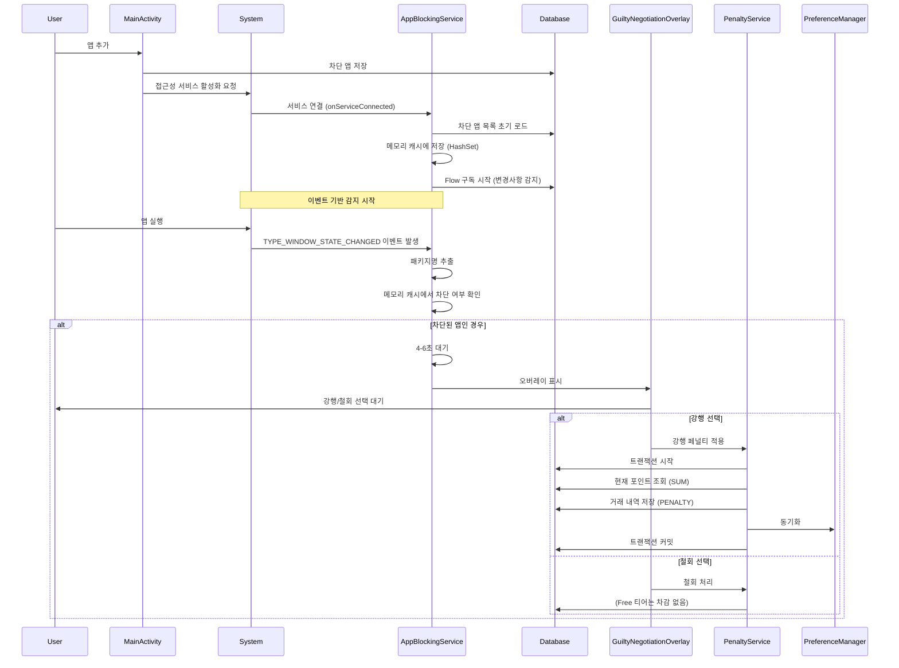
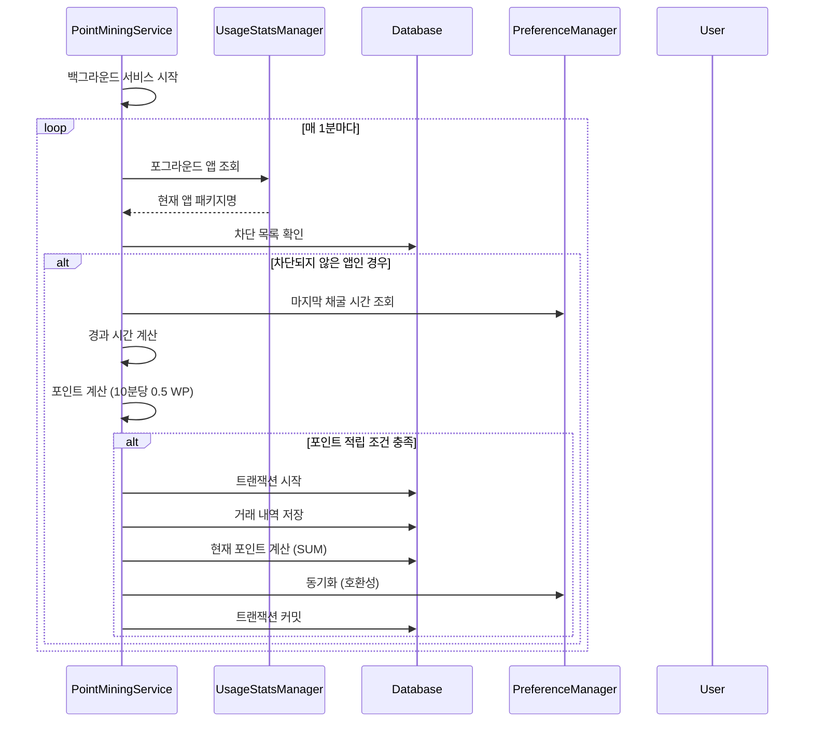
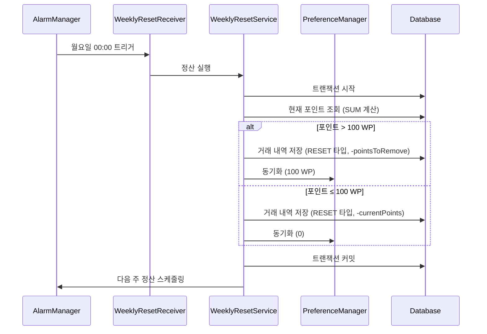
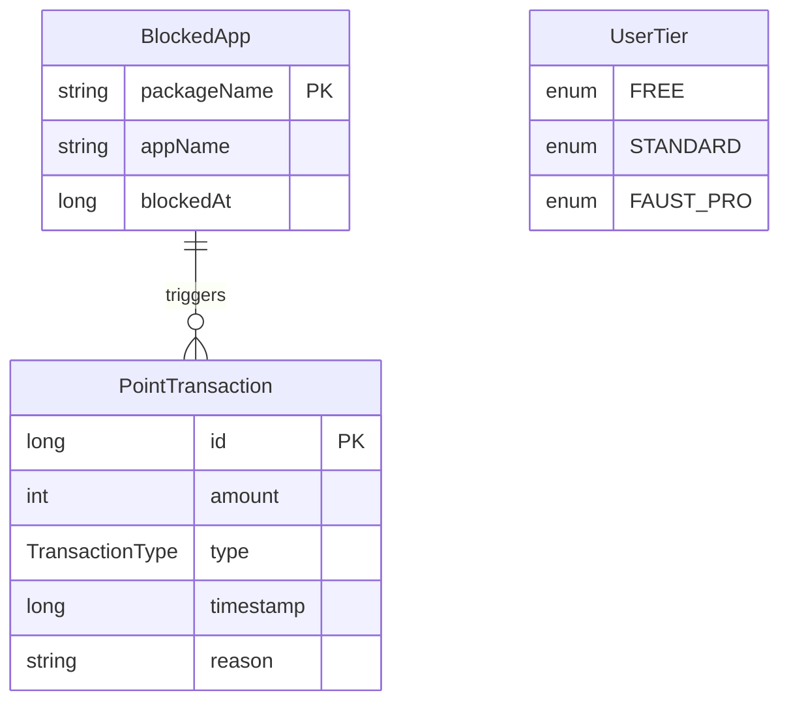

# Faust 아키텍처 문서

## 목차
1. [전체 개요](#전체-개요)
2. [아키텍처 패턴](#아키텍처-패턴)
3. [레이어 구조](#레이어-구조)
4. [데이터 흐름](#데이터-흐름)
5. [컴포넌트 상세](#컴포넌트-상세)
6. [서비스 아키텍처](#서비스-아키텍처)
7. [데이터베이스 스키마](#데이터베이스-스키마)
8. [성능 최적화](#성능-최적화)
9. [데이터 정합성](#데이터-정합성)
10. [시스템 진입점](#시스템-진입점-system-entry-points)
11. [핵심 이벤트 정의](#핵심-이벤트-정의-core-event-definitions)

---

## 전체 개요

Faust는 **계층형 아키텍처(Layered Architecture)**를 기반으로 하며, 각 레이어는 명확한 책임을 가집니다.

```
┌─────────────────────────────────────────────────────────┐
│                    Presentation Layer                    │
│  (UI Components, Activities, Fragments, Overlays)          │
└────────────────────┬────────────────────────────────────┘
                     │
┌────────────────────▼────────────────────────────────────┐
│                   Service Layer                         │
│  (AppBlockingService, PointMiningService, etc.)        │
└────────────────────┬────────────────────────────────────┘
                     │
┌────────────────────▼────────────────────────────────────┐
│                  Business Logic Layer                    │
│  (PenaltyService, WeeklyResetService)                   │
└────────────────────┬────────────────────────────────────┘
                     │
┌────────────────────▼────────────────────────────────────┐
│                   Data Layer                            │
│  (Room Database, SharedPreferences, DAOs)               │
└──────────────────────────────────────────────────────────┘
```

---

## 아키텍처 패턴

### 1. 계층형 아키텍처 (Layered Architecture)
- **Presentation Layer**: UI 컴포넌트 및 사용자 인터랙션
- **Service Layer**: 백그라운드 서비스 및 앱 모니터링
- **Business Logic Layer**: 비즈니스 규칙 및 페널티 로직
- **Data Layer**: 데이터 영속성 및 저장소

### 2. MVVM 패턴 (Model-View-ViewModel)
- **View**: `MainActivity` - UI 렌더링 및 사용자 인터랙션
- **ViewModel**: `MainViewModel` - 데이터 관찰 및 비즈니스 로직
- **Model**: `FaustDatabase`, `PreferenceManager` - 데이터 소스
- StateFlow를 통한 반응형 UI 업데이트

### 3. Repository 패턴 (암묵적)
- DAO를 통한 데이터 접근 추상화
- PreferenceManager를 통한 설정 데이터 관리

### 4. Service-Oriented Architecture
- 독립적인 Foreground Service들
- 서비스 간 느슨한 결합

---

## 레이어 구조

### 📁 프로젝트 디렉토리 구조

```
com.faust/
│
├── 📱 Presentation Layer
│   └── presentation/
│       ├── view/
│       │   ├── MainActivity.kt                    # 메인 액티비티
│       │   ├── GuiltyNegotiationOverlay.kt        # 유죄 협상 오버레이
│       │   ├── BlockedAppAdapter.kt                # 차단 앱 리스트 어댑터
│       │   └── AppSelectionDialog.kt              # 앱 선택 다이얼로그
│       └── viewmodel/
│           └── MainViewModel.kt                  # 메인 ViewModel (MVVM)
│
├── ⚙️ Service Layer
│   └── services/
│       ├── AppBlockingService.kt                  # 앱 차단 모니터링 서비스
│       └── PointMiningService.kt                  # 포인트 채굴 서비스
│
├── 🧠 Business Logic Layer (Domain)
│   └── domain/
│       ├── PenaltyService.kt                      # 페널티 계산 및 적용
│       └── WeeklyResetService.kt                 # 주간 정산 로직
│
├── 💾 Data Layer
│   └── data/
│       ├── database/
│       │   ├── FaustDatabase.kt                  # Room 데이터베이스
│       │   ├── AppBlockDao.kt                     # 차단 앱 DAO
│       │   └── PointTransactionDao.kt             # 포인트 거래 DAO
│       │
│       └── utils/
│           ├── PreferenceManager.kt               # EncryptedSharedPreferences 관리
│           └── TimeUtils.kt                       # 시간 계산 유틸리티
│
├── 📦 Models
│   └── models/
│       ├── BlockedApp.kt                          # 차단 앱 엔티티
│       ├── PointTransaction.kt                    # 포인트 거래 엔티티
│       └── UserTier.kt                            # 사용자 티어 enum
│
└── 🚀 Application
    └── FaustApplication.kt                        # Application 클래스
```

---

## 데이터 흐름

### 1. 앱 차단 플로우 (Event-driven)



### 2. 포인트 채굴 플로우



### 3. 주간 정산 플로우



---

## 컴포넌트 상세

### 1. Presentation Layer

#### MainActivity
- **책임**: 메인 UI 표시 및 사용자 인터랙션 처리, 권한 요청
- **의존성**: 
  - `MainViewModel` (데이터 관찰 및 비즈니스 로직)
  - `AppBlockingService`, `PointMiningService` (서비스 제어)
- **UI 업데이트**: 
  - ViewModel의 StateFlow를 관찰하여 UI 자동 업데이트
  - 포인트: `viewModel.currentPoints` StateFlow 구독
  - 차단 앱 목록: `viewModel.blockedApps` StateFlow 구독
- **경량화**: 데이터베이스 직접 접근 제거, ViewModel을 통한 간접 접근

#### MainViewModel
- **책임**: 데이터 관찰 및 비즈니스 로직 처리
- **의존성**:
  - `FaustDatabase` (데이터 소스)
  - `PreferenceManager` (설정 데이터)
- **StateFlow 관리**:
  - `currentPoints: StateFlow<Int>` - 포인트 합계
  - `blockedApps: StateFlow<List<BlockedApp>>` - 차단 앱 목록
- **주요 메서드**:
  - `addBlockedApp()`: 차단 앱 추가
  - `removeBlockedApp()`: 차단 앱 제거
  - `getMaxBlockedApps()`: 티어별 최대 앱 개수 반환

#### GuiltyNegotiationOverlay
- **책임**: 시스템 오버레이로 유죄 협상 화면 표시
- **특징**:
  - `WindowManager`를 사용한 시스템 레벨 오버레이
  - 30초 카운트다운 타이머
  - 강행/철회 버튼 제공

### 2. Service Layer

#### AppBlockingService
- **타입**: `AccessibilityService` (이벤트 기반 서비스)
- **책임**: 
  - `TYPE_WINDOW_STATE_CHANGED` 이벤트를 통한 앱 실행 실시간 감지
  - 차단된 앱 감지 시 오버레이 트리거
- **감지 방식**: 이벤트 기반 (Event-driven)
  - Polling 방식 제거로 배터리 효율 극대화
  - 앱 실행 즉시 감지 (실시간성 보장)
- **성능 최적화**:
  - 차단된 앱 목록을 `HashSet<String>`으로 메모리 캐싱
  - 서비스 시작 시 1회만 DB 로드
  - `getAllBlockedApps()` Flow를 구독하여 변경사항만 감지
  - 이벤트 발생 시에만 처리 (배터리 소모 최소화)

#### PointMiningService
- **타입**: `LifecycleService` (Foreground Service)
- **책임**:
  - 차단되지 않은 앱 사용 시간 추적
  - 포인트 자동 적립
- **주기**: 1분마다 체크 및 포인트 계산
- **데이터 정합성**:
  - `database.withTransaction`으로 포인트 적립과 거래 내역 저장을 원자적으로 처리
  - DB에서 현재 포인트 계산 (`PointTransactionDao.getTotalPoints()`)
  - PreferenceManager는 호환성을 위해 동기화만 수행
- **에러 처리**:
  - 트랜잭션 내부 예외 처리 및 로깅
  - 실패 시 자동 롤백

### 3. Business Logic Layer

#### PenaltyService
- **책임**: 페널티 계산 및 적용
- **로직**:
  - Free 티어: Launch 3 WP, Quit 0 WP
  - 포인트 부족 시 0으로 클램프
- **데이터 정합성**:
  - `database.withTransaction`으로 포인트 차감과 거래 내역 저장을 원자적으로 처리
  - DB에서 현재 포인트 계산 (`PointTransactionDao.getTotalPoints()`)
  - PreferenceManager는 호환성을 위해 동기화만 수행
- **에러 처리**:
  - 트랜잭션 내부 예외 처리 및 로깅
  - 실패 시 자동 롤백

#### WeeklyResetService
- **책임**: 주간 정산 로직
- **스케줄링**: `AlarmManager`로 매주 월요일 00:00 실행
- **데이터 정합성**:
  - `database.withTransaction`으로 포인트 조정과 거래 내역 저장을 원자적으로 처리
  - DB에서 현재 포인트 계산 (`PointTransactionDao.getTotalPoints()`)
  - PreferenceManager는 호환성을 위해 동기화만 수행
- **에러 처리**:
  - 트랜잭션 내부 예외 처리 및 로깅
  - 실패 시 자동 롤백 및 재시도 스케줄링

### 4. Data Layer

#### FaustDatabase (Room)
- **엔티티**: `BlockedApp`, `PointTransaction`
- **DAO**: `AppBlockDao`, `PointTransactionDao`
- **버전**: 1
- **포인트 관리**: 
  - 현재 포인트는 `PointTransaction`의 `SUM(amount)`로 계산
  - `PointTransactionDao.getTotalPointsFlow()`로 Flow 제공

#### PointTransactionDao
- **주요 메서드**:
  - `getTotalPoints()`: 현재 포인트 계산 (suspend)
  - `getTotalPointsFlow()`: 현재 포인트 Flow (반응형)
  - `insertTransaction()`: 거래 내역 저장
  - `getAllTransactions()`: 모든 거래 내역 Flow

#### PreferenceManager
- **저장 데이터**:
  - 사용자 티어
  - 현재 포인트 (호환성 유지, DB와 동기화)
  - 마지막 채굴 시간/앱
  - 마지막 정산 시간
  - 서비스 실행 상태
- **보안**:
  - `EncryptedSharedPreferences` 사용 (AES256-GCM 암호화)
  - 포인트 조작 방지
  - MasterKey 기반 키 관리
  - 암호화 실패 시 일반 SharedPreferences로 폴백 (로그 기록)
- **역할**: 
  - 포인트는 DB가 단일 소스 (PointTransaction의 SUM)
  - PreferenceManager는 호환성 및 기타 설정 데이터 관리
  - 모든 데이터 접근에 예외 처리 및 로깅

---

## 서비스 아키텍처

### 서비스 간 관계도

```
┌─────────────────────────────────────────────────────────┐
│                    MainActivity                          │
│  ┌──────────────────────────────────────────────────┐   │
│  │  • 서비스 시작/중지 제어                          │   │
│  │  • 권한 요청                                      │   │
│  │  • UI 업데이트                                    │   │
│  └──────────────────────────────────────────────────┘   │
└───────────────┬───────────────────┬─────────────────────┘
                │                   │
    ┌───────────▼──────────┐  ┌────▼──────────────────┐
    │ AppBlockingService    │  │ PointMiningService   │
    │ (AccessibilityService)│  │                      │
    │                       │  │ • 앱 사용 시간 추적  │
    │ • 이벤트 기반 감지     │  │ • 포인트 자동 적립    │
    │ • 오버레이 트리거     │  │                      │
    └───────────┬──────────┘  └────┬──────────────────┘
                │                   │
                │                   │
    ┌───────────▼───────────────────▼──────────┐
    │         PenaltyService                   │
    │  • 강행/철회 페널티 계산 및 적용          │
    └───────────┬──────────────────────────────┘
                │
    ┌───────────▼──────────────────────────────┐
    │      WeeklyResetService                  │
    │  • AlarmManager로 주간 정산 스케줄링      │
    │  • 포인트 몰수 로직                       │
    └──────────────────────────────────────────┘
```

### 서비스 생명주기

```
앱 시작
  │
  ├─► MainActivity.onCreate()
  │     │
  │     ├─► 권한 확인
  │     │     │
  │     │     ├─► 접근성 서비스 권한
  │     │     └─► Overlay 권한
  │     │
  │     └─► 서비스 시작
  │           │
  │           ├─► AppBlockingService (시스템 자동 시작)
  │           │     └─► 이벤트 기반 감지 (TYPE_WINDOW_STATE_CHANGED)
  │           │
  │           └─► PointMiningService.startForeground()
  │                 └─► 주기적 포인트 계산
  │
  └─► WeeklyResetService.scheduleWeeklyReset()
        └─► AlarmManager에 등록
```

---

## 데이터베이스 스키마

### ERD (Entity Relationship Diagram)



### 테이블 상세

#### blocked_apps
| 컬럼명 | 타입 | 제약조건 | 설명 |
|--------|------|----------|------|
| packageName | String | PRIMARY KEY | 앱 패키지명 |
| appName | String | NOT NULL | 앱 표시 이름 |
| blockedAt | Long | NOT NULL | 차단 시작 시간 (timestamp) |

#### point_transactions
| 컬럼명 | 타입 | 제약조건 | 설명 |
|--------|------|----------|------|
| id | Long | PRIMARY KEY, AUTO_INCREMENT | 거래 ID |
| amount | Int | NOT NULL | 포인트 양 (음수 가능) |
| type | TransactionType | NOT NULL | 거래 타입 (MINING, PENALTY, RESET) |
| timestamp | Long | NOT NULL | 거래 시간 |
| reason | String | | 거래 사유 |

### EncryptedSharedPreferences 스키마

**파일명**: `faust_prefs.xml` (암호화됨)

**암호화 방식**: AES256-GCM (키 및 값 모두 암호화)

| 키 | 타입 | 기본값 | 설명 |
|---|------|--------|------|
| user_tier | String | "FREE" | 사용자 티어 |
| current_points | Int | 0 | 현재 보유 포인트 (호환성, DB와 동기화) |
| last_mining_time | Long | 0 | 마지막 채굴 시간 |
| last_mining_app | String | null | 마지막 채굴 앱 패키지명 |
| last_reset_time | Long | 0 | 마지막 정산 시간 |
| is_service_running | Boolean | false | 서비스 실행 상태 |

**보안 특징**:
- MasterKey 기반 키 관리
- AES256-SIV (키 암호화) + AES256-GCM (값 암호화)
- 포인트 조작 방지
- 암호화 실패 시 일반 SharedPreferences로 폴백 (로그 기록)

---

## 의존성 그래프

```
MainActivity
  ├─► MainViewModel
  ├─► AppBlockingService
  ├─► PointMiningService
  └─► WeeklyResetService

MainViewModel
  ├─► FaustDatabase
  └─► PreferenceManager

AppBlockingService
  ├─► FaustDatabase
  └─► GuiltyNegotiationOverlay

PointMiningService
  ├─► FaustDatabase
  └─► PreferenceManager

GuiltyNegotiationOverlay
  └─► PenaltyService

PenaltyService
  ├─► FaustDatabase
  └─► PreferenceManager

WeeklyResetService
  ├─► FaustDatabase
  └─► PreferenceManager
```

---

## 데이터 흐름 요약

### 읽기 흐름 (Read Flow)
```
UI Component (MainActivity)
    ↓
ViewModel (MainViewModel)
    ↓
Database Flow (getTotalPointsFlow, getAllBlockedApps)
    ↓
ViewModel StateFlow 업데이트
    ↓
UI Update (Reactive)
```

### 쓰기 흐름 (Write Flow)
```
User Action / Service Event
    ↓
Business Logic (withTransaction)
    ↓
PointTransaction 삽입
    ↓
현재 포인트 계산 (SUM)
    ↓
PreferenceManager 동기화 (호환성, 암호화 저장)
    ↓
트랜잭션 커밋 (예외 처리 및 롤백 보장)
    ↓
Database Flow 자동 업데이트
    ↓
ViewModel StateFlow 업데이트
    ↓
UI 반응형 업데이트
```

---

## 보안 및 권한

### 필수 권한
1. **BIND_ACCESSIBILITY_SERVICE**: 접근성 서비스를 통한 앱 실행 감지
2. **SYSTEM_ALERT_WINDOW**: 오버레이 표시
3. **FOREGROUND_SERVICE**: 백그라운드 서비스 실행 (PointMiningService용)
4. **QUERY_ALL_PACKAGES**: 설치된 앱 목록 조회

### 보안 강화
1. **EncryptedSharedPreferences**: 포인트 데이터 암호화 저장
   - AES256-GCM 암호화
   - MasterKey 기반 키 관리
   - 포인트 조작 방지
2. **트랜잭션 예외 처리**: 모든 DB 트랜잭션에 예외 처리 및 롤백 보장
3. **동시성 보장**: 모든 포인트 수정 로직이 트랜잭션으로 처리되어 동시 접근 시 데이터 무결성 보장

### 권한 요청 플로우
```
MainActivity
  ↓
권한 확인
  ↓
├─► 접근성 서비스 권한 확인
│     ↓
│     [없음] → 접근성 설정 화면으로 이동
│     ↓
│     [있음] → 다음 권한 확인
│
└─► 오버레이 권한 확인
      ↓
      [없음] → 오버레이 권한 설정 화면으로 이동
      ↓
      [있음] → 서비스 시작
```

**참고**: 접근성 서비스는 시스템이 자동으로 시작하므로 별도의 서비스 시작 호출이 필요 없습니다.

---

## 확장성 고려사항

### 향후 추가 가능한 레이어
1. **Repository Layer**: 데이터 소스 추상화
2. **UseCase Layer**: 비즈니스 로직 캡슐화
3. **Dependency Injection**: Dagger/Hilt 도입
4. **추가 ViewModel**: 다른 화면에 대한 ViewModel 확장

### 확장 포인트
- Standard/Faust Pro 티어 로직
- 상점 시스템
- 음성 페르소나 엔진
- 다차원 분석 프레임워크 (NDA)

---

## 성능 최적화

### 현재 구현
- **이벤트 기반 감지**: `AppBlockingService`가 `AccessibilityService`를 활용하여 앱 실행 이벤트를 실시간 감지
- **메모리 캐싱**: 차단된 앱 목록을 `HashSet`으로 캐싱하여 DB 조회 제거
- **Flow 구독**: 변경사항만 감지하여 불필요한 업데이트 방지
- **반응형 UI**: Room Database의 Flow를 통한 반응형 데이터 업데이트
- **비동기 처리**: Coroutine을 사용한 비동기 처리
- **백그라운드 작업**: AccessibilityService로 시스템 레벨 이벤트 감지

### 최적화 상세

#### AppBlockingService 최적화
- **이전**: Polling 방식 (1초마다 `queryUsageStats()` 호출)
- **현재**: 
  - **이벤트 기반 감지**: `AccessibilityService`의 `TYPE_WINDOW_STATE_CHANGED` 이벤트 활용
  - 서비스 시작 시 1회만 DB 로드
  - `getAllBlockedApps()` Flow 구독으로 변경사항만 감지
  - 메모리 캐시 (`ConcurrentHashMap.newKeySet<String>()`)에서 조회
  - **Polling 루프 완전 제거**
- **효과**: 
  - 배터리 소모 대폭 감소 (이벤트 발생 시에만 처리)
  - 실시간 감지 (앱 실행 즉시 감지)
  - 시스템 리소스 사용 최소화

#### MainActivity UI 최적화
- **이전**: `while(true)` 루프로 5초마다 포인트 업데이트
- **현재**: 
  - `MainViewModel`의 StateFlow를 관찰
  - 포인트 및 차단 앱 목록 변경 시에만 UI 업데이트
  - 데이터베이스 직접 접근 제거로 경량화
- **효과**: 배터리 효율 향상, 불필요한 UI 갱신 제거, 코드 분리로 유지보수성 향상

### 개선 가능 영역
- 데이터베이스 인덱싱
- 메모리 누수 방지 (Lifecycle-aware 컴포넌트)
- PointMiningService도 이벤트 기반으로 전환 검토

---

## 데이터 정합성

### 포인트 관리 아키텍처

#### 단일 소스 원칙 (Single Source of Truth)
- **포인트의 단일 소스**: `PointTransaction` 테이블의 `SUM(amount)`
- **계산 방식**: `SELECT COALESCE(SUM(amount), 0) FROM point_transactions`
- **PreferenceManager 역할**: 호환성 유지 및 동기화만 수행

#### 트랜잭션 보장
모든 포인트 변경 작업은 Room의 `withTransaction`을 사용하여 원자적으로 처리됩니다:

1. **PenaltyService**
   ```kotlin
   try {
       database.withTransaction {
           try {
               val currentPoints = database.pointTransactionDao().getTotalPoints() ?: 0
               val actualPenalty = penalty.coerceAtMost(currentPoints)
               if (actualPenalty > 0) {
                   database.pointTransactionDao().insertTransaction(...)
                   preferenceManager.setCurrentPoints(...) // 동기화
               }
           } catch (e: Exception) {
               Log.e(TAG, "Error in transaction", e)
               throw e // 롤백을 위해 예외 재발생
           }
       }
   } catch (e: Exception) {
       Log.e(TAG, "Transaction failed", e)
       // 자동 롤백됨
   }
   ```

2. **PointMiningService**
   ```kotlin
   try {
       database.withTransaction {
           try {
               database.pointTransactionDao().insertTransaction(...)
               val currentPoints = database.pointTransactionDao().getTotalPoints() ?: 0
               preferenceManager.setCurrentPoints(currentPoints) // 동기화
           } catch (e: Exception) {
               Log.e(TAG, "Error in transaction", e)
               throw e // 롤백을 위해 예외 재발생
           }
       }
   } catch (e: Exception) {
       Log.e(TAG, "Transaction failed", e)
       // 자동 롤백됨
   }
   ```

3. **WeeklyResetService**
   ```kotlin
   try {
       database.withTransaction {
           try {
               val currentPoints = database.pointTransactionDao().getTotalPoints() ?: 0
               // 정산 로직...
               database.pointTransactionDao().insertTransaction(...)
               preferenceManager.setCurrentPoints(...) // 동기화
           } catch (e: Exception) {
               Log.e(TAG, "Error in transaction", e)
               throw e // 롤백을 위해 예외 재발생
           }
       }
   } catch (e: Exception) {
       Log.e(TAG, "Transaction failed", e)
       // 자동 롤백됨
   }
   ```

**에러 처리 특징**:
- 모든 트랜잭션에 이중 예외 처리 (내부/외부)
- 실패 시 자동 롤백 보장
- 상세한 에러 로깅
- 동시성 보장 (모든 포인트 수정이 트랜잭션으로 처리)

#### 데이터 흐름

```
포인트 변경 요청
    ↓
트랜잭션 시작
    ↓
PointTransaction 삽입
    ↓
현재 포인트 계산 (SUM)
    ↓
PreferenceManager 동기화 (호환성)
    ↓
트랜잭션 커밋
    ↓
Flow 자동 업데이트
    ↓
UI 반응형 업데이트
```

#### 장점
- **데이터 정합성**: 트랜잭션으로 원자적 처리 보장
- **단일 소스**: DB가 포인트의 단일 소스
- **호환성**: PreferenceManager는 동기화만 수행하여 기존 코드와 호환
- **반응형**: Flow로 자동 UI 업데이트
- **안정성**: 예외 처리 및 롤백으로 데이터 무결성 보장
- **보안**: EncryptedSharedPreferences로 포인트 조작 방지
- **동시성**: 모든 포인트 수정이 트랜잭션으로 처리되어 동시 접근 시 데이터 꼬임 방지

---

## 시스템 진입점 (System Entry Points)

시스템 진입점은 앱이 외부 자극이나 사용자 액션에 의해 활성화되는 지점입니다. 각 진입점은 특정 트리거 조건에 따라 시스템의 특정 컴포넌트를 활성화합니다.

### 1. 사용자 진입점 (MainActivity)

**파일**: [`app/src/main/java/com/faust/presentation/view/MainActivity.kt`](app/src/main/java/com/faust/presentation/view/MainActivity.kt)

**역할**: 사용자가 앱 아이콘을 눌러 실행하는 지점으로, 차단 앱 설정 및 포인트 현황을 확인하는 UI 레이어의 시작점입니다.

**트리거 조건**:
- 사용자가 홈 화면 또는 앱 목록에서 Faust 앱 아이콘 클릭
- `AndroidManifest.xml`의 `MAIN`/`LAUNCHER` intent-filter에 의해 시스템이 Activity 시작

**주요 책임**:
- UI 초기화 및 레이아웃 설정
- 권한 확인 및 요청 (접근성 서비스, 오버레이 권한)
- ViewModel StateFlow 관찰 및 UI 업데이트
- 서비스 시작 제어 (PointMiningService)

**MVVM 패턴**:
- ViewModel(`MainViewModel`)을 통한 데이터 관찰
- 데이터베이스 직접 접근 제거 (경량화)
- UI 렌더링과 권한 요청에만 집중

**생명주기**:
```
사용자 앱 아이콘 클릭
  ↓
MainActivity.onCreate()
  ↓
ViewModel 초기화 및 StateFlow 관찰 시작
  ↓
권한 확인 → 서비스 시작
  ↓
UI 초기화 완료
```

### 2. 시스템 이벤트 진입점 (AppBlockingService)

**파일**: [`app/src/main/java/com/faust/services/AppBlockingService.kt`](app/src/main/java/com/faust/services/AppBlockingService.kt)

**역할**: 안드로이드 시스템으로부터 앱 실행 상태 변화 신호를 받는 지점입니다. 현재 `AccessibilityService`를 상속받아 `onAccessibilityEvent`를 통해 시스템 이벤트를 직접 수신합니다.

**트리거 조건**:
- 사용자가 접근성 서비스 설정에서 Faust 서비스 활성화
- 시스템이 `onServiceConnected()` 콜백 호출
- 앱 실행 시 `TYPE_WINDOW_STATE_CHANGED` 이벤트 발생

**주요 책임**:
- 차단된 앱 목록 메모리 캐싱 (HashSet)
- 앱 실행 이벤트 실시간 감지
- 차단된 앱 감지 시 오버레이 트리거
- 데이터베이스 변경사항 Flow 구독

**생명주기**:
```
접근성 서비스 활성화
  ↓
onServiceConnected()
  ↓
차단 앱 목록 초기 로드 및 캐싱
  ↓
이벤트 기반 감지 시작 (TYPE_WINDOW_STATE_CHANGED)
```

### 3. 백그라운드 유지 진입점 (PointMiningService)

**파일**: [`app/src/main/java/com/faust/services/PointMiningService.kt`](app/src/main/java/com/faust/services/PointMiningService.kt)

**역할**: Foreground Service로 실행되어 앱이 꺼져 있어도 포인트 채굴 로직이 지속되도록 보장하는 지점입니다.

**트리거 조건**:
- `MainActivity.startServices()` 호출
- `PointMiningService.startService(context)` 호출
- 시스템이 Foreground Service로 시작

**주요 책임**:
- 1분마다 포그라운드 앱 확인
- 차단되지 않은 앱 사용 시간 추적
- 포인트 자동 적립 (10분당 1 WP, Free 티어는 0.5x)
- 포인트 거래 내역 저장 (트랜잭션 보장)

**생명주기**:
```
MainActivity.startServices()
  ↓
onStartCommand()
  ↓
Foreground Service 시작 (Notification 표시)
  ↓
1분마다 포인트 채굴 루프 실행
```

### 4. 시간 기반 진입점 (WeeklyResetReceiver)

**파일**: [`app/src/main/java/com/faust/domain/WeeklyResetService.kt`](app/src/main/java/com/faust/domain/WeeklyResetService.kt)

**역할**: `AlarmManager`에 의해 매주 월요일 00:00에 시스템이 브로드캐스트를 던져 정산 로직을 실행시키는 지점입니다.

**트리거 조건**:
- `AlarmManager`가 설정된 시간(매주 월요일 00:00)에 도달
- 시스템이 `WeeklyResetReceiver.onReceive()` 호출
- Intent action: `"com.faust.WEEKLY_RESET"`

**주요 책임**:
- 주간 정산 로직 실행 (`WeeklyResetService.performReset()`)
- 포인트 몰수 처리 (100 WP 초과 시 초과분 몰수, 이하 시 전액 몰수)
- 다음 주 정산 스케줄링

**생명주기**:
```
AlarmManager 트리거 (월요일 00:00)
  ↓
WeeklyResetReceiver.onReceive()
  ↓
WeeklyResetService.performReset()
  ↓
트랜잭션으로 포인트 조정
  ↓
다음 주 정산 스케줄링
```

### 5. 부팅 진입점 (WeeklyResetReceiver)

**파일**: [`app/src/main/java/com/faust/domain/WeeklyResetService.kt`](app/src/main/java/com/faust/domain/WeeklyResetService.kt)

**역할**: 기기 재부팅 시 `ACTION_BOOT_COMPLETED` 이벤트를 수신하여 중단된 서비스와 알람을 재등록하는 지점입니다.

**트리거 조건**:
- 기기 재부팅 완료
- 시스템이 `ACTION_BOOT_COMPLETED` 브로드캐스트 전송
- `AndroidManifest.xml`의 `BOOT_COMPLETED` intent-filter에 의해 수신

**주요 책임**:
- 주간 정산 알람 재등록 (`scheduleWeeklyReset()`)
- 서비스 재시작 (필요 시)

**생명주기**:
```
기기 재부팅 완료
  ↓
ACTION_BOOT_COMPLETED 브로드캐스트
  ↓
WeeklyResetReceiver.onReceive()
  ↓
주간 정산 알람 재등록
```

---

## 핵심 이벤트 정의 (Core Event Definitions)

핵심 이벤트는 앱의 비즈니스 로직을 트리거하는 주요 사건들입니다. 각 이벤트는 특정 조건에서 발생하며, 시스템의 특정 컴포넌트에 의해 처리됩니다.

### A. 차단 관련 이벤트 (Blocking Events)

#### 1. TYPE_WINDOW_STATE_CHANGED (앱 실행 감지)

**위치**: [`AppBlockingService.onAccessibilityEvent()`](app/src/main/java/com/faust/services/AppBlockingService.kt)

**발생 조건**: 사용자가 특정 앱(예: 유튜브)을 터치하여 화면 전환이 일어날 때 발생하는 접근성 이벤트입니다.

**처리 로직**:
- `event.eventType == AccessibilityEvent.TYPE_WINDOW_STATE_CHANGED` 확인
- `event.packageName`에서 패키지명 추출
- `handleAppLaunch()` 호출

**관련 컴포넌트**:
- `AppBlockingService`: 이벤트 수신 및 처리
- `AccessibilityService`: 시스템 이벤트 제공

#### 2. handleAppLaunch (차단 여부 판단)

**위치**: [`AppBlockingService.handleAppLaunch()`](app/src/main/java/com/faust/services/AppBlockingService.kt)

**발생 조건**: `TYPE_WINDOW_STATE_CHANGED` 이벤트에서 패키지명이 추출된 후 발생합니다.

**처리 로직**:
- 메모리 캐시(`blockedAppsCache`)에서 차단 여부 확인
- 차단된 앱인 경우: 4-6초 지연 후 오버레이 표시
- 차단되지 않은 앱인 경우: 오버레이 숨김

**관련 컴포넌트**:
- `AppBlockingService`: 차단 여부 판단
- `blockedAppsCache`: 메모리 캐시 (HashSet)

#### 3. showOverlay (오버레이 노출)

**위치**: [`AppBlockingService.showOverlay()`](app/src/main/java/com/faust/services/AppBlockingService.kt)

**발생 조건**: `TYPE_WINDOW_STATE_CHANGED` 이벤트에서 패키지명이 추출된 후 발생합니다.

**처리 로직**:
- 메모리 캐시(`blockedAppsCache`)에서 차단 여부 확인
- 차단된 앱인 경우: 4-6초 지연 후 오버레이 표시
- 차단되지 않은 앱인 경우: 오버레이 숨김

**관련 컴포넌트**:
- `AppBlockingService`: 차단 여부 판단
- `blockedAppsCache`: 메모리 캐시 (HashSet)

**발생 조건**: 차단 대상 앱임이 확인되고 4-6초 지연 시간이 경과한 후 발생합니다.

**처리 로직**:
- `GuiltyNegotiationOverlay` 인스턴스 생성
- `WindowManager`를 통해 시스템 레벨 오버레이 표시
- 30초 카운트다운 시작

**관련 컴포넌트**:
- `AppBlockingService`: 오버레이 트리거
- `GuiltyNegotiationOverlay`: 오버레이 UI 표시
- `WindowManager`: 시스템 레벨 오버레이 관리

### B. 포인트 및 페널티 이벤트 (Point & Penalty Events)

#### 1. onProceed (강행 실행)

**위치**: [`GuiltyNegotiationOverlay.onProceed()`](app/src/main/java/com/faust/presentation/view/GuiltyNegotiationOverlay.kt)

**발생 조건**: 사용자가 오버레이에서 '강행' 버튼을 선택할 때 발생합니다.

**처리 로직**:
- `PenaltyService.applyLaunchPenalty()` 호출
- Free 티어: 3 WP 차감
- 오버레이 닫기

**관련 컴포넌트**:
- `GuiltyNegotiationOverlay`: 사용자 인터랙션 처리
- `PenaltyService`: 페널티 계산 및 적용
- `FaustDatabase`: 포인트 차감 (트랜잭션)

#### 2. onCancel (철회)

**위치**: [`GuiltyNegotiationOverlay.onCancel()`](app/src/main/java/com/faust/presentation/view/GuiltyNegotiationOverlay.kt)

**발생 조건**: 사용자가 오버레이에서 '철회' 버튼을 선택할 때 발생합니다.

**처리 로직**:
- `PenaltyService.applyQuitPenalty()` 호출
- Free 티어: 페널티 0 (차감 없음)
- 오버레이 닫기

**관련 컴포넌트**:
- `GuiltyNegotiationOverlay`: 사용자 인터랙션 처리
- `PenaltyService`: 페널티 계산 및 적용

#### 3. processMining (포인트 채굴)

**위치**: [`PointMiningService.processMining()`](app/src/main/java/com/faust/services/PointMiningService.kt)

**발생 조건**: `PointMiningService`에서 1분마다 실행되며, 현재 사용 중인 앱이 차단 목록에 없을 경우 발생합니다.

**처리 로직**:
- 포그라운드 앱 확인
- 차단 목록 확인 (차단된 앱이면 중지)
- 같은 앱 사용 시간 계산
- 10분당 1 WP 기준으로 포인트 계산 (Free 티어는 0.5x)
- 포인트 적립 (트랜잭션 보장)

**관련 컴포넌트**:
- `PointMiningService`: 채굴 로직 실행
- `UsageStatsManager`: 포그라운드 앱 조회
- `FaustDatabase`: 포인트 적립 (트랜잭션)

### C. 데이터 동기화 이벤트 (Data Synchronization Events)

#### 1. getTotalPointsFlow (UI 업데이트)

**위치**: [`MainViewModel.observePoints()`](app/src/main/java/com/faust/presentation/viewmodel/MainViewModel.kt) → [`PointTransactionDao.getTotalPointsFlow()`](app/src/main/java/com/faust/data/database/PointTransactionDao.kt)

**발생 조건**: 데이터베이스의 포인트 합계가 변경되면 자동으로 발생합니다.

**처리 로직**:
- `MainViewModel`에서 `PointTransactionDao.getTotalPointsFlow()` Flow 구독
- 포인트 변경 시 `currentPoints` StateFlow 업데이트
- `MainActivity`에서 StateFlow 관찰하여 UI 자동 갱신

**관련 컴포넌트**:
- `MainActivity`: StateFlow 관찰 및 UI 업데이트
- `MainViewModel`: 데이터 관찰 및 StateFlow 관리
- `PointTransactionDao`: Flow 제공
- `FaustDatabase`: 데이터 변경 감지

#### 2. observeBlockedApps (차단 앱 목록 관찰)

**위치**: [`MainViewModel.observeBlockedApps()`](app/src/main/java/com/faust/presentation/viewmodel/MainViewModel.kt)

**발생 조건**: 차단 앱 목록 데이터베이스에 변경이 생기면 자동으로 발생합니다.

**처리 로직**:
- `MainViewModel`에서 `AppBlockDao.getAllBlockedApps()` Flow 구독
- 차단 앱 목록 변경 시 `blockedApps` StateFlow 업데이트
- `MainActivity`에서 StateFlow 관찰하여 UI 자동 갱신

**관련 컴포넌트**:
- `MainActivity`: StateFlow 관찰 및 UI 업데이트
- `MainViewModel`: 데이터 관찰 및 StateFlow 관리
- `AppBlockDao`: Flow 제공
- `FaustDatabase`: 데이터 변경 감지

#### 3. initializeBlockedAppsCache (캐시 동기화)

**위치**: [`AppBlockingService.initializeBlockedAppsCache()`](app/src/main/java/com/faust/services/AppBlockingService.kt)

**발생 조건**: 
- 서비스 시작 시 초기 로드
- 차단 목록 데이터베이스에 변경이 생기면 Flow를 통해 자동 발생

**처리 로직**:
- 초기 로드: `getAllBlockedApps().first()`로 차단 앱 목록 로드
- Flow 구독: `getAllBlockedApps().collect()`로 변경사항 실시간 감지
- 메모리 캐시(`blockedAppsCache`) 즉시 업데이트

**관련 컴포넌트**:
- `AppBlockingService`: 캐시 관리
- `AppBlockDao`: 차단 앱 목록 제공 (Flow)
- `blockedAppsCache`: 메모리 캐시 (HashSet)

---

## 테스트 전략

### 단위 테스트 대상
- `PenaltyService`: 페널티 계산 로직
- `WeeklyResetService`: 정산 로직
- `TimeUtils`: 시간 계산 유틸리티
- `PreferenceManager`: 데이터 저장/로드

### 통합 테스트 대상
- 서비스 간 통신
- 데이터베이스 CRUD 작업
- 권한 요청 플로우

---

## 결론

Faust는 **명확한 계층 분리**와 **단일 책임 원칙**을 따르는 구조로 설계되었습니다. 각 컴포넌트는 독립적으로 테스트 가능하며, 향후 기능 확장이 용이한 아키텍처입니다.
