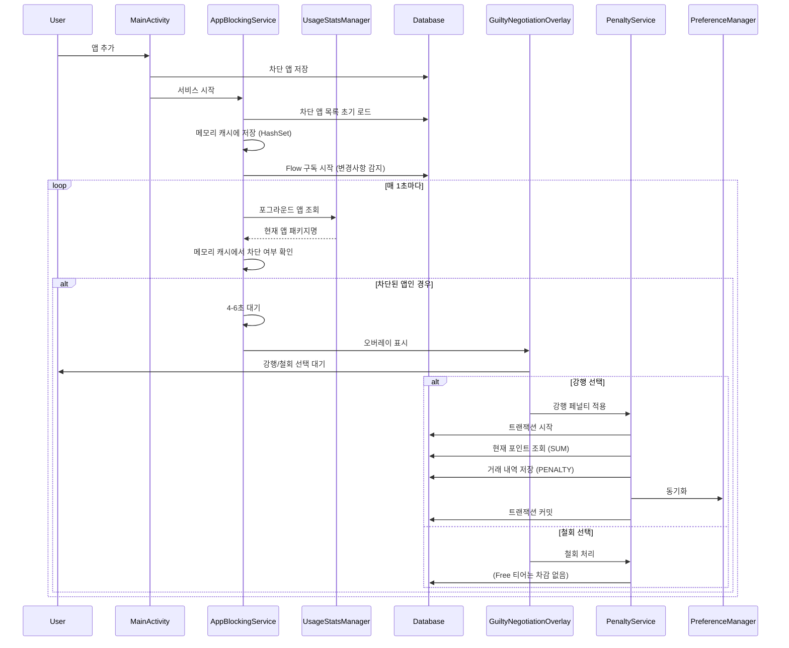
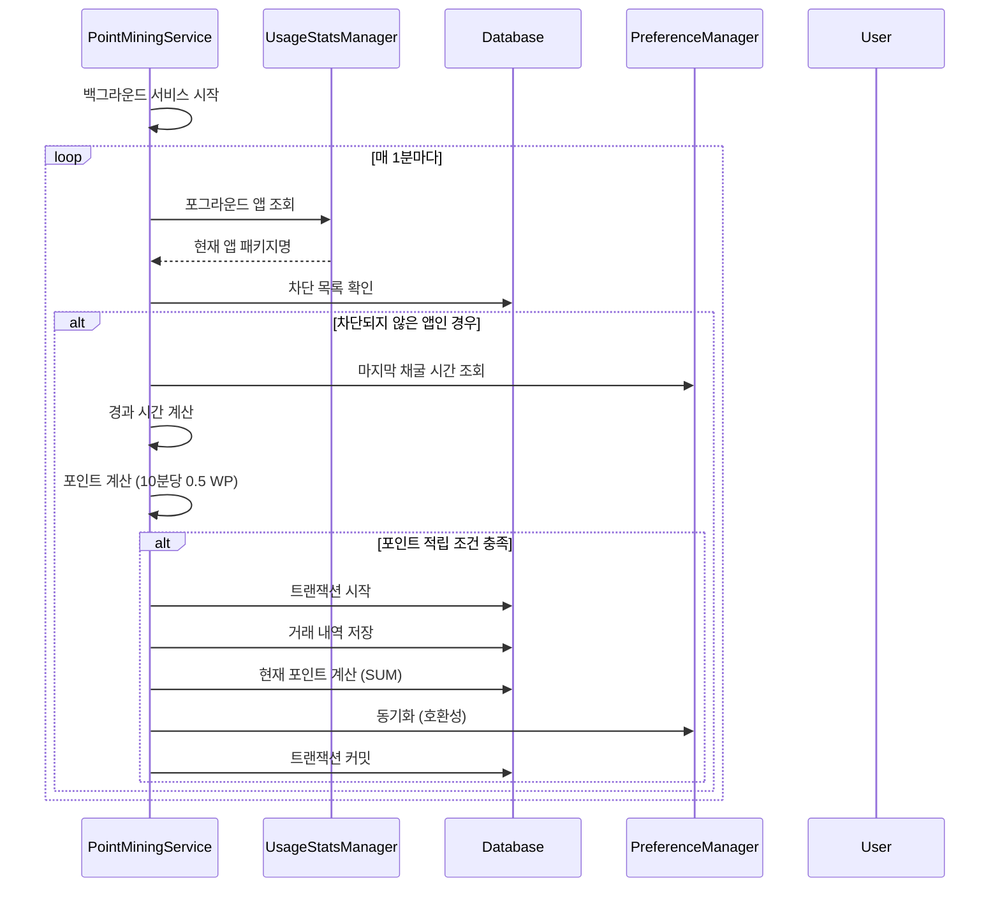
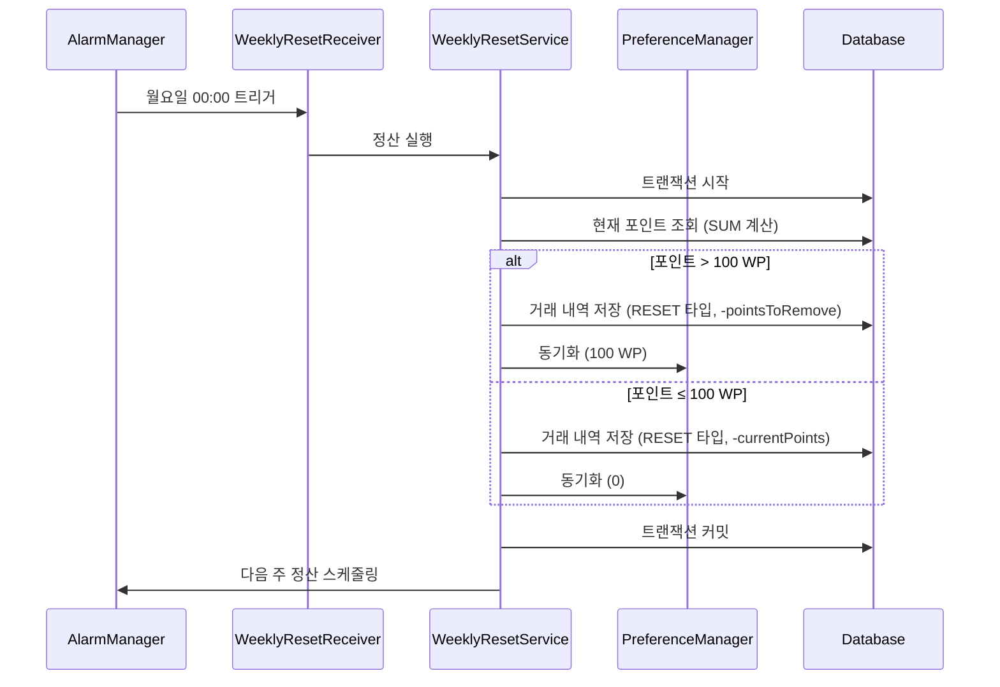
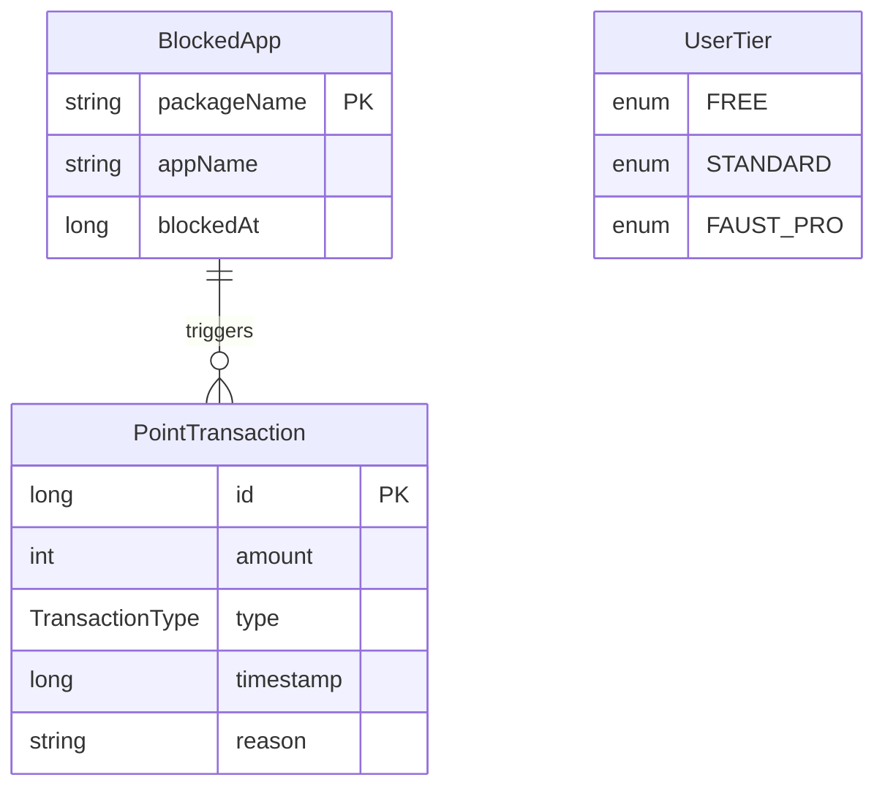

# Faust 아키텍처 문서

## 목차
1. [전체 개요](#전체-개요)
2. [아키텍처 패턴](#아키텍처-패턴)
3. [레이어 구조](#레이어-구조)
4. [데이터 흐름](#데이터-흐름)
5. [컴포넌트 상세](#컴포넌트-상세)
6. [서비스 아키텍처](#서비스-아키텍처)
7. [데이터베이스 스키마](#데이터베이스-스키마)
8. [성능 최적화](#성능-최적화)
9. [데이터 정합성](#데이터-정합성)

---

## 전체 개요

Faust는 **계층형 아키텍처(Layered Architecture)**를 기반으로 하며, 각 레이어는 명확한 책임을 가집니다.

```
┌─────────────────────────────────────────────────────────┐
│                    Presentation Layer                    │
│  (UI Components, Activities, Fragments, Overlays)          │
└────────────────────┬────────────────────────────────────┘
                     │
┌────────────────────▼────────────────────────────────────┐
│                   Service Layer                         │
│  (AppBlockingService, PointMiningService, etc.)        │
└────────────────────┬────────────────────────────────────┘
                     │
┌────────────────────▼────────────────────────────────────┐
│                  Business Logic Layer                    │
│  (PenaltyService, WeeklyResetService)                   │
└────────────────────┬────────────────────────────────────┘
                     │
┌────────────────────▼────────────────────────────────────┐
│                   Data Layer                            │
│  (Room Database, SharedPreferences, DAOs)               │
└──────────────────────────────────────────────────────────┘
```

---

## 아키텍처 패턴

### 1. 계층형 아키텍처 (Layered Architecture)
- **Presentation Layer**: UI 컴포넌트 및 사용자 인터랙션
- **Service Layer**: 백그라운드 서비스 및 앱 모니터링
- **Business Logic Layer**: 비즈니스 규칙 및 페널티 로직
- **Data Layer**: 데이터 영속성 및 저장소

### 2. Repository 패턴 (암묵적)
- DAO를 통한 데이터 접근 추상화
- PreferenceManager를 통한 설정 데이터 관리

### 3. Service-Oriented Architecture
- 독립적인 Foreground Service들
- 서비스 간 느슨한 결합

---

## 레이어 구조

### 📁 프로젝트 디렉토리 구조

```
com.faust/
│
├── 📱 Presentation Layer (UI)
│   ├── MainActivity.kt                    # 메인 액티비티
│   └── ui/
│       ├── GuiltyNegotiationOverlay.kt     # 유죄 협상 오버레이
│       ├── BlockedAppAdapter.kt            # 차단 앱 리스트 어댑터
│       └── AppSelectionDialog.kt           # 앱 선택 다이얼로그
│
├── ⚙️ Service Layer
│   └── services/
│       ├── AppBlockingService.kt           # 앱 차단 모니터링 서비스
│       └── PointMiningService.kt           # 포인트 채굴 서비스
│
├── 🧠 Business Logic Layer
│   └── services/
│       ├── PenaltyService.kt               # 페널티 계산 및 적용
│       └── WeeklyResetService.kt           # 주간 정산 로직
│
├── 💾 Data Layer
│   ├── database/
│   │   ├── FaustDatabase.kt                # Room 데이터베이스
│   │   ├── AppBlockDao.kt                   # 차단 앱 DAO
│   │   └── PointTransactionDao.kt          # 포인트 거래 DAO
│   │
│   ├── models/
│   │   ├── BlockedApp.kt                   # 차단 앱 엔티티
│   │   ├── PointTransaction.kt              # 포인트 거래 엔티티
│   │   └── UserTier.kt                      # 사용자 티어 enum
│   │
│   └── utils/
│       ├── PreferenceManager.kt             # SharedPreferences 관리
│       └── TimeUtils.kt                     # 시간 계산 유틸리티
│
└── 🚀 Application
    └── FaustApplication.kt                  # Application 클래스
```

---

## 데이터 흐름

### 1. 앱 차단 플로우



### 2. 포인트 채굴 플로우



### 3. 주간 정산 플로우



---

## 컴포넌트 상세

### 1. Presentation Layer

#### MainActivity
- **책임**: 메인 UI 표시 및 사용자 인터랙션 처리
- **의존성**: 
  - `FaustDatabase` (차단 앱 목록 조회, 포인트 Flow 관찰)
  - `PreferenceManager` (사용자 티어, 채굴 시간 등)
  - `AppBlockingService`, `PointMiningService` (서비스 제어)
- **UI 업데이트**: 
  - 포인트: `PointTransactionDao.getTotalPointsFlow()`를 구독하여 변경사항만 감지
  - 차단 앱 목록: `AppBlockDao.getAllBlockedApps()` Flow 구독

#### GuiltyNegotiationOverlay
- **책임**: 시스템 오버레이로 유죄 협상 화면 표시
- **특징**:
  - `WindowManager`를 사용한 시스템 레벨 오버레이
  - 30초 카운트다운 타이머
  - 강행/철회 버튼 제공

### 2. Service Layer

#### AppBlockingService
- **타입**: `LifecycleService` (Foreground Service)
- **책임**: 
  - `UsageStatsManager`로 포그라운드 앱 모니터링
  - 차단된 앱 감지 시 오버레이 트리거
- **주기**: 1초마다 체크
- **성능 최적화**:
  - 차단된 앱 목록을 `HashSet<String>`으로 메모리 캐싱
  - 서비스 시작 시 1회만 DB 로드
  - `getAllBlockedApps()` Flow를 구독하여 변경사항만 감지
  - DB 조회 제거로 배터리 소모 감소

#### PointMiningService
- **타입**: `LifecycleService` (Foreground Service)
- **책임**:
  - 차단되지 않은 앱 사용 시간 추적
  - 포인트 자동 적립
- **주기**: 1분마다 체크 및 포인트 계산
- **데이터 정합성**:
  - `database.withTransaction`으로 포인트 적립과 거래 내역 저장을 원자적으로 처리
  - DB에서 현재 포인트 계산 (`PointTransactionDao.getTotalPoints()`)
  - PreferenceManager는 호환성을 위해 동기화만 수행

### 3. Business Logic Layer

#### PenaltyService
- **책임**: 페널티 계산 및 적용
- **로직**:
  - Free 티어: Launch 3 WP, Quit 0 WP
  - 포인트 부족 시 0으로 클램프
- **데이터 정합성**:
  - `database.withTransaction`으로 포인트 차감과 거래 내역 저장을 원자적으로 처리
  - DB에서 현재 포인트 계산 (`PointTransactionDao.getTotalPoints()`)
  - PreferenceManager는 호환성을 위해 동기화만 수행

#### WeeklyResetService
- **책임**: 주간 정산 로직
- **스케줄링**: `AlarmManager`로 매주 월요일 00:00 실행
- **데이터 정합성**:
  - `database.withTransaction`으로 포인트 조정과 거래 내역 저장을 원자적으로 처리
  - DB에서 현재 포인트 계산 (`PointTransactionDao.getTotalPoints()`)
  - PreferenceManager는 호환성을 위해 동기화만 수행

### 4. Data Layer

#### FaustDatabase (Room)
- **엔티티**: `BlockedApp`, `PointTransaction`
- **DAO**: `AppBlockDao`, `PointTransactionDao`
- **버전**: 1
- **포인트 관리**: 
  - 현재 포인트는 `PointTransaction`의 `SUM(amount)`로 계산
  - `PointTransactionDao.getTotalPointsFlow()`로 Flow 제공

#### PointTransactionDao
- **주요 메서드**:
  - `getTotalPoints()`: 현재 포인트 계산 (suspend)
  - `getTotalPointsFlow()`: 현재 포인트 Flow (반응형)
  - `insertTransaction()`: 거래 내역 저장
  - `getAllTransactions()`: 모든 거래 내역 Flow

#### PreferenceManager
- **저장 데이터**:
  - 사용자 티어
  - 현재 포인트 (호환성 유지, DB와 동기화)
  - 마지막 채굴 시간/앱
  - 마지막 정산 시간
  - 서비스 실행 상태
- **역할**: 
  - 포인트는 DB가 단일 소스 (PointTransaction의 SUM)
  - PreferenceManager는 호환성 및 기타 설정 데이터 관리

---

## 서비스 아키텍처

### 서비스 간 관계도

```
┌─────────────────────────────────────────────────────────┐
│                    MainActivity                          │
│  ┌──────────────────────────────────────────────────┐   │
│  │  • 서비스 시작/중지 제어                          │   │
│  │  • 권한 요청                                      │   │
│  │  • UI 업데이트                                    │   │
│  └──────────────────────────────────────────────────┘   │
└───────────────┬───────────────────┬─────────────────────┘
                │                   │
    ┌───────────▼──────────┐  ┌────▼──────────────────┐
    │ AppBlockingService    │  │ PointMiningService   │
    │                       │  │                      │
    │ • UsageStats 모니터링 │  │ • 앱 사용 시간 추적  │
    │ • 오버레이 트리거     │  │ • 포인트 자동 적립    │
    └───────────┬──────────┘  └────┬──────────────────┘
                │                   │
                │                   │
    ┌───────────▼───────────────────▼──────────┐
    │         PenaltyService                   │
    │  • 강행/철회 페널티 계산 및 적용          │
    └───────────┬──────────────────────────────┘
                │
    ┌───────────▼──────────────────────────────┐
    │      WeeklyResetService                  │
    │  • AlarmManager로 주간 정산 스케줄링      │
    │  • 포인트 몰수 로직                       │
    └──────────────────────────────────────────┘
```

### 서비스 생명주기

```
앱 시작
  │
  ├─► MainActivity.onCreate()
  │     │
  │     ├─► 권한 확인
  │     │     │
  │     │     ├─► UsageStats 권한
  │     │     └─► Overlay 권한
  │     │
  │     └─► 서비스 시작
  │           │
  │           ├─► AppBlockingService.startForeground()
  │           │     └─► 지속적 모니터링 루프
  │           │
  │           └─► PointMiningService.startForeground()
  │                 └─► 주기적 포인트 계산
  │
  └─► WeeklyResetService.scheduleWeeklyReset()
        └─► AlarmManager에 등록
```

---

## 데이터베이스 스키마

### ERD (Entity Relationship Diagram)



### 테이블 상세

#### blocked_apps
| 컬럼명 | 타입 | 제약조건 | 설명 |
|--------|------|----------|------|
| packageName | String | PRIMARY KEY | 앱 패키지명 |
| appName | String | NOT NULL | 앱 표시 이름 |
| blockedAt | Long | NOT NULL | 차단 시작 시간 (timestamp) |

#### point_transactions
| 컬럼명 | 타입 | 제약조건 | 설명 |
|--------|------|----------|------|
| id | Long | PRIMARY KEY, AUTO_INCREMENT | 거래 ID |
| amount | Int | NOT NULL | 포인트 양 (음수 가능) |
| type | TransactionType | NOT NULL | 거래 타입 (MINING, PENALTY, RESET) |
| timestamp | Long | NOT NULL | 거래 시간 |
| reason | String | | 거래 사유 |

### SharedPreferences 스키마

**파일명**: `faust_prefs.xml`

| 키 | 타입 | 기본값 | 설명 |
|---|------|--------|------|
| user_tier | String | "FREE" | 사용자 티어 |
| current_points | Int | 0 | 현재 보유 포인트 |
| last_mining_time | Long | 0 | 마지막 채굴 시간 |
| last_mining_app | String | null | 마지막 채굴 앱 패키지명 |
| last_reset_time | Long | 0 | 마지막 정산 시간 |
| is_service_running | Boolean | false | 서비스 실행 상태 |

---

## 의존성 그래프

```
MainActivity
  ├─► FaustDatabase
  ├─► PreferenceManager
  ├─► AppBlockingService
  ├─► PointMiningService
  └─► WeeklyResetService

AppBlockingService
  ├─► FaustDatabase
  └─► GuiltyNegotiationOverlay

PointMiningService
  ├─► FaustDatabase
  └─► PreferenceManager

GuiltyNegotiationOverlay
  └─► PenaltyService

PenaltyService
  ├─► FaustDatabase
  └─► PreferenceManager

WeeklyResetService
  ├─► FaustDatabase
  └─► PreferenceManager
```

---

## 데이터 흐름 요약

### 읽기 흐름 (Read Flow)
```
UI Component
    ↓
Database Flow (getTotalPointsFlow, getAllBlockedApps)
    ↓
UI Update (Reactive)
```

### 쓰기 흐름 (Write Flow)
```
User Action / Service Event
    ↓
Business Logic (withTransaction)
    ↓
PointTransaction 삽입
    ↓
현재 포인트 계산 (SUM)
    ↓
PreferenceManager 동기화 (호환성)
    ↓
트랜잭션 커밋
    ↓
Flow 자동 업데이트
    ↓
UI 반응형 업데이트
```

---

## 보안 및 권한

### 필수 권한
1. **PACKAGE_USAGE_STATS**: 앱 사용 통계 조회
2. **SYSTEM_ALERT_WINDOW**: 오버레이 표시
3. **FOREGROUND_SERVICE**: 백그라운드 서비스 실행
4. **QUERY_ALL_PACKAGES**: 설치된 앱 목록 조회

### 권한 요청 플로우
```
MainActivity
  ↓
권한 확인
  ↓
[없음] → Settings 화면으로 이동
  ↓
[있음] → 서비스 시작
```

---

## 확장성 고려사항

### 향후 추가 가능한 레이어
1. **ViewModel Layer**: MVVM 패턴 완전 적용
2. **Repository Layer**: 데이터 소스 추상화
3. **UseCase Layer**: 비즈니스 로직 캡슐화
4. **Dependency Injection**: Dagger/Hilt 도입

### 확장 포인트
- Standard/Faust Pro 티어 로직
- 상점 시스템
- 음성 페르소나 엔진
- 다차원 분석 프레임워크 (NDA)

---

## 성능 최적화

### 현재 구현
- **메모리 캐싱**: `AppBlockingService`에서 차단된 앱 목록을 `HashSet`으로 캐싱하여 DB 조회 제거
- **Flow 구독**: 변경사항만 감지하여 불필요한 업데이트 방지
- **반응형 UI**: Room Database의 Flow를 통한 반응형 데이터 업데이트
- **비동기 처리**: Coroutine을 사용한 비동기 처리
- **백그라운드 작업**: Foreground Service로 백그라운드 작업 보장

### 최적화 상세

#### AppBlockingService 최적화
- **이전**: 1초마다 DB 조회 (`getBlockedApp()`)
- **현재**: 
  - 서비스 시작 시 1회만 DB 로드
  - `getAllBlockedApps()` Flow 구독으로 변경사항만 감지
  - 메모리 캐시 (`ConcurrentHashMap.newKeySet<String>()`)에서 조회
- **효과**: 배터리 소모 대폭 감소, 응답 속도 향상

#### MainActivity UI 최적화
- **이전**: `while(true)` 루프로 5초마다 포인트 업데이트
- **현재**: 
  - `PointTransactionDao.getTotalPointsFlow()` 구독
  - 포인트 변경 시에만 UI 업데이트
- **효과**: 배터리 효율 향상, 불필요한 UI 갱신 제거

### 개선 가능 영역
- 데이터베이스 인덱싱
- 서비스 체크 주기 최적화
- 메모리 누수 방지 (Lifecycle-aware 컴포넌트)

---

## 데이터 정합성

### 포인트 관리 아키텍처

#### 단일 소스 원칙 (Single Source of Truth)
- **포인트의 단일 소스**: `PointTransaction` 테이블의 `SUM(amount)`
- **계산 방식**: `SELECT COALESCE(SUM(amount), 0) FROM point_transactions`
- **PreferenceManager 역할**: 호환성 유지 및 동기화만 수행

#### 트랜잭션 보장
모든 포인트 변경 작업은 Room의 `withTransaction`을 사용하여 원자적으로 처리됩니다:

1. **PenaltyService**
   ```kotlin
   database.withTransaction {
       val currentPoints = database.pointTransactionDao().getTotalPoints() ?: 0
       val actualPenalty = penalty.coerceAtMost(currentPoints)
       if (actualPenalty > 0) {
           database.pointTransactionDao().insertTransaction(...)
           preferenceManager.setCurrentPoints(...) // 동기화
       }
   }
   ```

2. **PointMiningService**
   ```kotlin
   database.withTransaction {
       database.pointTransactionDao().insertTransaction(...)
       val currentPoints = database.pointTransactionDao().getTotalPoints() ?: 0
       preferenceManager.setCurrentPoints(currentPoints) // 동기화
   }
   ```

3. **WeeklyResetService**
   ```kotlin
   database.withTransaction {
       val currentPoints = database.pointTransactionDao().getTotalPoints() ?: 0
       // 정산 로직...
       database.pointTransactionDao().insertTransaction(...)
       preferenceManager.setCurrentPoints(...) // 동기화
   }
   ```

#### 데이터 흐름

```
포인트 변경 요청
    ↓
트랜잭션 시작
    ↓
PointTransaction 삽입
    ↓
현재 포인트 계산 (SUM)
    ↓
PreferenceManager 동기화 (호환성)
    ↓
트랜잭션 커밋
    ↓
Flow 자동 업데이트
    ↓
UI 반응형 업데이트
```

#### 장점
- **데이터 정합성**: 트랜잭션으로 원자적 처리 보장
- **단일 소스**: DB가 포인트의 단일 소스
- **호환성**: PreferenceManager는 동기화만 수행하여 기존 코드와 호환
- **반응형**: Flow로 자동 UI 업데이트

---

## 테스트 전략

### 단위 테스트 대상
- `PenaltyService`: 페널티 계산 로직
- `WeeklyResetService`: 정산 로직
- `TimeUtils`: 시간 계산 유틸리티
- `PreferenceManager`: 데이터 저장/로드

### 통합 테스트 대상
- 서비스 간 통신
- 데이터베이스 CRUD 작업
- 권한 요청 플로우

---

## 결론

Faust는 **명확한 계층 분리**와 **단일 책임 원칙**을 따르는 구조로 설계되었습니다. 각 컴포넌트는 독립적으로 테스트 가능하며, 향후 기능 확장이 용이한 아키텍처입니다.
