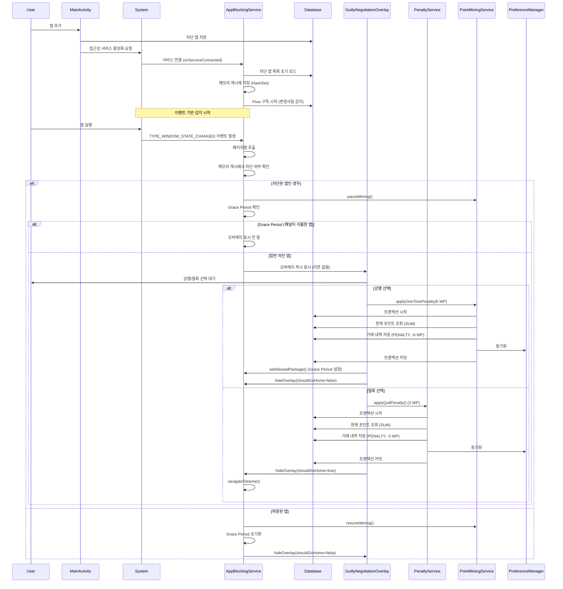
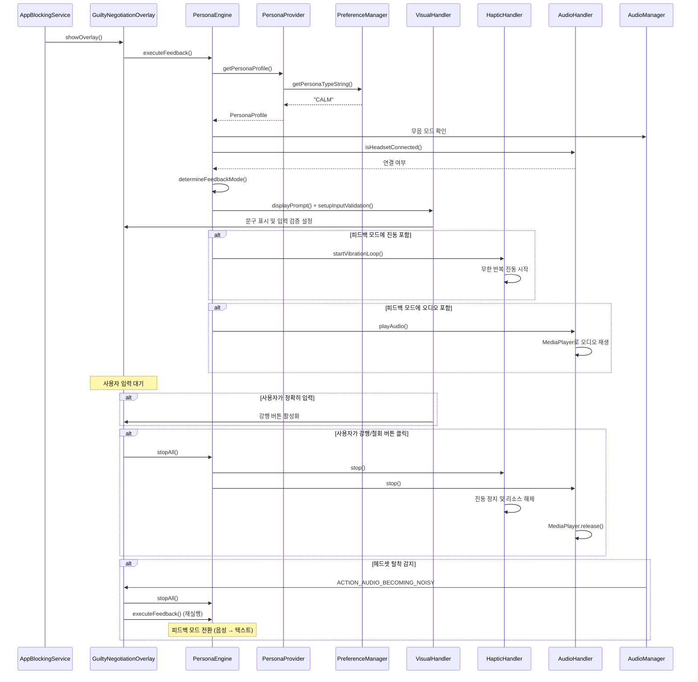
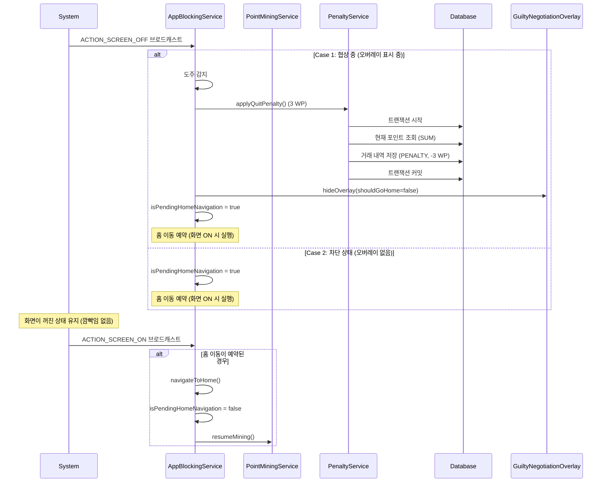
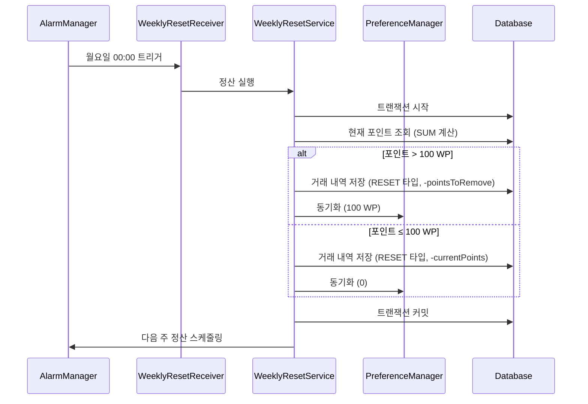
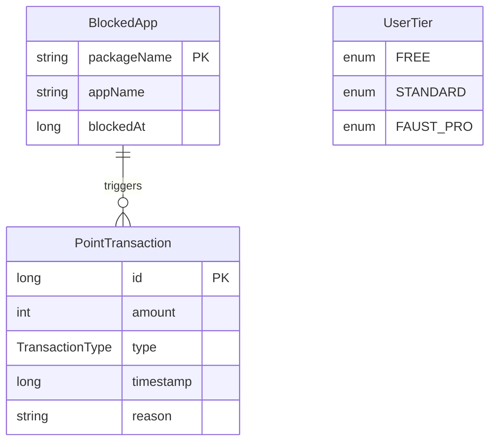

# Faust 아키텍처 문서

## 목차
1. [전체 개요](#전체-개요)
2. [아키텍처 패턴](#아키텍처-패턴)
3. [레이어 구조](#레이어-구조)
4. [데이터 흐름](#데이터-흐름)
5. [컴포넌트 상세](#컴포넌트-상세)
6. [서비스 아키텍처](#서비스-아키텍처)
7. [데이터베이스 스키마](#데이터베이스-스키마)
8. [성능 최적화](#성능-최적화)
9. [데이터 정합성](#데이터-정합성)
10. [시스템 진입점](#시스템-진입점-system-entry-points)
11. [핵심 이벤트 정의](#핵심-이벤트-정의-core-event-definitions)
12. [상태 전이 모델](#상태-전이-모델-state-transition-model)

---

## 전체 개요

Faust는 **계층형 아키텍처(Layered Architecture)**를 기반으로 하며, 각 레이어는 명확한 책임을 가집니다.

```
┌─────────────────────────────────────────────────────────┐
│                    Presentation Layer                    │
│  (UI Components, Activities, Fragments, Overlays)          │
└────────────────────┬────────────────────────────────────┘
                     │
┌────────────────────▼────────────────────────────────────┐
│                   Service Layer                         │
│  (AppBlockingService, PointMiningService, etc.)        │
└────────────────────┬────────────────────────────────────┘
                     │
┌────────────────────▼────────────────────────────────────┐
│                  Business Logic Layer                    │
│  (PenaltyService, WeeklyResetService)                   │
└────────────────────┬────────────────────────────────────┘
                     │
┌────────────────────▼────────────────────────────────────┐
│                   Data Layer                            │
│  (Room Database, SharedPreferences, DAOs)               │
└──────────────────────────────────────────────────────────┘
```

---

## 아키텍처 패턴

### 1. 계층형 아키텍처 (Layered Architecture)
- **Presentation Layer**: UI 컴포넌트 및 사용자 인터랙션
- **Service Layer**: 백그라운드 서비스 및 앱 모니터링
- **Business Logic Layer**: 비즈니스 규칙 및 페널티 로직
- **Data Layer**: 데이터 영속성 및 저장소

### 2. MVVM 패턴 (Model-View-ViewModel)
- **View**: `MainActivity` - UI 렌더링 및 사용자 인터랙션
- **ViewModel**: `MainViewModel` - 데이터 관찰 및 비즈니스 로직
- **Model**: `FaustDatabase`, `PreferenceManager` - 데이터 소스
- StateFlow를 통한 반응형 UI 업데이트

### 3. Repository 패턴 (암묵적)
- DAO를 통한 데이터 접근 추상화
- PreferenceManager를 통한 설정 데이터 관리

### 4. Service-Oriented Architecture
- 독립적인 Foreground Service들
- 서비스 간 느슨한 결합

---

## 레이어 구조

### 📁 프로젝트 디렉토리 구조

```
com.faust/
│
├── 📱 Presentation Layer
│   └── presentation/
│       ├── view/
│       │   ├── MainActivity.kt                    # 메인 액티비티
│       │   ├── GuiltyNegotiationOverlay.kt        # 유죄 협상 오버레이
│       │   ├── BlockedAppAdapter.kt                # 차단 앱 리스트 어댑터
│       │   └── AppSelectionDialog.kt              # 앱 선택 다이얼로그
│       └── viewmodel/
│           └── MainViewModel.kt                  # 메인 ViewModel (MVVM)
│
├── ⚙️ Service Layer
│   └── services/
│       ├── AppBlockingService.kt                  # 앱 차단 모니터링 서비스
│       └── PointMiningService.kt                  # 포인트 채굴 서비스
│
├── 🧠 Business Logic Layer (Domain)
│   └── domain/
│       ├── PenaltyService.kt                      # 페널티 계산 및 적용
│       ├── WeeklyResetService.kt                 # 주간 정산 로직
│       └── persona/                               # Persona Module (신규)
│           ├── PersonaType.kt                    # 페르소나 타입 Enum
│           ├── PersonaProfile.kt                  # 페르소나 프로필 데이터
│           ├── PersonaEngine.kt                  # 피드백 조율 엔진
│           ├── PersonaProvider.kt                 # 페르소나 설정 제공자
│           ├── FeedbackMode.kt                   # 피드백 모드 Enum
│           └── handlers/
│               ├── VisualHandler.kt              # 시각 피드백 핸들러
│               ├── HapticHandler.kt              # 촉각 피드백 핸들러
│               └── AudioHandler.kt               # 청각 피드백 핸들러
│
├── 💾 Data Layer
│   └── data/
│       ├── database/
│       │   ├── FaustDatabase.kt                  # Room 데이터베이스
│       │   ├── AppBlockDao.kt                     # 차단 앱 DAO
│       │   └── PointTransactionDao.kt             # 포인트 거래 DAO
│       │
│       └── utils/
│           ├── PreferenceManager.kt               # EncryptedSharedPreferences 관리
│           └── TimeUtils.kt                       # 시간 계산 유틸리티
│
├── 📦 Models
│   └── models/
│       ├── BlockedApp.kt                          # 차단 앱 엔티티
│       ├── PointTransaction.kt                    # 포인트 거래 엔티티
│       └── UserTier.kt                            # 사용자 티어 enum
│
└── 🚀 Application
    └── FaustApplication.kt                        # Application 클래스
```

---

## 데이터 흐름

### 1. 앱 차단 플로우 (Event-driven)



### 2. 포인트 채굴 플로우

```mermaid
sequenceDiagram
    participant PointMiningService
    participant Database
    participant PreferenceManager
    participant AudioManager
    participant AppBlockingService

    PointMiningService->>PointMiningService: 백그라운드 서비스 시작
    PointMiningService->>PointMiningService: 화면 이벤트 리시버 등록
    PointMiningService->>AudioManager: AudioPlaybackCallback 등록 (이벤트 기반)
    
    loop 매 1분마다 (화면 ON일 때만)
        PointMiningService->>PointMiningService: 화면 ON 확인 (isScreenOn)
        PointMiningService->>PointMiningService: 일시정지 상태 확인 (!isMiningPaused)
        Note over PointMiningService: isMiningPaused = isPausedByApp || isPausedByAudio
        
        alt 조건 충족 (화면 ON && !일시정지)
            PointMiningService->>Database: 트랜잭션 시작
            PointMiningService->>Database: 거래 내역 저장 (MINING, +1 WP)
            PointMiningService->>Database: 현재 포인트 계산 (SUM)
            PointMiningService->>PreferenceManager: 동기화 (호환성)
            PointMiningService->>Database: 트랜잭션 커밋
        end
    end
    
    Note over AudioManager,PointMiningService: 오디오 상태 변경 시 즉시 콜백 호출 (이벤트 기반)
    AudioManager->>PointMiningService: onPlaybackConfigChanged(configs)
    PointMiningService->>PointMiningService: serviceScope.launch (ANR 방지)
    PointMiningService->>PointMiningService: checkBlockedAppAudioFromConfigs(configs)
    
    PointMiningService->>AudioManager: isMusicActive 확인
    PointMiningService->>PreferenceManager: 마지막 앱 조회 (getLastMiningApp)
        PointMiningService->>Database: 차단 목록 확인
    end
    
    alt 차단 앱에서 오디오 재생 중
        PointMiningService->>PointMiningService: isPausedByAudio = true
    else 오디오 종료 또는 차단 앱 아님
        PointMiningService->>PointMiningService: isPausedByAudio = false
    end
    
    Note over PointMiningService: 화면 OFF → ON 전환 시
    PointMiningService->>PointMiningService: calculateAccumulatedPoints()
    PointMiningService->>PointMiningService: 차단 앱 사용/오디오 확인
    alt 정산 가능
        PointMiningService->>PreferenceManager: 화면 OFF 시간 조회
        PointMiningService->>PointMiningService: 경과 시간(분) 계산
        PointMiningService->>Database: 보너스 포인트 일괄 지급
    end
```

### 3. Persona 피드백 플로우



### 4. 화면 OFF/ON 감지 및 도주 패널티 플로우



### 5. 주간 정산 플로우



---

## 컴포넌트 상세

### 1. Presentation Layer

#### MainActivity
- **책임**: 메인 UI 표시 및 사용자 인터랙션 처리, 권한 요청
- **의존성**: 
  - `MainViewModel` (데이터 관찰 및 비즈니스 로직)
  - `AppBlockingService`, `PointMiningService` (서비스 제어)
- **UI 업데이트**: 
  - ViewModel의 StateFlow를 관찰하여 UI 자동 업데이트
  - 포인트: `viewModel.currentPoints` StateFlow 구독
  - 차단 앱 목록: `viewModel.blockedApps` StateFlow 구독
  - 거래 내역: `viewModel.transactions` StateFlow 구독 (포인트 정산 로그 포함)
- **경량화**: 데이터베이스 직접 접근 제거, ViewModel을 통한 간접 접근

#### MainViewModel
- **책임**: 데이터 관찰 및 비즈니스 로직 처리
- **의존성**:
  - `FaustDatabase` (데이터 소스)
  - `PreferenceManager` (설정 데이터)
- **StateFlow 관리**:
  - `currentPoints: StateFlow<Int>` - 포인트 합계
  - `blockedApps: StateFlow<List<BlockedApp>>` - 차단 앱 목록
  - `transactions: StateFlow<List<PointTransaction>>` - 거래 내역 (포인트 정산 로그 포함)
- **주요 메서드**:
  - `addBlockedApp()`: 차단 앱 추가
  - `removeBlockedApp()`: 차단 앱 제거
  - `getMaxBlockedApps()`: 티어별 최대 앱 개수 반환
- **티어별 최대 차단 앱 개수**:
  - `FREE`: 1개
  - `STANDARD`: 3개
  - `FAUST_PRO`: 무제한 (Int.MAX_VALUE)
- **테스트 모드**: `PreferenceManager.setTestModeMaxApps(10)`으로 설정 시 모든 티어에서 최대 10개까지 차단 가능 (실제 휴대폰 테스트용)
  - 기본값: 테스트 모드 활성화 (최대 10개)
  - 비활성화: `setTestModeMaxApps(null)` 호출

#### GuiltyNegotiationOverlay
- **책임**: 시스템 오버레이로 유죄 협상 화면 표시
- **특징**:
  - `WindowManager`를 사용한 시스템 레벨 오버레이
  - 30초 카운트다운 타이머
  - 강행/철회 버튼 제공
  - Persona Module 통합: 능동적 계약 방식 (사용자 입력 검증)
  - 페르소나별 피드백 (시각, 촉각, 청각)
  - Safety Net: 기기 상태에 따른 피드백 모드 자동 조정
- **성능 최적화**:
  - 하드웨어 가속 활성화: `WindowManager.LayoutParams.FLAG_HARDWARE_ACCELERATED` 플래그 사용
  - `PixelFormat.TRANSLUCENT`로 알파 채널 렌더링 시 가속 지원
  - `dimAmount = 0.5f`로 배경 어둡게 처리 (하드웨어 가속 시 부드러운 렌더링)
  - 앱 전체 하드웨어 가속: `AndroidManifest.xml`의 `<application>` 태그에 `android:hardwareAccelerated="true"` 설정

### 2. Service Layer

#### AppBlockingService
- **타입**: `AccessibilityService` (이벤트 기반 서비스)
- **책임**: 
  - `TYPE_WINDOW_STATE_CHANGED` 이벤트를 통한 앱 실행 실시간 감지
  - 차단된 앱 감지 시 오버레이 트리거
  - Grace Period 관리 (페널티 지불 후 일시적 허용)
  - 화면 OFF 감지 및 도주 패널티 적용
  - `PointMiningService`와 통신하여 채굴 일시정지/재개
- **감지 방식**: 이벤트 기반 (Event-driven)
  - Polling 방식 제거로 배터리 효율 극대화
  - 앱 실행 즉시 감지 (실시간성 보장)
- **Grace Period 기능**:
  - 사용자가 강행 버튼을 눌러 페널티를 지불한 앱은 `lastAllowedPackage`에 저장
  - 같은 앱이 다시 실행되면 오버레이를 표시하지 않음 (일시적 허용)
  - 허용된 앱으로 전환 시 Grace Period 초기화
- **화면 OFF 감지**:
  - `ACTION_SCREEN_OFF` 브로드캐스트 수신
  - 협상 중(오버레이 표시 중) 화면 OFF 시 도주 감지 → 철회 패널티 적용
  - 차단 상태에서 화면 OFF 시 홈으로 이동
- **성능 최적화**:
  - 차단된 앱 목록을 `HashSet<String>`으로 메모리 캐싱
  - 서비스 시작 시 1회만 DB 로드
  - `getAllBlockedApps()` Flow를 구독하여 변경사항만 감지
  - 이벤트 발생 시에만 처리 (배터리 소모 최소화)
- **주요 메서드**:
  - `hideOverlay(shouldGoHome: Boolean)`: 오버레이 닫기 및 선택적 홈 이동
  - `navigateToHome(contextLabel: String)`: 홈 화면으로 이동
  - `setAllowedPackage(packageName: String?)`: Grace Period 설정

#### PointMiningService
- **타입**: `LifecycleService` (Foreground Service)
- **책임**:
  - 차단되지 않은 앱 사용 시간 추적
  - 포인트 자동 적립 (1분마다, 화면 ON일 때만)
  - 오디오 모니터링 (10초마다, 화면 상태와 무관)
  - 화면 OFF 시 타이머 중지, ON 시 일괄 정산
  - 차단 앱 오디오 감지 시 채굴 일시정지
- **주기**: 
  - 포인트 적립: 1분마다 (화면 ON이고 일시정지 상태가 아닐 때만)
  - 오디오 모니터링: 이벤트 기반 (오디오 상태 변경 시 즉시 감지, 화면 상태와 무관하게 지속 실행)
- **화면 상태 관리**:
  - `ACTION_SCREEN_ON`: 타이머 재개 및 일괄 정산 (`calculateAccumulatedPoints()`)
  - `ACTION_SCREEN_OFF`: 타이머 중지 및 화면 OFF 시간 저장
- **일괄 정산 로직** (`calculateAccumulatedPoints()`):
  - 화면이 꺼져있던 동안의 시간(분) 계산
  - 차단 앱 사용 중이거나 오디오 재생 중이면 정산 제외
  - 유효한 시간만큼 보너스 포인트 지급
- **오디오 모니터링** (이벤트 기반):
  - `AudioPlaybackCallback`을 사용하여 오디오 상태 변경 시 즉시 감지 (API 26+)
  - Polling 방식 제거: `while` 루프와 `delay` 완전 제거
  - API 29+: `AudioPlaybackConfiguration.getClientUid()`로 실제 오디오 재생 앱의 UID 확인
  - API 26-28: 하위 호환성을 위해 기존 방식 유지
  - 배터리 소모 최소화: 이벤트 기반으로 CPU Wake Lock 효과 제거 (90% 절감)
  - ANR 방지: 콜백에서 `serviceScope.launch`로 코루틴 전환, DB 접근은 suspend 함수로 처리
  - 메모리 누수 방지: `onDestroy()`에서 `unregisterAudioPlaybackCallback()` 호출 필수
  - 마지막 감지된 앱(`PreferenceManager.getLastMiningApp()`)이 차단 목록에 있는지 확인
  - 차단 앱에서 오디오 재생 감지 시 `isMiningPaused = true` 설정
- **채굴 일시정지/재개**:
  - `pauseMining()`: 외부(주로 `AppBlockingService`)에서 호출하여 채굴 일시정지
  - `resumeMining()`: 외부에서 호출하여 채굴 재개
  - `isMiningPaused()`: 현재 일시정지 상태 확인
- **강행 페널티**:
  - `applyOneTimePenalty(context, penaltyAmount)`: 강행 버튼 클릭 시 6 WP 차감
- **데이터 정합성**:
  - `database.withTransaction`으로 포인트 적립과 거래 내역 저장을 원자적으로 처리
  - DB에서 현재 포인트 계산 (`PointTransactionDao.getTotalPoints()`)
  - PreferenceManager는 호환성을 위해 동기화만 수행
- **에러 처리**:
  - 트랜잭션 내부 예외 처리 및 로깅
  - 실패 시 자동 롤백

### 3. Business Logic Layer

#### PenaltyService
- **책임**: 페널티 계산 및 적용 (주로 철회 시 사용)
- **로직**:
  - 강행(Launch): 모든 티어 6 WP 차감 (실제로는 `PointMiningService.applyOneTimePenalty()` 사용)
  - 철회(Quit): Free/Standard 티어 3 WP 차감
  - 포인트 부족 시 0으로 클램프
- **주요 메서드**:
  - `applyLaunchPenalty()`: 강행 페널티 적용 (현재는 사용되지 않음, `PointMiningService.applyOneTimePenalty()` 사용)
  - `applyQuitPenalty()`: 철회 페널티 적용 (화면 OFF 도주 감지 시에도 사용)
- **데이터 정합성**:
  - `database.withTransaction`으로 포인트 차감과 거래 내역 저장을 원자적으로 처리
  - DB에서 현재 포인트 계산 (`PointTransactionDao.getTotalPoints()`)
  - PreferenceManager는 호환성을 위해 동기화만 수행
- **에러 처리**:
  - 트랜잭션 내부 예외 처리 및 로깅
  - 실패 시 자동 롤백

#### WeeklyResetService
- **책임**: 주간 정산 로직
- **스케줄링**: `AlarmManager`로 매주 월요일 00:00 실행
- **데이터 정합성**:
  - `database.withTransaction`으로 포인트 조정과 거래 내역 저장을 원자적으로 처리
  - DB에서 현재 포인트 계산 (`PointTransactionDao.getTotalPoints()`)
  - PreferenceManager는 호환성을 위해 동기화만 수행
- **에러 처리**:
  - 트랜잭션 내부 예외 처리 및 로깅
  - 실패 시 자동 롤백 및 재시도 스케줄링

### 4. Persona Module (Business Logic Layer)

#### PersonaEngine
- **책임**: 기기 상태와 페르소나 프로필을 조합하여 최적의 피드백 모드를 결정하고 각 핸들러에게 실행 명령을 내립니다
- **Safety Net 로직**:
  - 무음 모드 + 헤드셋 없음 → `TEXT_VIBRATION`
  - 소리 모드 + 헤드셋 있음 → `ALL`
  - 무음 모드 + 헤드셋 있음 → `TEXT_VIBRATION`
  - 기타 → `TEXT`
- **주요 메서드**:
  - `determineFeedbackMode()`: 기기 상태 기반 피드백 모드 결정
  - `executeFeedback()`: 피드백 실행 (시각, 촉각, 청각)
  - `stopAll()`: 모든 피드백 즉시 정지 및 리소스 해제

#### PersonaProvider
- **책임**: PreferenceManager에서 사용자가 선택한 페르소나 타입을 읽어와 해당하는 PersonaProfile을 제공합니다
- **페르소나 타입**:
  - `STREET`: 불규칙 자극 (빠른 리듬 진동)
  - `CALM`: 부드러운 성찰 (부드러운 진동)
  - `DIPLOMATIC`: 규칙적 압박 (규칙적 진동)
- **기본값**: `CALM`

#### VisualHandler
- **책임**: 페르소나가 제시하는 문구를 화면에 표시하고 사용자 입력을 검증합니다
- **능동적 계약 방식**: 사용자가 정확히 문구를 입력해야 강행 버튼이 활성화됩니다
- **주요 기능**:
  - `displayPrompt()`: 문구 표시
  - `setupInputValidation()`: 실시간 입력 검증 (TextWatcher)

#### HapticHandler
- **책임**: 페르소나별 진동 패턴을 무한 반복으로 실행합니다
- **구현**: `VibrationEffect` 사용 (API 26+)
- **리소스 관리**: `stop()` 호출 시 Job 취소 및 Vibrator.cancel()

#### AudioHandler
- **책임**: res/raw의 로컬 오디오 파일을 MediaPlayer로 재생합니다
- **헤드셋 감지**: AudioManager를 통한 헤드셋 연결 상태 확인
- **리소스 관리**: `stop()` 호출 시 MediaPlayer.release() 보장

### 4. Data Layer

#### FaustDatabase (Room)
- **엔티티**: `BlockedApp`, `PointTransaction`
- **DAO**: `AppBlockDao`, `PointTransactionDao`
- **버전**: 1
- **포인트 관리**: 
  - 현재 포인트는 `PointTransaction`의 `SUM(amount)`로 계산
  - `PointTransactionDao.getTotalPointsFlow()`로 Flow 제공

#### PointTransactionDao
- **주요 메서드**:
  - `getTotalPoints()`: 현재 포인트 계산 (suspend)
  - `getTotalPointsFlow()`: 현재 포인트 Flow (반응형)
  - `insertTransaction()`: 거래 내역 저장
  - `getAllTransactions()`: 모든 거래 내역 Flow

#### PreferenceManager
- **저장 데이터**:
  - 사용자 티어
  - 현재 포인트 (호환성 유지, DB와 동기화)
  - 마지막 채굴 시간/앱
  - 마지막 정산 시간
  - 서비스 실행 상태
  - 페르소나 타입 (persona_type)
- **보안**:
  - `EncryptedSharedPreferences` 사용 (AES256-GCM 암호화)
  - 포인트 조작 방지
  - MasterKey 기반 키 관리
  - 암호화 실패 시 일반 SharedPreferences로 폴백 (로그 기록)
- **역할**: 
  - 포인트는 DB가 단일 소스 (PointTransaction의 SUM)
  - PreferenceManager는 호환성 및 기타 설정 데이터 관리
  - 모든 데이터 접근에 예외 처리 및 로깅

---

## 서비스 아키텍처

### 서비스 간 관계도

```
┌─────────────────────────────────────────────────────────┐
│                    MainActivity                          │
│  ┌──────────────────────────────────────────────────┐   │
│  │  • 서비스 시작/중지 제어                          │   │
│  │  • 권한 요청                                      │   │
│  │  • UI 업데이트                                    │   │
│  └──────────────────────────────────────────────────┘   │
└───────────────┬───────────────────┬─────────────────────┘
                │                   │
    ┌───────────▼──────────┐  ┌────▼──────────────────┐
    │ AppBlockingService    │  │ PointMiningService   │
    │ (AccessibilityService)│  │                      │
    │                       │  │ • 앱 사용 시간 추적  │
    │ • 이벤트 기반 감지     │  │ • 포인트 자동 적립    │
    │ • 오버레이 트리거     │  │                      │
    └───────────┬──────────┘  └────┬──────────────────┘
                │                   │
                │                   │
    ┌───────────▼───────────────────▼──────────┐
    │         PenaltyService                   │
    │  • 강행/철회 페널티 계산 및 적용          │
    └───────────┬──────────────────────────────┘
                │
    ┌───────────▼──────────────────────────────┐
    │      WeeklyResetService                  │
    │  • AlarmManager로 주간 정산 스케줄링      │
    │  • 포인트 몰수 로직                       │
    └──────────────────────────────────────────┘
```

### 서비스 생명주기

```
앱 시작
  │
  ├─► MainActivity.onCreate()
  │     │
  │     ├─► 권한 확인
  │     │     │
  │     │     ├─► 접근성 서비스 권한
  │     │     └─► Overlay 권한
  │     │
  │     └─► 서비스 시작
  │           │
  │           ├─► AppBlockingService (시스템 자동 시작)
  │           │     └─► 이벤트 기반 감지 (TYPE_WINDOW_STATE_CHANGED)
  │           │
  │           └─► PointMiningService.startForeground()
  │                 └─► 주기적 포인트 계산
  │
  └─► WeeklyResetService.scheduleWeeklyReset()
        └─► AlarmManager에 등록
```

---

## 데이터베이스 스키마

### ERD (Entity Relationship Diagram)



### 테이블 상세

#### blocked_apps
| 컬럼명 | 타입 | 제약조건 | 설명 |
|--------|------|----------|------|
| packageName | String | PRIMARY KEY | 앱 패키지명 |
| appName | String | NOT NULL | 앱 표시 이름 |
| blockedAt | Long | NOT NULL | 차단 시작 시간 (timestamp) |

#### point_transactions
| 컬럼명 | 타입 | 제약조건 | 설명 |
|--------|------|----------|------|
| id | Long | PRIMARY KEY, AUTO_INCREMENT | 거래 ID |
| amount | Int | NOT NULL | 포인트 양 (음수 가능) |
| type | TransactionType | NOT NULL | 거래 타입 (MINING, PENALTY, RESET) |
| timestamp | Long | NOT NULL | 거래 시간 |
| reason | String | | 거래 사유 |

### EncryptedSharedPreferences 스키마

**파일명**: `faust_prefs.xml` (암호화됨)

**암호화 방식**: AES256-GCM (키 및 값 모두 암호화)

| 키 | 타입 | 기본값 | 설명 |
|---|------|--------|------|
| user_tier | String | "FREE" | 사용자 티어 |
| current_points | Int | 0 | 현재 보유 포인트 (호환성, DB와 동기화) |
| last_mining_time | Long | 0 | 마지막 채굴 시간 |
| last_mining_app | String | null | 마지막 채굴 앱 패키지명 |
| last_reset_time | Long | 0 | 마지막 정산 시간 |
| last_screen_off_time | Long | 0 | 마지막 화면 OFF 시간 (일괄 정산용) |
| last_screen_on_time | Long | 0 | 마지막 화면 ON 시간 |
| is_service_running | Boolean | false | 서비스 실행 상태 |
| persona_type | String | "CALM" | 페르소나 타입 (STREET, CALM, DIPLOMATIC) |

**보안 특징**:
- MasterKey 기반 키 관리
- AES256-SIV (키 암호화) + AES256-GCM (값 암호화)
- 포인트 조작 방지
- 암호화 실패 시 일반 SharedPreferences로 폴백 (로그 기록)

---

## 의존성 그래프

```
MainActivity
  ├─► MainViewModel
  ├─► AppBlockingService
  ├─► PointMiningService
  └─► WeeklyResetService

MainViewModel
  ├─► FaustDatabase
  └─► PreferenceManager

AppBlockingService
  ├─► FaustDatabase
  ├─► GuiltyNegotiationOverlay
  ├─► PenaltyService
  └─► PointMiningService (pauseMining/resumeMining)

PointMiningService
  ├─► FaustDatabase
  └─► PreferenceManager

GuiltyNegotiationOverlay
  ├─► PenaltyService
  └─► PersonaEngine (신규)
      ├─► PersonaProvider
      │   └─► PreferenceManager
      ├─► VisualHandler
      ├─► HapticHandler
      │   └─► Vibrator (시스템)
      └─► AudioHandler
          ├─► MediaPlayer
          └─► AudioManager (시스템)

PenaltyService
  ├─► FaustDatabase
  └─► PreferenceManager

WeeklyResetService
  ├─► FaustDatabase
  └─► PreferenceManager
```

---

## 데이터 흐름 요약

### 읽기 흐름 (Read Flow)
```
UI Component (MainActivity)
    ↓
ViewModel (MainViewModel)
    ↓
Database Flow (getTotalPointsFlow, getAllBlockedApps)
    ↓
ViewModel StateFlow 업데이트
    ↓
UI Update (Reactive)
```

### 쓰기 흐름 (Write Flow)
```
User Action / Service Event
    ↓
Business Logic (withTransaction)
    ↓
PointTransaction 삽입
    ↓
현재 포인트 계산 (SUM)
    ↓
PreferenceManager 동기화 (호환성, 암호화 저장)
    ↓
트랜잭션 커밋 (예외 처리 및 롤백 보장)
    ↓
Database Flow 자동 업데이트
    ↓
ViewModel StateFlow 업데이트
    ↓
UI 반응형 업데이트
```

---

## 보안 및 권한

### 필수 권한
1. **BIND_ACCESSIBILITY_SERVICE**: 접근성 서비스를 통한 앱 실행 감지
2. **SYSTEM_ALERT_WINDOW**: 오버레이 표시
3. **FOREGROUND_SERVICE**: 백그라운드 서비스 실행 (PointMiningService용)
4. **QUERY_ALL_PACKAGES**: 설치된 앱 목록 조회

### 보안 강화
1. **EncryptedSharedPreferences**: 포인트 데이터 암호화 저장
   - AES256-GCM 암호화
   - MasterKey 기반 키 관리
   - 포인트 조작 방지
2. **트랜잭션 예외 처리**: 모든 DB 트랜잭션에 예외 처리 및 롤백 보장
3. **동시성 보장**: 모든 포인트 수정 로직이 트랜잭션으로 처리되어 동시 접근 시 데이터 무결성 보장

### 권한 요청 플로우
```
MainActivity
  ↓
권한 확인
  ↓
├─► 접근성 서비스 권한 확인
│     ↓
│     [없음] → 접근성 설정 화면으로 이동
│     ↓
│     [있음] → 다음 권한 확인
│
└─► 오버레이 권한 확인
      ↓
      [없음] → 오버레이 권한 설정 화면으로 이동
      ↓
      [있음] → 서비스 시작
```

**참고**: 접근성 서비스는 시스템이 자동으로 시작하므로 별도의 서비스 시작 호출이 필요 없습니다.

---

## 확장성 고려사항

### 향후 추가 가능한 레이어
1. **Repository Layer**: 데이터 소스 추상화
2. **UseCase Layer**: 비즈니스 로직 캡슐화
3. **Dependency Injection**: Dagger/Hilt 도입
4. **추가 ViewModel**: 다른 화면에 대한 ViewModel 확장

### 확장 포인트
- Standard/Faust Pro 티어 로직
- 상점 시스템
- **Persona Module 확장**:
  - 새로운 페르소나 타입 추가 (PersonaType Enum 확장)
  - 새로운 핸들러 추가 (인터페이스 구현 후 PersonaEngine에 주입)
  - 오디오 파일 추가 (res/raw에 파일 추가 후 PersonaProfile 업데이트)
- 다차원 분석 프레임워크 (NDA)

---

## 성능 최적화

### 현재 구현
- **이벤트 기반 감지**: `AppBlockingService`가 `AccessibilityService`를 활용하여 앱 실행 이벤트를 실시간 감지
- **메모리 캐싱**: 차단된 앱 목록을 `HashSet`으로 캐싱하여 DB 조회 제거
- **Flow 구독**: 변경사항만 감지하여 불필요한 업데이트 방지
- **반응형 UI**: Room Database의 Flow를 통한 반응형 데이터 업데이트
- **비동기 처리**: Coroutine을 사용한 비동기 처리
- **백그라운드 작업**: AccessibilityService로 시스템 레벨 이벤트 감지

### 최적화 상세

#### AppBlockingService 최적화
- **이전**: Polling 방식 (1초마다 `queryUsageStats()` 호출)
- **현재**: 
  - **이벤트 기반 감지**: `AccessibilityService`의 `TYPE_WINDOW_STATE_CHANGED` 이벤트 활용
  - 서비스 시작 시 1회만 DB 로드
  - `getAllBlockedApps()` Flow 구독으로 변경사항만 감지
  - 메모리 캐시 (`ConcurrentHashMap.newKeySet<String>()`)에서 조회
  - **Polling 루프 완전 제거**
- **효과**: 
  - 배터리 소모 대폭 감소 (이벤트 발생 시에만 처리)
  - 실시간 감지 (앱 실행 즉시 감지)
  - 시스템 리소스 사용 최소화

#### MainActivity UI 최적화
- **이전**: `while(true)` 루프로 5초마다 포인트 업데이트
- **현재**: 
  - `MainViewModel`의 StateFlow를 관찰
  - 포인트 및 차단 앱 목록 변경 시에만 UI 업데이트
  - 데이터베이스 직접 접근 제거로 경량화
- **효과**: 배터리 효율 향상, 불필요한 UI 갱신 제거, 코드 분리로 유지보수성 향상

#### GuiltyNegotiationOverlay 하드웨어 가속 최적화
- **목적**: 오버레이 렌더링 성능 향상 및 리플 애니메이션 부드러운 동작 보장
- **구현**:
  - `WindowManager.LayoutParams.FLAG_HARDWARE_ACCELERATED` 플래그 추가
  - `PixelFormat.TRANSLUCENT` 유지 (알파 채널 렌더링 시 가속 지원)
  - `dimAmount = 0.5f` 설정 (하드웨어 가속 시 부드러운 배경 어둡게 처리)
  - `AndroidManifest.xml`의 `<application>` 태그에 `android:hardwareAccelerated="true"` 명시
- **효과**: 
  - "non-hardware accelerated Canvas" 경고 제거
  - 버튼 클릭 시 리플 애니메이션 부드럽게 동작
  - 오버레이 UI 반응 속도 향상
  - GPU 가속을 통한 렌더링 성능 개선

### 개선 가능 영역
- 데이터베이스 인덱싱
- 메모리 누수 방지 (Lifecycle-aware 컴포넌트)
- PointMiningService도 이벤트 기반으로 전환 검토

---

## 데이터 정합성

### 포인트 관리 아키텍처

#### 단일 소스 원칙 (Single Source of Truth)
- **포인트의 단일 소스**: `PointTransaction` 테이블의 `SUM(amount)`
- **계산 방식**: `SELECT COALESCE(SUM(amount), 0) FROM point_transactions`
- **PreferenceManager 역할**: 호환성 유지 및 동기화만 수행

#### 트랜잭션 보장
모든 포인트 변경 작업은 Room의 `withTransaction`을 사용하여 원자적으로 처리됩니다:

1. **PenaltyService**
   ```kotlin
   try {
       database.withTransaction {
           try {
               val currentPoints = database.pointTransactionDao().getTotalPoints() ?: 0
               val actualPenalty = penalty.coerceAtMost(currentPoints)
               if (actualPenalty > 0) {
                   database.pointTransactionDao().insertTransaction(...)
                   preferenceManager.setCurrentPoints(...) // 동기화
               }
           } catch (e: Exception) {
               Log.e(TAG, "Error in transaction", e)
               throw e // 롤백을 위해 예외 재발생
           }
       }
   } catch (e: Exception) {
       Log.e(TAG, "Transaction failed", e)
       // 자동 롤백됨
   }
   ```

2. **PointMiningService**
   ```kotlin
   try {
       database.withTransaction {
           try {
               database.pointTransactionDao().insertTransaction(...)
               val currentPoints = database.pointTransactionDao().getTotalPoints() ?: 0
               preferenceManager.setCurrentPoints(currentPoints) // 동기화
           } catch (e: Exception) {
               Log.e(TAG, "Error in transaction", e)
               throw e // 롤백을 위해 예외 재발생
           }
       }
   } catch (e: Exception) {
       Log.e(TAG, "Transaction failed", e)
       // 자동 롤백됨
   }
   ```

3. **WeeklyResetService**
   ```kotlin
   try {
       database.withTransaction {
           try {
               val currentPoints = database.pointTransactionDao().getTotalPoints() ?: 0
               // 정산 로직...
               database.pointTransactionDao().insertTransaction(...)
               preferenceManager.setCurrentPoints(...) // 동기화
           } catch (e: Exception) {
               Log.e(TAG, "Error in transaction", e)
               throw e // 롤백을 위해 예외 재발생
           }
       }
   } catch (e: Exception) {
       Log.e(TAG, "Transaction failed", e)
       // 자동 롤백됨
   }
   ```

**에러 처리 특징**:
- 모든 트랜잭션에 이중 예외 처리 (내부/외부)
- 실패 시 자동 롤백 보장
- 상세한 에러 로깅
- 동시성 보장 (모든 포인트 수정이 트랜잭션으로 처리)

#### 데이터 흐름

```
포인트 변경 요청
    ↓
트랜잭션 시작
    ↓
PointTransaction 삽입
    ↓
현재 포인트 계산 (SUM)
    ↓
PreferenceManager 동기화 (호환성)
    ↓
트랜잭션 커밋
    ↓
Flow 자동 업데이트
    ↓
UI 반응형 업데이트
```

#### 장점
- **데이터 정합성**: 트랜잭션으로 원자적 처리 보장
- **단일 소스**: DB가 포인트의 단일 소스
- **호환성**: PreferenceManager는 동기화만 수행하여 기존 코드와 호환
- **반응형**: Flow로 자동 UI 업데이트
- **안정성**: 예외 처리 및 롤백으로 데이터 무결성 보장
- **보안**: EncryptedSharedPreferences로 포인트 조작 방지
- **동시성**: 모든 포인트 수정이 트랜잭션으로 처리되어 동시 접근 시 데이터 꼬임 방지

---

## 시스템 진입점 (System Entry Points)

시스템 진입점은 앱이 외부 자극이나 사용자 액션에 의해 활성화되는 지점입니다. 각 진입점은 특정 트리거 조건에 따라 시스템의 특정 컴포넌트를 활성화합니다.

### 1. 사용자 진입점 (MainActivity)

**파일**: [`app/src/main/java/com/faust/presentation/view/MainActivity.kt`](app/src/main/java/com/faust/presentation/view/MainActivity.kt)

**역할**: 사용자가 앱 아이콘을 눌러 실행하는 지점으로, 차단 앱 설정 및 포인트 현황을 확인하는 UI 레이어의 시작점입니다.

**트리거 조건**:
- 사용자가 홈 화면 또는 앱 목록에서 Faust 앱 아이콘 클릭
- `AndroidManifest.xml`의 `MAIN`/`LAUNCHER` intent-filter에 의해 시스템이 Activity 시작

**주요 책임**:
- UI 초기화 및 레이아웃 설정
- 권한 확인 및 요청 (접근성 서비스, 오버레이 권한)
- ViewModel StateFlow 관찰 및 UI 업데이트
- 서비스 시작 제어 (PointMiningService)

**MVVM 패턴**:
- ViewModel(`MainViewModel`)을 통한 데이터 관찰
- 데이터베이스 직접 접근 제거 (경량화)
- UI 렌더링과 권한 요청에만 집중

**생명주기**:
```
사용자 앱 아이콘 클릭
  ↓
MainActivity.onCreate()
  ↓
ViewModel 초기화 및 StateFlow 관찰 시작
  ↓
권한 확인 → 서비스 시작
  ↓
UI 초기화 완료
```

### 2. 시스템 이벤트 진입점 (AppBlockingService)

**파일**: [`app/src/main/java/com/faust/services/AppBlockingService.kt`](app/src/main/java/com/faust/services/AppBlockingService.kt)

**역할**: 안드로이드 시스템으로부터 앱 실행 상태 변화 신호를 받는 지점입니다. 현재 `AccessibilityService`를 상속받아 `onAccessibilityEvent`를 통해 시스템 이벤트를 직접 수신합니다.

**트리거 조건**:
- 사용자가 접근성 서비스 설정에서 Faust 서비스 활성화
- 시스템이 `onServiceConnected()` 콜백 호출
- 앱 실행 시 `TYPE_WINDOW_STATE_CHANGED` 이벤트 발생

**주요 책임**:
- 차단된 앱 목록 메모리 캐싱 (HashSet)
- 앱 실행 이벤트 실시간 감지
- 차단된 앱 감지 시 오버레이 트리거
- Grace Period 관리 (페널티 지불 후 일시적 허용)
- 화면 OFF 감지 및 도주 패널티 적용
- `PointMiningService`와 통신하여 채굴 일시정지/재개
- 데이터베이스 변경사항 Flow 구독

**생명주기**:
```
접근성 서비스 활성화
  ↓
onServiceConnected()
  ↓
차단 앱 목록 초기 로드 및 캐싱
  ↓
화면 OFF 리시버 등록
  ↓
이벤트 기반 감지 시작 (TYPE_WINDOW_STATE_CHANGED)
  ↓
앱 실행 감지 → 차단 여부 확인 → 오버레이 표시 또는 Grace Period 적용
```

### 3. 백그라운드 유지 진입점 (PointMiningService)

**파일**: [`app/src/main/java/com/faust/services/PointMiningService.kt`](app/src/main/java/com/faust/services/PointMiningService.kt)

**역할**: Foreground Service로 실행되어 앱이 꺼져 있어도 포인트 채굴 로직이 지속되도록 보장하는 지점입니다.

**트리거 조건**:
- `MainActivity.startServices()` 호출
- `PointMiningService.startService(context)` 호출
- 시스템이 Foreground Service로 시작

**주요 책임**:
- 1분마다 포인트 적립 (화면 ON이고 일시정지 상태가 아닐 때만)
- 화면 OFF 시 타이머 중지, ON 시 일괄 정산
- 오디오 감시: 차단 앱의 오디오 재생 감지 (10초마다, 화면 상태와 무관하게 작동)
- 차단 앱 오디오 감지 시 채굴 일시정지
- 포인트 거래 내역 저장 (트랜잭션 보장)
- 강행 페널티 적용 (`applyOneTimePenalty()`)

**생명주기**:
```
MainActivity.startServices()
  ↓
onStartCommand()
  ↓
Foreground Service 시작 (Notification 표시)
  ↓
화면 이벤트 리시버 등록 (ACTION_SCREEN_ON/OFF)
  ↓
1분마다 포인트 채굴 루프 실행 (화면 ON일 때만)
  ↓
오디오 감시 시작 (10초마다, 화면 상태와 무관)
```

**오디오 감시 로직** (이벤트 기반):
- **API 레벨 체크**: `AudioPlaybackCallback`은 API 26+에서만 사용 가능 (API 26 미만에서는 감시 비활성화)
- 서비스 시작 시 `AudioPlaybackCallback` 등록 (이벤트 기반)
- 콜백 등록 후 초기 오디오 상태 확인:
  - API 29+: `activePlaybackConfigurations`로 현재 활성 세션 확인
  - API 26-28: `isMusicActive`로 초기 상태 확인 후 `checkBlockedAppAudio()` 호출
- 화면 상태(ON/OFF)와 무관하게 지속적으로 작동
- 오디오 상태 변경 시 즉시 콜백 호출 (`onPlaybackConfigChanged`)
- 콜백 호출 시 상세 로그 출력: "오디오 콜백 호출: N개 세션 감지"
- 주의: `AudioPlaybackConfiguration.getClientUid()`는 public API가 아니므로 사용 불가
- 모든 API 레벨: `AudioManager.isMusicActive`와 `PreferenceManager.getLastMiningApp()`을 사용하여 마지막 앱 정보로 판단
- 차단 앱에서 오디오 재생이 감지되면 `isPausedByAudio = true` 설정 (상태 분리)
- 오디오가 꺼지면 `isPausedByAudio = false`로 해제 (양방향 상태 관리)
- 배터리 소모 최소화: Polling 제거로 CPU Wake Lock 효과 제거 (90% 절감)
- ANR 방지: 콜백에서 `serviceScope.launch`로 코루틴 전환, DB 접근은 suspend 함수로 처리
- 예외 처리: `startAudioMonitoring()`과 `stopAudioMonitoring()`에서 try-catch로 안전하게 처리
- 메모리 누수 방지: `onDestroy()`에서 `unregisterAudioPlaybackCallback()` 호출 필수 (API 26+ 체크 포함)
- 상세한 로그를 통해 디버깅 가능: 콜백 호출, 상태 변경, 초기 상태 확인 등 모든 단계 로깅

**화면 상태 관리**:
- `ACTION_SCREEN_ON`: 타이머 재개 및 일괄 정산 (`calculateAccumulatedPoints()`)
- `ACTION_SCREEN_OFF`: 타이머 중지 및 화면 OFF 시간 저장
- 오디오 모니터링은 화면 상태와 무관하게 계속 실행

### 4. 시간 기반 진입점 (WeeklyResetReceiver)

**파일**: [`app/src/main/java/com/faust/domain/WeeklyResetService.kt`](app/src/main/java/com/faust/domain/WeeklyResetService.kt)

**역할**: `AlarmManager`에 의해 매주 월요일 00:00에 시스템이 브로드캐스트를 던져 정산 로직을 실행시키는 지점입니다.

**트리거 조건**:
- `AlarmManager`가 설정된 시간(매주 월요일 00:00)에 도달
- 시스템이 `WeeklyResetReceiver.onReceive()` 호출
- Intent action: `"com.faust.WEEKLY_RESET"`

**주요 책임**:
- 주간 정산 로직 실행 (`WeeklyResetService.performReset()`)
- 포인트 몰수 처리 (100 WP 초과 시 초과분 몰수, 이하 시 전액 몰수)
- 다음 주 정산 스케줄링

**생명주기**:
```
AlarmManager 트리거 (월요일 00:00)
  ↓
WeeklyResetReceiver.onReceive()
  ↓
WeeklyResetService.performReset()
  ↓
트랜잭션으로 포인트 조정
  ↓
다음 주 정산 스케줄링
```

### 5. 부팅 진입점 (WeeklyResetReceiver)

**파일**: [`app/src/main/java/com/faust/domain/WeeklyResetService.kt`](app/src/main/java/com/faust/domain/WeeklyResetService.kt)

**역할**: 기기 재부팅 시 `ACTION_BOOT_COMPLETED` 이벤트를 수신하여 중단된 서비스와 알람을 재등록하는 지점입니다.

**트리거 조건**:
- 기기 재부팅 완료
- 시스템이 `ACTION_BOOT_COMPLETED` 브로드캐스트 전송
- `AndroidManifest.xml`의 `BOOT_COMPLETED` intent-filter에 의해 수신

**주요 책임**:
- 주간 정산 알람 재등록 (`scheduleWeeklyReset()`)
- 서비스 재시작 (필요 시)

**생명주기**:
```
기기 재부팅 완료
  ↓
ACTION_BOOT_COMPLETED 브로드캐스트
  ↓
WeeklyResetReceiver.onReceive()
  ↓
주간 정산 알람 재등록
```

---

## 핵심 이벤트 정의 (Core Event Definitions)

핵심 이벤트는 앱의 비즈니스 로직을 트리거하는 주요 사건들입니다. 각 이벤트는 특정 조건에서 발생하며, 시스템의 특정 컴포넌트에 의해 처리됩니다.

### A. 차단 관련 이벤트 (Blocking Events)

#### 1. TYPE_WINDOW_STATE_CHANGED (앱 실행 감지)

**위치**: [`AppBlockingService.onAccessibilityEvent()`](app/src/main/java/com/faust/services/AppBlockingService.kt)

**발생 조건**: 사용자가 특정 앱(예: 유튜브)을 터치하여 화면 전환이 일어날 때 발생하는 접근성 이벤트입니다.

**처리 로직**:
- `event.eventType == AccessibilityEvent.TYPE_WINDOW_STATE_CHANGED` 확인
- `event.packageName`에서 패키지명 추출
- `handleAppLaunch()` 호출

**관련 컴포넌트**:
- `AppBlockingService`: 이벤트 수신 및 처리
- `AccessibilityService`: 시스템 이벤트 제공

#### 2. handleAppLaunch (차단 여부 판단)

**위치**: [`AppBlockingService.handleAppLaunch()`](app/src/main/java/com/faust/services/AppBlockingService.kt)

**발생 조건**: `TYPE_WINDOW_STATE_CHANGED` 이벤트에서 패키지명이 추출된 후 발생합니다.

**처리 로직**:
- 메모리 캐시(`blockedAppsCache`)에서 차단 여부 확인
- 차단된 앱인 경우: 즉시 오버레이 표시
- 차단되지 않은 앱인 경우: 오버레이 숨김

**관련 컴포넌트**:
- `AppBlockingService`: 차단 여부 판단
- `blockedAppsCache`: 메모리 캐시 (HashSet)

#### 3. showOverlay (오버레이 노출)

**위치**: [`AppBlockingService.showOverlay()`](app/src/main/java/com/faust/services/AppBlockingService.kt)

**발생 조건**: 차단 대상 앱임이 확인되면 즉시 발생합니다. (지연 없음)

**처리 로직**:
- **중복 오버레이 생성 방지**: `currentOverlay != null` 체크로 이미 활성화된 오버레이가 있으면 즉시 반환
- `currentBlockedPackage`, `currentBlockedAppName` 설정
- `GuiltyNegotiationOverlay` 인스턴스 생성 (비동기 실행)
- **이중 체크**: 비동기 실행 중에 다른 스레드에서 오버레이가 생성되었을 수 있으므로 `currentOverlay == null` 재확인
- `WindowManager`를 통해 시스템 레벨 오버레이 표시
- 30초 카운트다운 시작

**중복 방지 메커니즘**:
- **동기 체크**: 함수 진입 시 `currentOverlay != null`이면 즉시 반환
- **오버레이 닫기 중 플래그**: `isOverlayDismissing` 플래그로 닫기 중인 경우 새 오버레이 생성 차단
- **Cool-down 체크**: `showOverlay()` 내부에서도 Cool-down 시간 내인지 확인
- **비동기 이중 체크**: `serviceScope.launch` 내부에서 `currentOverlay == null && !isOverlayDismissing` 재확인
- `hideOverlay()`에서 `isOverlayDismissing = true` 설정 후 `currentOverlay = null` 설정하여 경쟁 조건 방지

**관련 컴포넌트**:
- `AppBlockingService`: 오버레이 트리거 및 중복 방지
- `GuiltyNegotiationOverlay`: 오버레이 UI 표시
- `WindowManager`: 시스템 레벨 오버레이 관리

### B. 포인트 및 페널티 이벤트 (Point & Penalty Events)

#### 1. onProceed (강행 실행)

**위치**: [`GuiltyNegotiationOverlay.onProceed()`](app/src/main/java/com/faust/presentation/view/GuiltyNegotiationOverlay.kt)

**발생 조건**: 사용자가 오버레이에서 '강행' 버튼을 선택할 때 발생합니다.

**처리 로직**:
- `PointMiningService.applyOneTimePenalty(context, 6)` 호출하여 6 WP 차감
- `AppBlockingService.setAllowedPackage(packageName)` 호출하여 Grace Period 설정
- `AppBlockingService.hideOverlay(shouldGoHome = false)` 호출하여 오버레이만 닫기 (앱 계속 사용 가능)

**관련 컴포넌트**:
- `GuiltyNegotiationOverlay`: 사용자 인터랙션 처리
- `PointMiningService`: 강행 페널티 적용 (6 WP 차감)
- `AppBlockingService`: Grace Period 설정 및 오버레이 닫기
- `FaustDatabase`: 포인트 차감 (트랜잭션)

#### 2. onCancel (철회)

**위치**: [`GuiltyNegotiationOverlay.onCancel()`](app/src/main/java/com/faust/presentation/view/GuiltyNegotiationOverlay.kt)

**발생 조건**: 사용자가 오버레이에서 '철회' 버튼을 선택할 때 발생합니다.

**처리 로직**:
- `PenaltyService.applyQuitPenalty(packageName, appName)` 호출
- Free/Standard 티어: 3 WP 차감
- `AppBlockingService.hideOverlay(shouldGoHome = true)` 호출하여 오버레이 닫기 및 홈으로 이동

**관련 컴포넌트**:
- `GuiltyNegotiationOverlay`: 사용자 인터랙션 처리
- `PenaltyService`: 페널티 계산 및 적용 (3 WP 차감)
- `AppBlockingService`: 오버레이 닫기 및 홈 이동

#### 3. executePersonaFeedback (Persona 피드백 실행)

**위치**: [`GuiltyNegotiationOverlay.show()`](app/src/main/java/com/faust/presentation/view/GuiltyNegotiationOverlay.kt) → [`PersonaEngine.executeFeedback()`](app/src/main/java/com/faust/domain/persona/PersonaEngine.kt)

**발생 조건**: 오버레이가 표시될 때 자동으로 발생합니다.

**처리 로직**:
- `PersonaProvider`에서 현재 페르소나 프로필 로드
- `PersonaEngine.determineFeedbackMode()`로 기기 상태 기반 피드백 모드 결정
- `VisualHandler`로 문구 표시 및 입력 검증 설정
- 결정된 모드에 따라 `HapticHandler`, `AudioHandler` 실행
- 사용자가 정확히 문구를 입력할 때까지 강행 버튼 비활성화

**관련 컴포넌트**:
- `GuiltyNegotiationOverlay`: 오버레이 표시 및 피드백 트리거
- `PersonaEngine`: 피드백 조율 및 모드 결정
- `PersonaProvider`: 페르소나 프로필 제공
- `VisualHandler`, `HapticHandler`, `AudioHandler`: 각 피드백 실행

#### 4. stopAllFeedback (피드백 정지)

**위치**: [`GuiltyNegotiationOverlay.onProceed()`, `onCancel()`, `dismiss()`](app/src/main/java/com/faust/presentation/view/GuiltyNegotiationOverlay.kt) → [`PersonaEngine.stopAll()`](app/src/main/java/com/faust/domain/persona/PersonaEngine.kt)

**발생 조건**: 
- 사용자가 강행/철회 버튼 클릭 시
- 오버레이가 닫힐 때
- 헤드셋이 탈착될 때

**처리 로직**:
- `HapticHandler.stop()`: 진동 즉시 정지 및 Job 취소
- `AudioHandler.stop()`: MediaPlayer 정지 및 리소스 해제
- 모든 코루틴 Job 취소

**관련 컴포넌트**:
- `GuiltyNegotiationOverlay`: 사용자 액션 처리
- `PersonaEngine`: 피드백 정지 명령
- `HapticHandler`, `AudioHandler`: 리소스 해제

#### 5. addMiningPoints (포인트 적립)

**위치**: [`PointMiningService.addMiningPoints()`](app/src/main/java/com/faust/services/PointMiningService.kt)

**발생 조건**: `PointMiningService`에서 1분마다 실행되며, 화면이 ON이고 채굴이 일시정지되지 않았을 경우 발생합니다.

**처리 로직**:
- 화면 ON 상태 확인 (`isScreenOn`)
- 채굴 일시정지 상태 확인 (`!isMiningPaused`)
- 조건 충족 시 1 WP 적립
- 트랜잭션으로 거래 내역 저장 및 포인트 계산

**관련 컴포넌트**:
- `PointMiningService`: 채굴 로직 실행
- `FaustDatabase`: 포인트 적립 (트랜잭션)

#### 6. calculateAccumulatedPoints (일괄 정산)

**위치**: [`PointMiningService.calculateAccumulatedPoints()`](app/src/main/java/com/faust/services/PointMiningService.kt)

**발생 조건**: 화면이 OFF 상태에서 ON으로 전환될 때 자동으로 실행됩니다.

**처리 로직**:
- 차단 앱 사용 중이면 정산 제외
- 차단 앱 오디오 재생 중이면 정산 제외
- 화면 OFF 시간부터 ON 시간까지의 경과 시간(분) 계산
- 유효한 시간만큼 보너스 포인트 일괄 지급

**관련 컴포넌트**:
- `PointMiningService`: 일괄 정산 로직 실행
- `PreferenceManager`: 화면 OFF 시간 저장/조회
- `FaustDatabase`: 포인트 적립 (트랜잭션)

#### 7. checkBlockedAppAudioFromConfigs (오디오 모니터링 - 이벤트 기반)

**위치**: [`PointMiningService.checkBlockedAppAudioFromConfigs()`](app/src/main/java/com/faust/services/PointMiningService.kt)

**발생 조건**: `AudioPlaybackCallback.onPlaybackConfigChanged()`에서 오디오 상태 변경 시 즉시 호출되며, 화면 상태와 무관하게 지속적으로 작동합니다.

**처리 로직**:
- **초기화**: `startAudioMonitoring()`에서 API 26+ 체크 후 콜백 등록
- **초기 상태 확인**: 콜백 등록 직후 현재 오디오 상태 확인
  - API 29+: `activePlaybackConfigurations`로 활성 세션 확인
  - API 26-28: `isMusicActive`로 확인 후 `checkBlockedAppAudio()` 호출
- **이벤트 처리**: `onPlaybackConfigChanged()` 콜백에서 "오디오 콜백 호출: N개 세션 감지" 로그 출력
- 주의: `AudioPlaybackConfiguration.getClientUid()`는 public API가 아니므로 사용 불가
- 모든 API 레벨: `AudioManager.isMusicActive`로 오디오 재생 상태 확인
- `PreferenceManager.getLastMiningApp()`으로 마지막 앱 정보 조회
- 마지막 앱이 차단 목록에 있으면 `true` 반환
- 차단 앱에서 오디오 재생 중이면 `isPausedByAudio = true` 설정 (상태 분리)
- 오디오가 꺼지면 `isPausedByAudio = false`로 해제 (양방향 상태 관리)
- 오디오 종료 시 `PreferenceManager.setAudioBlockedOnScreenOff(false)` 호출하여 화면 OFF 시 기록 리셋
- **예외 처리**: 모든 단계에서 try-catch로 안전하게 처리

**상태 분리 메커니즘**:
- `isPausedByApp`: 앱 실행으로 인한 일시정지 (시각적 차단, AppBlockingService가 관리)
- `isPausedByAudio`: 오디오로 인한 일시정지 (청각적 차단, 오디오 감시가 관리)
- `isMiningPaused`: 계산된 속성 = `isPausedByApp || isPausedByAudio` (OR 조건)
- 시각적 차단 무력화 방지: 오디오가 꺼져도 (`isPausedByAudio = false`) 앱이 실행 중이면 (`isPausedByApp = true`) 채굴 중단 유지

**관련 컴포넌트**:
- `PointMiningService.startAudioMonitoring()`: 오디오 모니터링 시작 (API 26+ 체크 포함)
- `PointMiningService.stopAudioMonitoring()`: 오디오 모니터링 중지 (API 26+ 체크 포함)
- `AudioPlaybackCallback`: 오디오 상태 변경 이벤트 수신 (API 26+)
- `AudioPlaybackConfiguration`: 활성 오디오 재생 세션 정보 (API 29+)
- `AudioManager.activePlaybackConfigurations`: 현재 활성 오디오 세션 조회 (API 29+)
- `AudioManager.isMusicActive`: 오디오 재생 상태 확인 (API 26-28에서 초기 상태 확인용)
- `FaustDatabase`: 차단 앱 목록 조회

#### 8. ACTION_SCREEN_OFF/ON (화면 OFF/ON 감지)

**위치**: [`AppBlockingService.registerScreenOffReceiver()`](app/src/main/java/com/faust/services/AppBlockingService.kt)

**발생 조건**: 
- `ACTION_SCREEN_OFF`: 사용자가 기기 화면을 끌 때 시스템이 브로드캐스트를 전송합니다.
- `ACTION_SCREEN_ON`: 사용자가 기기 화면을 켤 때 시스템이 브로드캐스트를 전송합니다.

**핵심 개선사항**: 화면이 꺼질 때 즉시 홈으로 이동하면 시스템의 화면 꺼짐 정책과 충돌하여 깜빡임(Wake-up loop) 현상이 발생합니다. 이를 해결하기 위해 홈 이동을 지연 처리합니다.

**플래그 변수**:
- `isPendingHomeNavigation`: 화면이 꺼진 동안 홈 이동이 예약되었는지를 추적하는 Boolean 플래그 (기본값: false)

**ACTION_SCREEN_OFF 처리 로직**:
- **차단 앱 오디오 재생 상태 기록**: 화면 OFF 시점에 차단 앱에서 오디오가 재생 중인지 확인하고 저장
  - `PointMiningService.isPausedByAudio()` 호출하여 현재 오디오 일시정지 상태 확인
  - `PreferenceManager.setAudioBlockedOnScreenOff()` 호출하여 상태 저장
  - 이 기록은 화면 ON 후 허용 앱으로 전환되어도 채굴을 재개하지 않도록 사용됨
- Case 1: 협상 중(오버레이 표시 중) 화면 OFF → 도주 감지
  - `PenaltyService.applyQuitPenalty()` 호출하여 철회 패널티 적용 (비동기)
  - `hideOverlay(shouldGoHome = false)` 호출하여 오버레이만 닫기 (홈 이동은 즉시 하지 않음)
  - `isPendingHomeNavigation = true` 설정하여 홈 이동 예약
  - 채굴은 이미 pause 상태이므로 유지
- Case 2: 차단 상태(오버레이 없음)에서 화면 OFF → 홈 이동 예약
  - `isPendingHomeNavigation = true` 설정하여 홈 이동 예약
  - 채굴은 이미 pause 상태이므로 유지

**ACTION_SCREEN_ON 처리 로직**:
- `isPendingHomeNavigation`이 true인지 확인
- true인 경우:
  - `navigateToHome("화면 ON 이벤트")` 호출하여 홈으로 이동
  - `isPendingHomeNavigation = false`로 리셋
  - `PointMiningService.resumeMining()` 호출하여 채굴 재개

**관련 컴포넌트**:
- `AppBlockingService`: 화면 OFF/ON 이벤트 수신 및 처리
- `PointMiningService`: 오디오 일시정지 상태 확인 (`isPausedByAudio()`)
- `PreferenceManager`: 화면 OFF 시 차단 앱 오디오 재생 상태 저장/조회
- `PenaltyService`: 도주 패널티 적용 (Case 1)
- `PointMiningService`: 채굴 재개 (화면 ON 시)

#### 9. 강제 홈 버튼 클릭 호출 시점

**개요**: 강제 홈 이동(`navigateToHome()` 또는 `hideOverlay(shouldGoHome = true)`)이 호출되는 모든 시점을 정리합니다.

**호출 시점**:

1. **사용자 철회 버튼 클릭**
   - **위치**: [`GuiltyNegotiationOverlay.onCancel()`](app/src/main/java/com/faust/presentation/view/GuiltyNegotiationOverlay.kt:243)
   - **발생 조건**: 오버레이에서 사용자가 '철회' 버튼을 클릭할 때
   - **처리 로직**:
     - `PenaltyService.applyQuitPenalty(packageName, appName)` 호출 (3 WP 차감)
     - `AppBlockingService.hideOverlay(shouldGoHome = true)` 호출
     - 내부적으로 `currentBlockedPackage`를 null로 설정하기 전에 로컬 변수에 백업
     - 오버레이를 먼저 닫고, 150ms 지연 후 `navigateToHome("오버레이 종료 요청", blockedPackageForCoolDown)` 실행
     - **영상 재생 중 화면 축소 방지**: 오버레이를 먼저 닫고 지연 후 홈 이동하여 전체화면 모드 해제를 방지
     - **유죄협상 중복 진행 방지**: 
       - 백업된 패키지 정보로 Cool-down 설정하여 1초간 중복 오버레이 차단
       - `isOverlayDismissing` 플래그로 오버레이 닫기 중 새 오버레이 생성 차단
       - `hideOverlay()`에서 `isOverlayDismissing = true` 설정 후 `currentOverlay = null` 설정하여 경쟁 조건 방지
       - `showOverlay()`에서 `isOverlayDismissing` 체크 및 Cool-down 체크 추가
       - `showOverlay()`에서 동기 및 비동기 이중 체크로 중복 생성 방지
   - **관련 컴포넌트**:
     - `GuiltyNegotiationOverlay`: 사용자 인터랙션 처리
     - `PenaltyService`: 철회 패널티 적용
     - `AppBlockingService`: 홈 이동 실행

2. **협상 중 화면 OFF (도주 감지) → 화면 ON 시 홈 이동**
   - **위치**: [`AppBlockingService.registerScreenOffReceiver()`](app/src/main/java/com/faust/services/AppBlockingService.kt:259) - Case 1
   - **발생 조건**: 오버레이가 표시 중인 상태에서 사용자가 기기 화면을 끌 때
   - **처리 로직 (ACTION_SCREEN_OFF)**:
     - 도주 감지 로그 출력
     - `PenaltyService.applyQuitPenalty(targetPackage, targetAppName)` 호출 (3 WP 차감, 비동기)
     - `hideOverlay(shouldGoHome = false)` 호출하여 오버레이만 닫기
     - `isPendingHomeNavigation = true` 설정하여 홈 이동 예약
     - 채굴은 이미 pause 상태이므로 유지
   - **처리 로직 (ACTION_SCREEN_ON)**:
     - `isPendingHomeNavigation`이 true인지 확인
     - `navigateToHome("화면 ON 이벤트")` 호출하여 홈으로 이동
     - `isPendingHomeNavigation = false`로 리셋
     - `PointMiningService.resumeMining()` 호출하여 채굴 재개
   - **관련 컴포넌트**:
     - `AppBlockingService`: 화면 OFF/ON 이벤트 수신 및 도주 감지
     - `PenaltyService`: 도주 패널티 적용
     - `PointMiningService`: 채굴 재개 (화면 ON 시)

3. **차단 상태에서 화면 OFF → 화면 ON 시 홈 이동**
   - **위치**: [`AppBlockingService.registerScreenOffReceiver()`](app/src/main/java/com/faust/services/AppBlockingService.kt:259) - Case 2
   - **발생 조건**: 오버레이 없이 차단 상태에서 사용자가 기기 화면을 끌 때
   - **처리 로직 (ACTION_SCREEN_OFF)**:
     - `isPendingHomeNavigation = true` 설정하여 홈 이동 예약
     - 채굴은 이미 pause 상태이므로 유지
   - **처리 로직 (ACTION_SCREEN_ON)**:
     - `isPendingHomeNavigation`이 true인지 확인
     - `navigateToHome("화면 ON 이벤트")` 호출하여 홈으로 이동
     - `isPendingHomeNavigation = false`로 리셋
     - `PointMiningService.resumeMining()` 호출하여 채굴 재개
   - **관련 컴포넌트**:
     - `AppBlockingService`: 화면 OFF/ON 이벤트 수신 및 홈 이동
     - `PointMiningService`: 채굴 재개 (화면 ON 시)

**홈 이동 구현 방식**:
- **위치**: [`AppBlockingService.navigateToHome()`](app/src/main/java/com/faust/services/AppBlockingService.kt:251)
- **메서드 시그니처**: `navigateToHome(contextLabel: String, blockedPackageForCoolDown: String? = null)`
- **구현 방식**:
  1. **화면 상태 확인**: `PowerManager.isInteractive`를 사용하여 화면이 켜진 상태인지 확인
  2. **화면 OFF 지연 처리**: 화면이 꺼진 상태면 `isPendingHomeNavigation = true` 설정하고 즉시 실행하지 않음 (ACTION_SCREEN_ON에서 자동 실행)
  3. **Cool-down 설정**: 파라미터로 전달된 `blockedPackageForCoolDown`이 있으면 우선 사용, 없으면 `currentBlockedPackage` 확인 (폴백 로직)
  4. **Global Action 방식**: `performGlobalAction(GLOBAL_ACTION_HOME)` 호출 (AccessibilityService API 활용)
  5. **Intent 방식 제거**: Android 10+ 백그라운드 제한 및 일관성 문제로 인해 제거됨
- **오버레이 닫기 및 홈 이동 순서**:
  - **위치**: [`AppBlockingService.hideOverlay()`](app/src/main/java/com/faust/services/AppBlockingService.kt:232)
  - **중복 오버레이 생성 방지**:
    - `isOverlayDismissing = true` 플래그 설정으로 닫기 중 상태 표시
    - `currentOverlay` 참조를 먼저 로컬 변수에 저장하고 즉시 null로 설정하여 `showOverlay()`의 경쟁 조건 방지
    - 오버레이 닫기 완료 후 100ms 지연하여 플래그 해제 (경쟁 조건 방지)
  - **상태 관리**: `currentBlockedPackage`를 null로 설정하기 전에 로컬 변수 `blockedPackageForCoolDown`에 백업
  - **영상 재생 중 화면 축소 방지**: 오버레이를 먼저 닫고, 150ms 지연 후 홈으로 이동
  - `DELAY_AFTER_OVERLAY_DISMISS_MS = 150L`: 오버레이 닫은 후 홈 이동 지연 시간
  - 전체화면 모드에서 `performGlobalAction(GLOBAL_ACTION_HOME)` 호출 시 화면 축소 현상을 방지하기 위한 조치
- **Cool-down 로직 (이중 협상 방지)**:
  - 홈 이동 시 차단된 앱 패키지명과 시간 저장 (`lastHomeNavigationPackage`, `lastHomeNavigationTime`)
  - `hideOverlay()`에서 `currentBlockedPackage`를 null로 설정하기 전에 백업하여 `navigateToHome()`에 전달
  - `navigateToHome()`에서 파라미터로 전달된 패키지 정보로 Cool-down 설정 보장
  - `handleAppLaunch()`에서 같은 앱이 감지되고 Cool-down 시간(1초) 내면 오버레이 표시 차단
  - `COOLDOWN_DURATION_MS = 1000L` (1초)
- **에러 처리**: GlobalAction 실패 시 로그만 남기기

**관련 컴포넌트**:
- `AppBlockingService`: 홈 이동 로직 구현 및 호출
- `GuiltyNegotiationOverlay`: 사용자 철회 액션 처리
- `PenaltyService`: 철회/도주 패널티 적용
- `PointMiningService`: 채굴 재개

**페널티 시스템 개선사항**:
- **위치**: [`PenaltyService.applyPenalty()`](app/src/main/java/com/faust/domain/PenaltyService.kt:90)
- **포인트 음수 방지 정책**: 포인트는 절대 0 미만이 되지 않도록 보장
  - 모든 포인트 차감 시 현재 포인트를 초과하지 않도록 제한
  - DB와 UI 모두 0 이상의 값만 저장/표시
  - 포인트 부족 시 패널티는 현재 포인트까지만 차감
- **동작 방식**:
  - 포인트 5 WP일 때 10 WP 패널티 요청 → 실제 차감: 5 WP (현재 포인트로 제한)
  - 포인트 0 WP일 때 3 WP 패널티 요청 → 차감 불가 (로그만 기록)
  - 채굴 1 WP 적립 → DB: 1 WP, UI: 1 WP
- **변경 사항**: 
  - `PenaltyService.applyPenalty()`: `actualPenalty = penalty.coerceAtMost(currentPoints)` 적용
  - `PointMiningService.subtractPoints()`: 차감량을 현재 포인트로 제한
  - 모든 `getTotalPoints()` 호출 시 `.coerceAtLeast(0)` 적용
  - `MainViewModel.observePoints()`: Flow 수집 시 `coerceAtLeast(0)` 적용

### C. 데이터 동기화 이벤트 (Data Synchronization Events)

#### 1. getTotalPointsFlow (UI 업데이트)

**위치**: [`MainViewModel.observePoints()`](app/src/main/java/com/faust/presentation/viewmodel/MainViewModel.kt) → [`PointTransactionDao.getTotalPointsFlow()`](app/src/main/java/com/faust/data/database/PointTransactionDao.kt)

**발생 조건**: 데이터베이스의 포인트 합계가 변경되면 자동으로 발생합니다.

**처리 로직**:
- `MainViewModel`에서 `PointTransactionDao.getTotalPointsFlow()` Flow 구독
- 포인트 변경 시 `currentPoints` StateFlow 업데이트
- `MainActivity`에서 StateFlow 관찰하여 UI 자동 갱신

**관련 컴포넌트**:
- `MainActivity`: StateFlow 관찰 및 UI 업데이트
- `MainViewModel`: 데이터 관찰 및 StateFlow 관리
- `PointTransactionDao`: Flow 제공
- `FaustDatabase`: 데이터 변경 감지

#### 2. observeBlockedApps (차단 앱 목록 관찰)

**위치**: [`MainViewModel.observeBlockedApps()`](app/src/main/java/com/faust/presentation/viewmodel/MainViewModel.kt)

**발생 조건**: 차단 앱 목록 데이터베이스에 변경이 생기면 자동으로 발생합니다.

**처리 로직**:
- `MainViewModel`에서 `AppBlockDao.getAllBlockedApps()` Flow 구독
- 차단 앱 목록 변경 시 `blockedApps` StateFlow 업데이트
- `MainActivity`에서 StateFlow 관찰하여 UI 자동 갱신

**관련 컴포넌트**:
- `MainActivity`: StateFlow 관찰 및 UI 업데이트
- `MainViewModel`: 데이터 관찰 및 StateFlow 관리
- `AppBlockDao`: Flow 제공
- `FaustDatabase`: 데이터 변경 감지

#### 3. initializeBlockedAppsCache (캐시 동기화)

**위치**: [`AppBlockingService.initializeBlockedAppsCache()`](app/src/main/java/com/faust/services/AppBlockingService.kt)

**발생 조건**: 
- 서비스 시작 시 초기 로드
- 차단 목록 데이터베이스에 변경이 생기면 Flow를 통해 자동 발생

**처리 로직**:
- 초기 로드: `getAllBlockedApps().first()`로 차단 앱 목록 로드
- Flow 구독: `getAllBlockedApps().collect()`로 변경사항 실시간 감지
- 메모리 캐시(`blockedAppsCache`) 즉시 업데이트

**관련 컴포넌트**:
- `AppBlockingService`: 캐시 관리
- `AppBlockDao`: 차단 앱 목록 제공 (Flow)
- `blockedAppsCache`: 메모리 캐시 (HashSet)

---

## 상태 전이 모델 (State Transition Model)

### 개요

상태 전이 모델은 포인트 채굴 상태를 명확하게 관리하고, 오버레이 중복 발동 문제를 해결하기 위해 도입되었습니다.

### 상태 정의

- **ALLOWED**: 포인트 채굴이 활성화된 상태입니다.
- **BLOCKED**: 포인트 채굴이 중단된 상태입니다. 제한 앱이 시각적으로 노출되거나, 화면 OFF 상태에서 제한 앱의 오디오가 재생될 때 이 상태가 됩니다.

### 핵심 원칙

1. **오버레이 실행 조건**: 시스템이 'ALLOWED' 상태에서 'BLOCKED' 상태로 변경되는 시점에만 단 1회 실행합니다. 이미 'BLOCKED' 상태인 경우(예: 화면을 다시 켰을 때)에는 오버레이를 다시 띄우지 않습니다.

2. **이벤트 기반 오디오 감지**: `AudioManager.AudioPlaybackCallback`을 사용하여 오디오 상태 변화를 감지합니다. 고정된 주기적 검사 대신, 오디오 세션의 시작/종료 이벤트가 발생할 때만 상태를 업데이트합니다.

3. **채굴 서비스 연동**: 상태가 ALLOWED로 변하면 채굴을 시작하고, BLOCKED로 변하면 즉시 채굴을 중단합니다.

### 상태 전이 흐름

#### 시각적 차단 (앱 실행)

```
사용자가 제한 앱 실행
  ↓
ALLOWED → BLOCKED 전이 감지
  ↓
유죄협상 오버레이 표시 (1회만)
  ↓
채굴 중단
```

#### 오디오 차단 (화면 OFF 중 오디오 재생)

```
화면 OFF 상태에서 제한 앱 오디오 재생
  ↓
ALLOWED → BLOCKED 전이 감지
  ↓
오버레이 표시 안 함 (화면 OFF 상태이므로)
  ↓
채굴 중단
```

#### 화면 재활성화 시나리오

```
화면 OFF 상태에서 제한 앱 오디오 재생 중
  ↓
상태: BLOCKED 유지
  ↓
화면 ON
  ↓
BLOCKED → BLOCKED (상태 변경 없음)
  ↓
오버레이 중복 표시 방지 ✅
```

#### 오디오 종료 시나리오

```
화면 OFF 상태에서 제한 앱 오디오 재생 중
  ↓
상태: BLOCKED
  ↓
오디오 종료
  ↓
BLOCKED → ALLOWED 전이
  ↓
채굴 재개
  ↓
화면 ON 시 제한 앱이 보이면
  ↓
ALLOWED → BLOCKED 전이
  ↓
유죄협상 오버레이 정상 작동 ✅
```

#### 화면 OFF 시 차단 앱 오디오 재생 기록 시나리오

```
화면 OFF 시점에 차단 앱 오디오 재생 중
  ↓
PreferenceManager에 상태 기록 (wasAudioBlockedOnScreenOff = true)
  ↓
화면 ON 후 허용 앱으로 전환
  ↓
transitionToState(ALLOWED) 호출
  ↓
wasAudioBlockedOnScreenOff 확인
  ↓
true인 경우: 채굴 재개하지 않음 (return)
  ↓
오디오 종료 시
  ↓
checkBlockedAppAudioFromConfigs()에서 플래그 리셋
  ↓
다음 ALLOWED 전이 시 정상적으로 채굴 재개 ✅
```

### 구현 위치

- **상태 정의**: [`AppBlockingService.MiningState`](app/src/main/java/com/faust/services/AppBlockingService.kt)
- **상태 전이 로직**: [`AppBlockingService.transitionToState()`](app/src/main/java/com/faust/services/AppBlockingService.kt)
  - ALLOWED 전이 시 `PreferenceManager.wasAudioBlockedOnScreenOff()` 확인하여 조건부 재개
- **오디오 상태 변경 처리**: [`AppBlockingService.onAudioBlockStateChanged()`](app/src/main/java/com/faust/services/AppBlockingService.kt)
- **콜백 등록**: [`PointMiningService.setBlockingServiceCallback()`](app/src/main/java/com/faust/services/PointMiningService.kt)
- **화면 OFF 시 오디오 상태 기록**: [`AppBlockingService.registerScreenOffReceiver()`](app/src/main/java/com/faust/services/AppBlockingService.kt)
  - `PointMiningService.isPausedByAudio()` 호출하여 상태 확인
  - `PreferenceManager.setAudioBlockedOnScreenOff()` 호출하여 상태 저장
- **오디오 종료 시 플래그 리셋**: [`PointMiningService.checkBlockedAppAudioFromConfigs()`](app/src/main/java/com/faust/services/PointMiningService.kt)

### 관련 컴포넌트

- `AppBlockingService`: 상태 전이 관리 및 오버레이 트리거
- `PointMiningService`: 오디오 상태 변경 감지 및 콜백 전달
- `AudioPlaybackCallback`: 오디오 상태 변경 이벤트 수신

---

## 테스트 전략

### 단위 테스트 대상
- `PenaltyService`: 페널티 계산 로직
- `WeeklyResetService`: 정산 로직
- `TimeUtils`: 시간 계산 유틸리티
- `PreferenceManager`: 데이터 저장/로드
- `PersonaEngine`: 피드백 모드 결정 로직 (Safety Net)
- `PersonaProvider`: 페르소나 프로필 제공
- `VisualHandler`: 입력 검증 로직
- `HapticHandler`: 진동 패턴 실행
- `AudioHandler`: 오디오 재생 및 헤드셋 감지

### 통합 테스트 대상
- 서비스 간 통신
- 데이터베이스 CRUD 작업
- 권한 요청 플로우
- Persona Module 통합:
  - 오버레이 표시 시 피드백 실행
  - 사용자 입력 검증 및 버튼 활성화
  - 버튼 클릭 시 피드백 정지
  - 헤드셋 탈착 시 피드백 모드 전환
  - Safety Net 로직 (무음 모드, 헤드셋 연결 상태)

---

## 변경 이력 (Architecture Change Log)

### [2024-12-XX] 유죄 협상 오버레이 즉시 호출 변경
- **작업**: 차단된 앱 실행 시 유죄 협상 오버레이를 즉시 표시하도록 변경
- **컴포넌트 영향**: `AppBlockingService.transitionToState()`
- **변경 사항**:
  - `DELAY_BEFORE_OVERLAY_MS` 상수 제거 (기존: 4-6초 지연)
  - `overlayDelayJob` 변수 및 관련 로직 제거
  - `transitionToState()` 메서드에서 오버레이를 즉시 표시하도록 수정
- **영향 범위**:
  - 차단된 앱 실행 시 사용자 경험 개선 (즉각적인 피드백)
  - 기존 로직 보존: Grace Period, Cool-down, 중복 방지 메커니즘 유지

### [2026-01-15] 화면 OFF 시 차단 앱 오디오 재생 상태 기록 및 채굴 재개 방지
- **작업**: 화면을 끌 때 차단 앱에서 음성이 출력되면 채굴을 중지하고, 이 기록을 보관하여 화면을 켤 때 허용된 앱으로 변경되어도 채굴을 재개하지 않도록 구현
- **컴포넌트 영향**: 
  - `PreferenceManager`: 화면 OFF 시 차단 앱 오디오 재생 상태 저장/조회 메서드 추가
  - `PointMiningService`: `isPausedByAudio()` companion 메서드 추가, 오디오 종료 시 플래그 리셋
  - `AppBlockingService`: 화면 OFF 시 상태 확인 및 저장, ALLOWED 전이 시 조건부 재개
- **변경 사항**:
  - `PreferenceManager`에 `wasAudioBlockedOnScreenOff()`, `setAudioBlockedOnScreenOff()` 메서드 추가
  - `PointMiningService`에 `isPausedByAudio()` companion 메서드 추가
  - `AppBlockingService.registerScreenOffReceiver()`에서 화면 OFF 시 `isPausedByAudio` 상태 확인 및 저장
  - `AppBlockingService.transitionToState()`에서 ALLOWED 전이 시 저장된 상태 확인 후 조건부 재개
  - `PointMiningService.checkBlockedAppAudioFromConfigs()`에서 오디오 종료 시 플래그 리셋
- **영향 범위**:
  - 화면 OFF 시 차단 앱 오디오 재생 중이면 채굴 중지 상태를 기록
  - 화면 ON 후 허용 앱으로 전환되어도 오디오가 종료될 때까지 채굴 재개하지 않음
  - 오디오 종료 시 자동으로 플래그가 리셋되어 정상적으로 채굴 재개

---

## 결론

Faust는 **명확한 계층 분리**와 **단일 책임 원칙**을 따르는 구조로 설계되었습니다. 각 컴포넌트는 독립적으로 테스트 가능하며, 향후 기능 확장이 용이한 아키텍처입니다.
