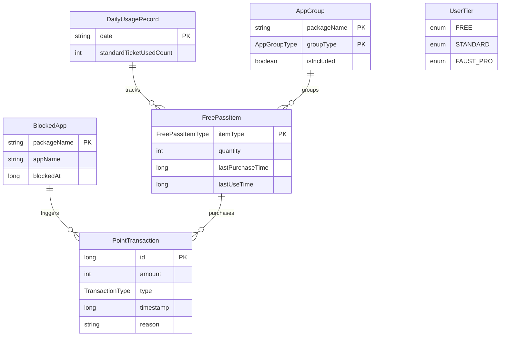

# Data Layer 아키텍처

## 책임 (Responsibilities)

Data Layer는 데이터 영속성과 저장소 관리를 담당합니다. Room Database를 사용하여 구조화된 데이터를 관리하고, EncryptedSharedPreferences를 통해 보안이 중요한 설정 데이터를 암호화하여 저장합니다.

---

## 데이터베이스 스키마

### ERD (Entity Relationship Diagram)



### 테이블 상세

#### blocked_apps

| 컬럼명 | 타입 | 제약조건 | 설명 |
|--------|------|----------|------|
| packageName | String | PRIMARY KEY | 앱 패키지명 |
| appName | String | NOT NULL | 앱 표시 이름 |
| blockedAt | Long | NOT NULL | 차단 시작 시간 (timestamp) |

#### point_transactions

| 컬럼명 | 타입 | 제약조건 | 설명 |
|--------|------|----------|------|
| id | Long | PRIMARY KEY, AUTO_INCREMENT | 거래 ID |
| amount | Int | NOT NULL | 포인트 양 (음수 가능) |
| type | TransactionType | NOT NULL | 거래 타입 (MINING, PENALTY, PURCHASE, RESET) |
| timestamp | Long | NOT NULL | 거래 시간 |
| reason | String | | 거래 사유 |

#### free_pass_items

| 컬럼명 | 타입 | 제약조건 | 설명 |
|--------|------|----------|------|
| itemType | FreePassItemType | PRIMARY KEY | 아이템 타입 (DOPAMINE_SHOT, STANDARD_TICKET, CINEMA_PASS) |
| quantity | Int | NOT NULL, DEFAULT 0 | 보유 수량 |
| lastPurchaseTime | Long | NOT NULL, DEFAULT 0 | 마지막 구매 시간 (timestamp) |
| lastUseTime | Long | NOT NULL, DEFAULT 0 | 마지막 사용 시간 (timestamp) |

#### daily_usage_records

| 컬럼명 | 타입 | 제약조건 | 설명 |
|--------|------|----------|------|
| date | String | PRIMARY KEY | 날짜 (YYYY-MM-DD 형식, 사용자 지정 시간 기준) |
| standardTicketUsedCount | Int | NOT NULL, DEFAULT 0 | 스탠다드 티켓 일일 사용 횟수 |

#### app_groups

| 컬럼명 | 타입 | 제약조건 | 설명 |
|--------|------|----------|------|
| packageName | String | PRIMARY KEY | 앱 패키지명 |
| groupType | AppGroupType | PRIMARY KEY | 그룹 타입 (SNS, OTT) |
| isIncluded | Boolean | NOT NULL, DEFAULT true | 포함 여부 (true: 포함, false: 제외) |

---

## Data Layer 컴포넌트

### 1. FaustDatabase (Room)

**파일**: [`app/src/main/java/com/faust/data/database/FaustDatabase.kt`](app/src/main/java/com/faust/data/database/FaustDatabase.kt)

- **엔티티**: `BlockedApp`, `PointTransaction`, `FreePassItem`, `DailyUsageRecord`, `AppGroup`
- **DAO**: `AppBlockDao`, `PointTransactionDao`, `FreePassItemDao`, `DailyUsageRecordDao`, `AppGroupDao`
- **버전**: 2
- **Migration**: 버전 1 → 2 Migration 스크립트 포함
- **포인트 관리**: 
  - 현재 포인트는 `PointTransaction`의 `SUM(amount)`로 계산
  - `PointTransactionDao.getTotalPointsFlow()`로 Flow 제공

### 2. PointTransactionDao

**파일**: [`app/src/main/java/com/faust/data/database/PointTransactionDao.kt`](app/src/main/java/com/faust/data/database/PointTransactionDao.kt)

- **주요 메서드**:
  - `getTotalPoints()`: 현재 포인트 계산 (suspend)
  - `getTotalPointsFlow()`: 현재 포인트 Flow (반응형)
  - `insertTransaction()`: 거래 내역 저장
  - `getAllTransactions()`: 모든 거래 내역 Flow

### 3. AppBlockDao

**파일**: [`app/src/main/java/com/faust/data/database/AppBlockDao.kt`](app/src/main/java/com/faust/data/database/AppBlockDao.kt)

- **주요 메서드**:
  - `getAllBlockedApps()`: 모든 차단 앱 목록 Flow
  - `insertBlockedApp()`: 차단 앱 추가
  - `deleteBlockedApp()`: 차단 앱 제거

### 4. FreePassItemDao

**파일**: [`app/src/main/java/com/faust/data/database/FreePassItemDao.kt`](app/src/main/java/com/faust/data/database/FreePassItemDao.kt)

- **주요 메서드**:
  - `getAllItems()`: 모든 프리 패스 아이템 Flow
  - `getItem(itemType)`: 특정 타입의 아이템 조회 (suspend)
  - `getItemFlow(itemType)`: 특정 타입의 아이템 Flow
  - `insertOrUpdateItem()`: 아이템 삽입 또는 업데이트

### 5. DailyUsageRecordDao

**파일**: [`app/src/main/java/com/faust/data/database/DailyUsageRecordDao.kt`](app/src/main/java/com/faust/data/database/DailyUsageRecordDao.kt)

- **주요 메서드**:
  - `getAllRecords()`: 모든 일일 사용 기록 Flow
  - `getTodayRecord(date)`: 특정 날짜의 기록 조회 (사용자 지정 시간 기준)
  - `insertOrUpdateRecord()`: 기록 삽입 또는 업데이트

### 6. AppGroupDao

**파일**: [`app/src/main/java/com/faust/data/database/AppGroupDao.kt`](app/src/main/java/com/faust/data/database/AppGroupDao.kt)

- **주요 메서드**:
  - `getAllGroups()`: 모든 앱 그룹 Flow
  - `getGroupsByType(groupType)`: 특정 그룹 타입의 모든 앱 Flow
  - `isAppInGroup(packageName, groupType)`: 앱이 특정 그룹에 속하는지 확인
  - `insertOrUpdateGroup()`: 앱 그룹 삽입 또는 업데이트

---

## PreferenceManager

**파일**: [`app/src/main/java/com/faust/data/utils/PreferenceManager.kt`](app/src/main/java/com/faust/data/utils/PreferenceManager.kt)

### 저장 데이터

- 사용자 티어
- 현재 포인트 (호환성 유지, DB와 동기화)
- 마지막 채굴 시간/앱
- 마지막 정산 시간
- 서비스 실행 상태
- 페르소나 타입 (persona_type)
- 화면 OFF 시 차단 앱 오디오 재생 상태 (wasAudioBlockedOnScreenOff)

### EncryptedSharedPreferences 스키마

**파일명**: `faust_prefs.xml` (암호화됨)

**암호화 방식**: AES256-GCM (키 및 값 모두 암호화)

| 키 | 타입 | 기본값 | 설명 |
|---|------|--------|------|
| user_tier | String | "FREE" | 사용자 티어 |
| current_points | Int | 0 | 현재 보유 포인트 (호환성, DB와 동기화) |
| last_mining_time | Long | 0 | 마지막 채굴 시간 |
| last_mining_app | String | null | 마지막 채굴 앱 패키지명 |
| last_reset_time | Long | 0 | 마지막 정산 시간 |
| last_screen_off_time | Long | 0 | 마지막 화면 OFF 시간 (일괄 정산용) |
| last_screen_on_time | Long | 0 | 마지막 화면 ON 시간 |
| is_service_running | Boolean | false | 서비스 실행 상태 |
| persona_type | String | "" | 페르소나 타입 (STREET, CALM, DIPLOMATIC, COMFORTABLE) |
| wasAudioBlockedOnScreenOff | Boolean | false | 화면 OFF 시 차단 앱 오디오 재생 상태 |
| custom_daily_reset_time | String | "00:00" | 사용자 지정 일일 리셋 시간 (HH:mm 형식) |
| active_pass_item_type | String | null | 활성 패스 아이템 타입 |
| active_pass_start_time | Long | 0 | 활성 패스 시작 시간 (timestamp) |

### 보안 특징

- MasterKey 기반 키 관리
- AES256-SIV (키 암호화) + AES256-GCM (값 암호화)
- 포인트 조작 방지
- 암호화 실패 시 일반 SharedPreferences로 폴백 (로그 기록)

### 역할

- 포인트는 DB가 단일 소스 (PointTransaction의 SUM)
- PreferenceManager는 호환성 및 기타 설정 데이터 관리
- 모든 데이터 접근에 예외 처리 및 로깅

---

## 데이터 정합성

### 포인트 관리 아키텍처

#### 단일 소스 원칙 (Single Source of Truth)

- **포인트의 단일 소스**: `PointTransaction` 테이블의 `SUM(amount)`
- **계산 방식**: `SELECT COALESCE(SUM(amount), 0) FROM point_transactions`
- **PreferenceManager 역할**: 호환성 유지 및 동기화만 수행

#### 트랜잭션 보장

모든 포인트 변경 작업은 Room의 `withTransaction`을 사용하여 원자적으로 처리됩니다:

1. **PenaltyService**
   ```kotlin
   try {
       database.withTransaction {
           try {
               val currentPoints = database.pointTransactionDao().getTotalPoints() ?: 0
               val actualPenalty = penalty.coerceAtMost(currentPoints)
               if (actualPenalty > 0) {
                   database.pointTransactionDao().insertTransaction(...)
                   preferenceManager.setCurrentPoints(...) // 동기화
               }
           } catch (e: Exception) {
               Log.e(TAG, "Error in transaction", e)
               throw e // 롤백을 위해 예외 재발생
           }
       }
   } catch (e: Exception) {
       Log.e(TAG, "Transaction failed", e)
       // 자동 롤백됨
   }
   ```

2. **PointMiningService**
   ```kotlin
   try {
       database.withTransaction {
           try {
               database.pointTransactionDao().insertTransaction(...)
               val currentPoints = database.pointTransactionDao().getTotalPoints() ?: 0
               preferenceManager.setCurrentPoints(currentPoints) // 동기화
           } catch (e: Exception) {
               Log.e(TAG, "Error in transaction", e)
               throw e // 롤백을 위해 예외 재발생
           }
       }
   } catch (e: Exception) {
       Log.e(TAG, "Transaction failed", e)
       // 자동 롤백됨
   }
   ```

3. **WeeklyResetService**
   ```kotlin
   try {
       database.withTransaction {
           try {
               val currentPoints = database.pointTransactionDao().getTotalPoints() ?: 0
               // 정산 로직...
               database.pointTransactionDao().insertTransaction(...)
               preferenceManager.setCurrentPoints(...) // 동기화
           } catch (e: Exception) {
               Log.e(TAG, "Error in transaction", e)
               throw e // 롤백을 위해 예외 재발생
           }
       }
   } catch (e: Exception) {
       Log.e(TAG, "Transaction failed", e)
       // 자동 롤백됨
   }
   ```

**에러 처리 특징**:
- 모든 트랜잭션에 이중 예외 처리 (내부/외부)
- 실패 시 자동 롤백 보장
- 상세한 에러 로깅
- 동시성 보장 (모든 포인트 수정이 트랜잭션으로 처리)

#### 데이터 흐름

```
포인트 변경 요청
    ↓
트랜잭션 시작
    ↓
PointTransaction 삽입
    ↓
현재 포인트 계산 (SUM)
    ↓
PreferenceManager 동기화 (호환성)
    ↓
트랜잭션 커밋
    ↓
Flow 자동 업데이트
    ↓
UI 반응형 업데이트
```

#### 장점

- **데이터 정합성**: 트랜잭션으로 원자적 처리 보장
- **단일 소스**: DB가 포인트의 단일 소스
- **호환성**: PreferenceManager는 동기화만 수행하여 기존 코드와 호환
- **반응형**: Flow로 자동 UI 업데이트
- **안정성**: 예외 처리 및 롤백으로 데이터 무결성 보장
- **보안**: EncryptedSharedPreferences로 포인트 조작 방지
- **동시성**: 모든 포인트 수정이 트랜잭션으로 처리되어 동시 접근 시 데이터 꼬임 방지

---

## 관련 문서

- [마스터 아키텍처 문서](../ARCHITECTURE.md)
- [프레젠테이션 레이어 아키텍처](./arch_presentation.md)
- [도메인 레이어 아키텍처](./arch_domain_persona.md)
- [이벤트 정의 문서](./arch_events.md)
