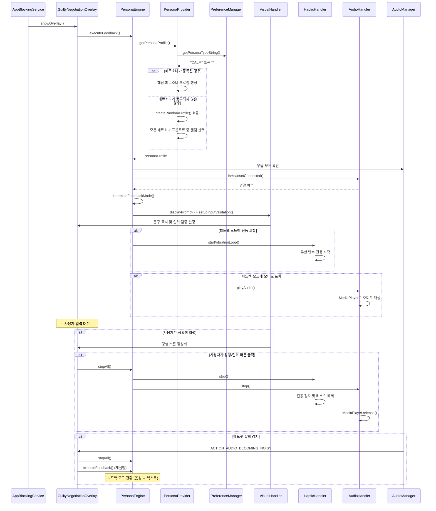

# Domain Layer & Persona Module 아키텍처

## 책임 (Responsibilities)

Domain Layer는 비즈니스 로직과 규칙을 담당합니다. Persona Module은 사용자에게 맞춤형 피드백을 제공하는 핵심 모듈입니다.

---

## Business Logic Layer

### 1. PenaltyService

**파일**: [`app/src/main/java/com/faust/domain/PenaltyService.kt`](app/src/main/java/com/faust/domain/PenaltyService.kt)

- **책임**: 페널티 계산 및 적용 (주로 철회 시 사용)
- **로직**:
  - 강행(Launch): 모든 티어 6 WP 차감 (실제로는 `PointMiningService.applyOneTimePenalty()` 사용)
  - 철회(Quit): Free/Standard 티어 3 WP 차감
  - 포인트 부족 시 0으로 클램프
- **주요 메서드**:
  - `applyLaunchPenalty()`: 강행 페널티 적용 (현재는 사용되지 않음, `PointMiningService.applyOneTimePenalty()` 사용)
  - `applyQuitPenalty()`: 철회 페널티 적용 (화면 OFF 도주 감지 시에도 사용)
- **데이터 정합성**:
  - `database.withTransaction`으로 포인트 차감과 거래 내역 저장을 원자적으로 처리
  - DB에서 현재 포인트 계산 (`PointTransactionDao.getTotalPoints()`)
  - PreferenceManager는 호환성을 위해 동기화만 수행
- **에러 처리**:
  - 트랜잭션 내부 예외 처리 및 로깅
  - 실패 시 자동 롤백

### 2. WeeklyResetService

**파일**: [`app/src/main/java/com/faust/domain/WeeklyResetService.kt`](app/src/main/java/com/faust/domain/WeeklyResetService.kt)

- **책임**: 주간 정산 로직
- **스케줄링**: `AlarmManager`로 매주 월요일 00:00 실행
- **데이터 정합성**:
  - `database.withTransaction`으로 포인트 조정과 거래 내역 저장을 원자적으로 처리
  - DB에서 현재 포인트 계산 (`PointTransactionDao.getTotalPoints()`)
  - PreferenceManager는 호환성을 위해 동기화만 수행
- **에러 처리**:
  - 트랜잭션 내부 예외 처리 및 로깅
  - 실패 시 자동 롤백 및 재시도 스케줄링

### 3. DailyResetService

**파일**: [`app/src/main/java/com/faust/domain/DailyResetService.kt`](app/src/main/java/com/faust/domain/DailyResetService.kt)

- **책임**: 일일 초기화 로직 (스탠다드 티켓 일일 사용 횟수 초기화)
- **스케줄링**: `AlarmManager`로 매일 사용자 지정 시간에 실행 (기본값: 00:00)
- **사용자 지정 시간 지원**:
  - `PreferenceManager.getCustomDailyResetTime()`으로 사용자 지정 시간 조회
  - `TimeUtils.getNextResetTime(customTime)`으로 다음 리셋 시간 계산
  - 시간 변경 시 알람 재스케줄링
- **데이터 정합성**:
  - `database.withTransaction`으로 일일 사용 기록 초기화를 원자적으로 처리
  - 사용자 지정 시간 기준으로 날짜 계산 (`TimeUtils.getDayString()`)
- **에러 처리**:
  - 트랜잭션 내부 예외 처리 및 로깅
  - 실패 시 자동 롤백

### 4. FreePassService

**파일**: [`app/src/main/java/com/faust/domain/FreePassService.kt`](app/src/main/java/com/faust/domain/FreePassService.kt)

- **책임**: 프리 패스 구매 및 사용 로직
- **주요 기능**:
  - 구매 검증: 잔액, 인벤토리 한도, 재구매 쿨타임 확인
  - 구매 처리: 포인트 차감 (TransactionType.PURCHASE), 아이템 추가, 쿨타임 기록
  - 사용 처리: 아이템 소모, 사용 시간 기록, 하이브리드 쿨타임 적용
  - 누진 가격 계산: 스탠다드 티켓 보유 수량에 따른 가격 계산
- **아이템별 상세 정보**:
  - **도파민 샷 (DOPAMINE_SHOT)**:
    - 가격: 15 WP (고정)
    - 재구매 쿨타임: 30분
    - 인벤토리: 없음 (구매 시 즉시 사용)
    - 효과: SNS 앱 그룹 차단 해제
  - **스탠다드 티켓 (STANDARD_TICKET)**:
    - 가격: 20 WP (기본) + 보유 수량당 10 WP 누진 (최대 3장)
    - 재구매 쿨타임: 없음
    - 하이브리드 쿨타임: 일일 3회 사용까지 쿨타임 없음, 4회부터 1시간 쿨타임
    - 인벤토리: 최대 3장 보관 가능
    - 효과: 전체 앱 차단 해제 (SNS 앱 제외)
  - **시네마 패스 (CINEMA_PASS)**:
    - 가격: 75 WP (고정)
    - 재구매 쿨타임: 18시간
    - 인벤토리: 최대 1장 보관 가능
    - 효과: OTT 앱 그룹 차단 해제
- **데이터 정합성**:
  - `database.withTransaction`으로 포인트 차감과 아이템 업데이트를 원자적으로 처리
  - DB에서 현재 포인트 계산 (`PointTransactionDao.getTotalPoints()`)
  - PreferenceManager는 호환성을 위해 동기화만 수행
- **에러 처리**:
  - 트랜잭션 내부 예외 처리 및 로깅
  - 실패 시 자동 롤백

### 5. AppGroupService

**파일**: [`app/src/main/java/com/faust/domain/AppGroupService.kt`](app/src/main/java/com/faust/domain/AppGroupService.kt)

- **책임**: 앱 그룹 관리 (SNS/OTT 앱 분류)
- **주요 기능**:
  - SNS 앱 그룹: `CATEGORY_SOCIAL` + 특정 패키지명 추가/제외
  - OTT 앱 그룹: `CATEGORY_VIDEO` + 특정 패키지명 추가/제외
  - 앱이 특정 그룹에 속하는지 확인 (카테고리 기반 + 명시적 포함/제외)
  - 초기 데이터 설정 (주요 SNS/OTT 앱 패키지명)
- **초기화 타이밍**: 앱 첫 실행 시 또는 AppGroupService 초기화 시 자동 설정 (데이터가 없을 때만)

### 6. ActivePassService

**파일**: [`app/src/main/java/com/faust/domain/ActivePassService.kt`](app/src/main/java/com/faust/domain/ActivePassService.kt)

- **책임**: 활성 프리 패스 추적 및 타이머 관리
- **주요 기능**:
  - 현재 활성화된 프리 패스 추적
  - 타이머 관리 및 만료 시 자동 해제
  - 그룹별 활성 패스 확인 (SNS/OTT/전체)
- **아이템별 지속 시간**:
  - **도파민 샷**: 20분
  - **스탠다드 티켓**: 1시간
  - **시네마 패스**: 4시간
- **타이머 관리 방식**:
  - WorkManager를 사용하여 앱이 종료되어도 타이머가 동작
  - `PassExpirationWorker`로 만료 시간 처리
  - PreferenceManager에 활성 패스 정보 저장 (앱 재시작 시에도 상태 유지)

---

## Persona Module

### 개요

Persona Module은 사용자가 선택한 페르소나에 따라 차단된 앱 실행 시 다양한 피드백(시각, 촉각, 청각)을 제공합니다. 능동적 계약 방식을 통해 사용자가 정확히 문구를 입력해야 강행 버튼이 활성화됩니다.

### 1. PersonaEngine

**파일**: [`app/src/main/java/com/faust/domain/persona/PersonaEngine.kt`](app/src/main/java/com/faust/domain/persona/PersonaEngine.kt)

- **책임**: 기기 상태와 페르소나 프로필을 조합하여 최적의 피드백 모드를 결정하고 각 핸들러에게 실행 명령을 내립니다
- **Safety Net 로직**:
  - 무음 모드 + 헤드셋 없음 → `TEXT_VIBRATION`
  - 소리 모드 + 헤드셋 있음 → `ALL`
  - 무음 모드 + 헤드셋 있음 → `TEXT_VIBRATION`
  - 기타 → `TEXT`
- **주요 메서드**:
  - `determineFeedbackMode()`: 기기 상태 기반 피드백 모드 결정
  - `executeFeedback()`: 피드백 실행 (시각, 촉각, 청각)
  - `stopAll()`: 모든 피드백 즉시 정지 및 리소스 해제

### 2. PersonaProvider

**파일**: [`app/src/main/java/com/faust/domain/persona/PersonaProvider.kt`](app/src/main/java/com/faust/domain/persona/PersonaProvider.kt)

- **책임**: PreferenceManager에서 사용자가 선택한 페르소나 타입을 읽어와 해당하는 PersonaProfile을 제공합니다
- **페르소나 타입**:
  - `STREET`: 불규칙 자극 (빠른 리듬 진동)
  - `CALM`: 부드러운 성찰 (부드러운 진동)
  - `DIPLOMATIC`: 규칙적 압박 (규칙적 진동)
  - `COMFORTABLE`: 편안한 위로 (부드럽고 편안한 피드백)
- **등록되지 않은 경우 (랜덤 텍스트)**:
  - `getPersonaType()`가 `null`을 반환하면 `createRandomProfile()` 호출
  - 모든 페르소나 타입의 프롬프트 텍스트를 수집
  - 랜덤으로 하나 선택하여 PersonaProfile 반환
  - 진동 패턴: 기본값 `listOf(200, 200, 200)`
  - 오디오: `null`
- **주요 메서드**:
  - `getPersonaProfile()`: 현재 설정된 페르소나 프로필 반환 (등록되지 않은 경우 랜덤)
  - `getPersonaType()`: PreferenceManager에서 페르소나 타입 읽기 (등록되지 않은 경우 `null`)
  - `createRandomProfile()`: 모든 페르소나의 프롬프트 텍스트 중 랜덤 선택

### 3. VisualHandler

**파일**: [`app/src/main/java/com/faust/domain/persona/handlers/VisualHandler.kt`](app/src/main/java/com/faust/domain/persona/handlers/VisualHandler.kt)

- **책임**: 페르소나가 제시하는 문구를 화면에 표시하고 사용자 입력을 검증합니다
- **능동적 계약 방식**: 사용자가 정확히 문구를 입력해야 강행 버튼이 활성화됩니다
- **주요 기능**:
  - `displayPrompt()`: 문구 표시
  - `setupInputValidation()`: 실시간 입력 검증 (TextWatcher)

### 4. HapticHandler

**파일**: [`app/src/main/java/com/faust/domain/persona/handlers/HapticHandler.kt`](app/src/main/java/com/faust/domain/persona/handlers/HapticHandler.kt)

- **책임**: 페르소나별 진동 패턴을 무한 반복으로 실행합니다
- **구현**: `VibrationEffect` 사용 (API 26+)
- **리소스 관리**: `stop()` 호출 시 Job 취소 및 Vibrator.cancel()

### 5. AudioHandler

**파일**: [`app/src/main/java/com/faust/domain/persona/handlers/AudioHandler.kt`](app/src/main/java/com/faust/domain/persona/handlers/AudioHandler.kt)

- **책임**: res/raw의 로컬 오디오 파일을 MediaPlayer로 재생합니다
- **헤드셋 감지**: AudioManager를 통한 헤드셋 연결 상태 확인
- **리소스 관리**: `stop()` 호출 시 MediaPlayer.release() 보장

---

## Persona 피드백 플로우



---

## 의존성 그래프

```
PenaltyService
  ├─► FaustDatabase
  └─► PreferenceManager

WeeklyResetService
  ├─► FaustDatabase
  └─► PreferenceManager

PersonaEngine
  ├─► PersonaProvider
  │   └─► PreferenceManager
  ├─► VisualHandler
  ├─► HapticHandler
  │   └─► Vibrator (시스템)
  └─► AudioHandler
      ├─► MediaPlayer
      └─► AudioManager (시스템)
```

---

## 관련 문서

- [마스터 아키텍처 문서](../ARCHITECTURE.md)
- [프레젠테이션 레이어 아키텍처](./arch_presentation.md)
- [데이터 레이어 아키텍처](./arch_data.md)
- [이벤트 정의 문서](./arch_events.md)
