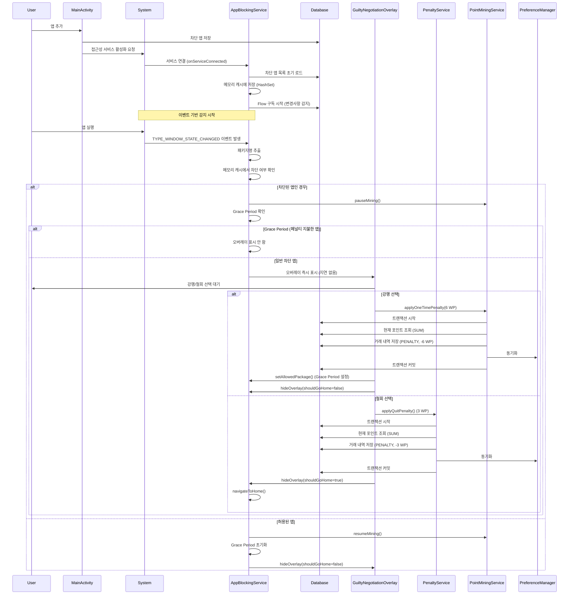
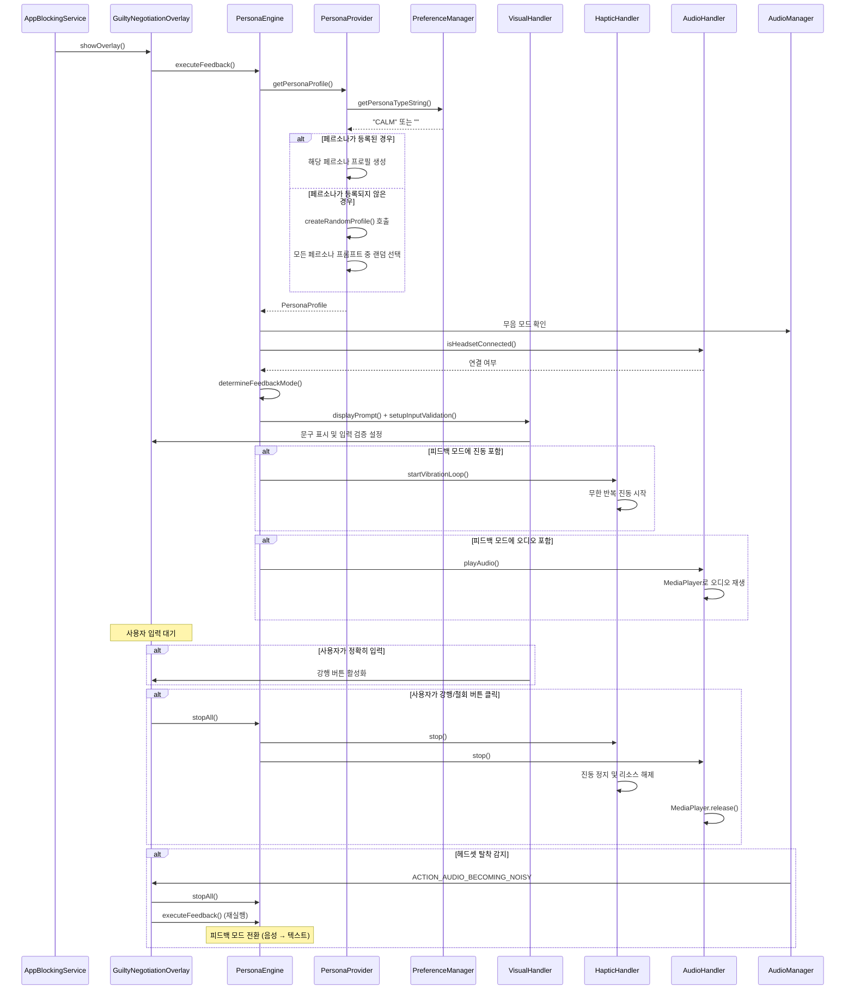
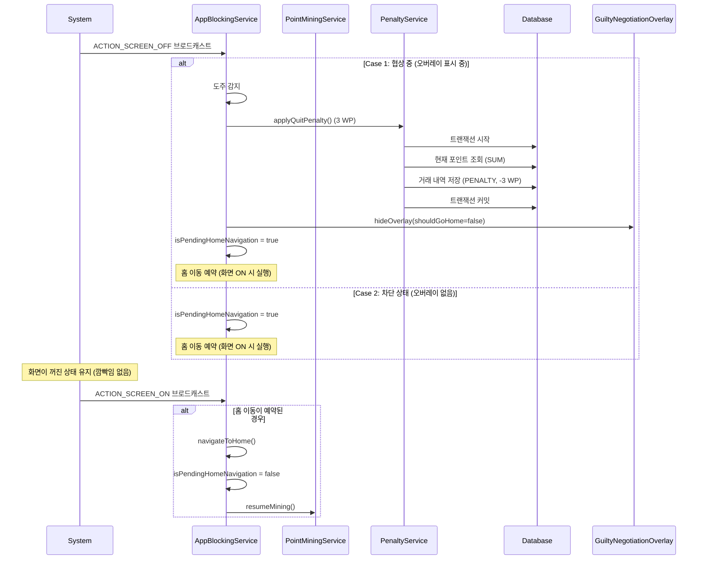
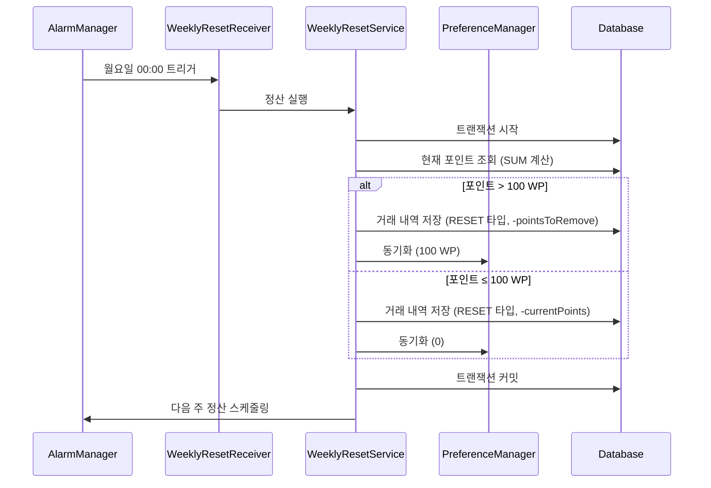
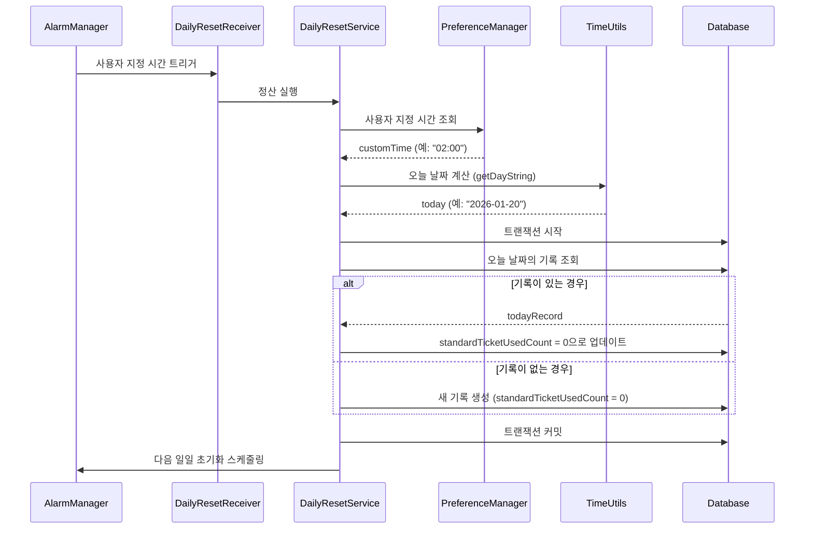
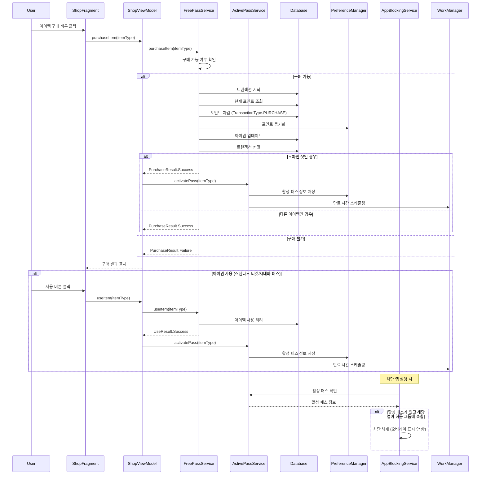
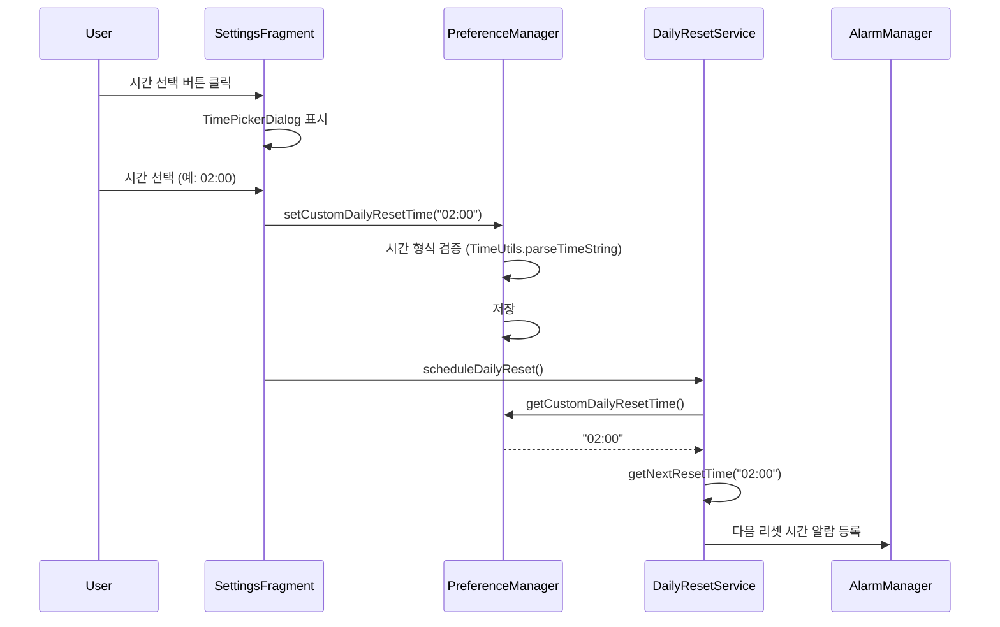

# 핵심 이벤트 정의 및 시퀀스 다이어그램

## 책임 (Responsibilities)

이 문서는 Faust 앱의 비즈니스 로직을 트리거하는 주요 이벤트들과 시스템 컴포넌트 간의 상호작용을 시퀀스 다이어그램으로 설명합니다.

---

## 데이터 흐름 시퀀스 다이어그램

### 1. 앱 차단 플로우 (Event-driven)



### 2. 포인트 채굴 플로우

```mermaid
sequenceDiagram
    participant PointMiningService
    participant Database
    participant PreferenceManager
    participant AudioManager
    participant AppBlockingService

    PointMiningService->>PointMiningService: 백그라운드 서비스 시작
    PointMiningService->>PointMiningService: 화면 이벤트 리시버 등록
    PointMiningService->>AudioManager: AudioPlaybackCallback 등록 (이벤트 기반)
    
    loop 매 1분마다 (화면 ON일 때만)
        PointMiningService->>PointMiningService: 화면 ON 확인 (isScreenOn)
        PointMiningService->>PointMiningService: 일시정지 상태 확인 (!isMiningPaused)
        Note over PointMiningService: isMiningPaused = isPausedByApp || isPausedByAudio
        
        alt 조건 충족 (화면 ON && !일시정지)
            PointMiningService->>Database: 트랜잭션 시작
            PointMiningService->>Database: 거래 내역 저장 (MINING, +1 WP)
            PointMiningService->>Database: 현재 포인트 계산 (SUM)
            PointMiningService->>PreferenceManager: 동기화 (호환성)
            PointMiningService->>Database: 트랜잭션 커밋
        end
    end
    
    Note over AudioManager,PointMiningService: 오디오 상태 변경 시 즉시 콜백 호출 (이벤트 기반)
    AudioManager->>PointMiningService: onPlaybackConfigChanged(configs)
    PointMiningService->>PointMiningService: serviceScope.launch (ANR 방지)
    PointMiningService->>PointMiningService: checkBlockedAppAudioFromConfigs(configs)
    
    PointMiningService->>AudioManager: isMusicActive 확인
    PointMiningService->>PreferenceManager: 마지막 앱 조회 (getLastMiningApp)
        PointMiningService->>Database: 차단 목록 확인
    end
    
    alt 차단 앱에서 오디오 재생 중
        PointMiningService->>PointMiningService: isPausedByAudio = true
    else 오디오 종료 또는 차단 앱 아님
        PointMiningService->>PointMiningService: isPausedByAudio = false
    end
    
    Note over PointMiningService: 화면 OFF → ON 전환 시
    PointMiningService->>PointMiningService: calculateAccumulatedPoints()
    PointMiningService->>PointMiningService: 차단 앱 사용/오디오 확인
    alt 정산 가능
        PointMiningService->>PreferenceManager: 화면 OFF 시간 조회
        PointMiningService->>PointMiningService: 경과 시간(분) 계산
        PointMiningService->>Database: 보너스 포인트 일괄 지급
    end
```

### 3. Persona 피드백 플로우



### 4. 화면 OFF/ON 감지 및 도주 패널티 플로우



### 5. 주간 정산 플로우



### 6. 일일 초기화 플로우 (사용자 지정 시간 기준)



### 7. 프리 패스 구매/사용 플로우



### 8. 사용자 지정 시간 변경 이벤트



---

## 핵심 이벤트 정의 (Core Event Definitions)

핵심 이벤트는 앱의 비즈니스 로직을 트리거하는 주요 사건들입니다. 각 이벤트는 특정 조건에서 발생하며, 시스템의 특정 컴포넌트에 의해 처리됩니다.

### A. 차단 관련 이벤트 (Blocking Events)

#### 1. TYPE_WINDOW_STATE_CHANGED (앱 실행 감지)

**위치**: [`AppBlockingService.onAccessibilityEvent()`](app/src/main/java/com/faust/services/AppBlockingService.kt)

**발생 조건**: 사용자가 특정 앱(예: 유튜브)을 터치하여 화면 전환이 일어날 때 발생하는 접근성 이벤트입니다.

**처리 로직**:
- `event.eventType == AccessibilityEvent.TYPE_WINDOW_STATE_CHANGED` 확인
- **필터링 1: IGNORED_PACKAGES 체크**: 시스템 UI 패키지 무시
- **필터링 1.5: 오버레이 패키지의 FrameLayout 이벤트 필터링**: `com.faust` 패키지의 FrameLayout 이벤트 무시 (오버레이가 표시된 후 불필요한 이벤트 발생 방지)
- **Window ID 검사**: `event.windowId`로 실제 창 전환만 감지
  - Window ID가 유효한 경우: 같은 창이면 무시 (화면 내부 변화 제외)
  - Window ID가 -1(UNDEFINED)인 경우: 오버레이 상태 확인하여 IDLE 상태면 처리 허용
- **클래스 이름 검증**: Layout은 항상 허용
  - Activity/Dialog/Fragment/Layout 모두 허용 (FrameLayout, LinearLayout 등 포함)
  - 단, 오버레이 패키지(`com.faust`)의 FrameLayout은 사전 필터링됨
  - Window ID 검사와 오버레이 상태 체크로 이미 중복 방지하고 있으므로 더 관대하게 처리
- **코루틴 Throttling**: 300ms 지연으로 연속 이벤트를 마지막 것만 처리
- `event.packageName`에서 패키지명 추출
- `handleAppLaunch()` 호출
- **상태 전이 즉시화**: `hideOverlay()`에서 오버레이 닫힘 시 즉시 `overlayState=IDLE`, `lastWindowId=-1`, `lastProcessedPackage=null`로 리셋하여 재진입 즉시 허용

**관련 컴포넌트**:
- `AppBlockingService`: 이벤트 수신 및 처리
- `AccessibilityService`: 시스템 이벤트 제공

#### 2. handleAppLaunch (차단 여부 판단)

**위치**: [`AppBlockingService.handleAppLaunch()`](app/src/main/java/com/faust/services/AppBlockingService.kt)

**발생 조건**: `TYPE_WINDOW_STATE_CHANGED` 이벤트에서 패키지명이 추출된 후 발생합니다.

**처리 로직**:
- 메모리 캐시(`blockedAppsCache`)에서 차단 여부 확인
- 차단된 앱인 경우:
  - **Grace Period 우선 체크**: `lastAllowedPackage`가 설정되어 있고 현재 패키지와 일치하면 오버레이 표시 차단 (중복 징벌 방지)
  - **프리 패스 활성화 체크**: 활성 패스가 있고 해당 앱이 허용 그룹에 속하면 차단 해제 (오버레이 표시 안 함)
    - SNS 앱: 도파민 샷 활성 여부 확인
    - OTT 앱: 시네마 패스 활성 여부 확인
    - SNS 제외 전체 앱: 스탠다드 티켓 활성 여부 확인
  - Cool-down 체크: 같은 앱이 최근에 홈으로 이동했고 쿨다운 시간 내면 오버레이 표시 차단
  - Grace Period, 프리 패스, Cool-down 체크를 통과한 경우에만 오버레이 표시
- 차단되지 않은 앱인 경우: 오버레이 숨김

**관련 컴포넌트**:
- `AppBlockingService`: 차단 여부 판단
- `blockedAppsCache`: 메모리 캐시 (HashSet)

#### 3. showOverlay (오버레이 노출)

**위치**: [`AppBlockingService.showOverlay()`](app/src/main/java/com/faust/services/AppBlockingService.kt)

**발생 조건**: 차단 대상 앱임이 확인되면 즉시 발생합니다. (지연 없음)

**처리 로직**:
- **중복 오버레이 생성 방지**: `currentOverlay != null` 체크로 이미 활성화된 오버레이가 있으면 즉시 반환
- `currentBlockedPackage`, `currentBlockedAppName` 설정
- `GuiltyNegotiationOverlay` 인스턴스 생성 (비동기 실행)
- **이중 체크**: 비동기 실행 중에 다른 스레드에서 오버레이가 생성되었을 수 있으므로 `currentOverlay == null` 재확인
- `WindowManager`를 통해 시스템 레벨 오버레이 표시
- 30초 카운트다운 시작

**중복 방지 메커니즘**:
- **Window ID 검사**: `event.windowId`로 실제 창 전환만 감지 (같은 창이면 무시하여 화면 내부 변화 제외)
- **클래스 이름 검증**: `event.className`으로 Activity/Dialog만 처리 (Toast, Notification 등 제외)
- **코루틴 Throttling**: 300ms 지연으로 연속 이벤트를 마지막 것만 처리 (시스템 이벤트 중복 차단)
- **상태 머신 패턴**: `OverlayState` enum (IDLE, SHOWING, DISMISSING)으로 오버레이 생명주기 명확히 관리
- **상태 전이 제어**: DISMISSING 상태일 때는 어떤 앱 실행 이벤트도 무시하여 "닫히는 도중 다시 뜨는" 현상 원천 차단
- **동기 체크**: 함수 진입 시 `currentOverlay != null || overlayState != IDLE`이면 즉시 반환
- **비동기 이중 체크**: `serviceScope.launch` 내부에서 상태 머신 재확인
- **즉시 상태 동기화**: `hideOverlay()`에서 오버레이 참조를 백업한 후 즉시 `currentOverlay = null`, `overlayState = DISMISSING` 설정
- **리소스 정리 보장**: 백업한 참조로 `dismiss()` 호출하여 PersonaEngine 오디오 정지 및 WindowManager 뷰 제거 보장
- **콜백 패턴**: `OverlayDismissCallback`으로 오버레이 닫힘 완료 시점 명확화
- **쿨다운 면제**: 철회 버튼 클릭 시 `applyCooldown=false`로 쿨다운 면제하여 의도적 재실행 허용
  - 쿨다운 변수(`lastHomeNavigationPackage`, `lastHomeNavigationTime`)를 명시적으로 리셋하여 재실행 시 오버레이 표시 보장
  - 스레드 안전성을 위해 `@Volatile` 어노테이션 적용
- **상태 변경 기반 오버레이 표시**: `transitionToState()`에서 `isStateChanged=false`인 경우 오버레이 표시하지 않음
  - `hideOverlay()` 직후 같은 상태로 재전이되는 경우 중복 표시 방지
  - `isStateChanged=true && previousState=ALLOWED`인 경우만 오버레이 표시 (실제 상태 전이 발생 시에만)
- **스레드 안전성**: 모든 공유 변수에 `@Volatile` 어노테이션 적용
  - `currentOverlay`, `overlayState`: 오버레이 상태 관리
  - `lastWindowId`, `lastProcessedPackage`: Window ID 기반 중복 호출 방지
  - `lastAllowedPackage`: Grace Period 체크
  - `currentBlockedPackage`, `currentBlockedAppName`: 현재 협상 중인 앱 정보
  - `latestActivePackage`: 현재 활성 앱 추적
  - `lastHomeNavigationPackage`, `lastHomeNavigationTime`: 쿨다운 메커니즘
  - 여러 스레드(`onAccessibilityEvent` 메인 스레드, `collectLatest` Default 스레드, `hideOverlay`/`showOverlay` Main 스레드)에서 접근하므로 가시성 보장 필수
- **체크 순서 최적화**: `handleAppLaunch()`에서 오버레이 상태 → Grace Period → Cool-down 순서로 체크
- **예외 처리 강화**: try-catch-finally로 상태 머신 데드락 방지 (항상 IDLE로 복귀)

**관련 컴포넌트**:
- `AppBlockingService`: 오버레이 트리거 및 중복 방지
- `GuiltyNegotiationOverlay`: 오버레이 UI 표시
- `WindowManager`: 시스템 레벨 오버레이 관리

### B. 포인트 및 페널티 이벤트 (Point & Penalty Events)

#### 1. onProceed (강행 실행)

**위치**: [`GuiltyNegotiationOverlay.onProceed()`](app/src/main/java/com/faust/presentation/view/GuiltyNegotiationOverlay.kt)

**발생 조건**: 사용자가 오버레이에서 '강행' 버튼을 선택할 때 발생합니다.

**처리 로직**:
- `PointMiningService.applyOneTimePenalty(context, 6)` 호출하여 6 WP 차감
- `AppBlockingService.setAllowedPackage(packageName)` 호출하여 Grace Period 설정
- `AppBlockingService.hideOverlay(shouldGoHome = false)` 호출하여 오버레이만 닫기 (앱 계속 사용 가능)

**관련 컴포넌트**:
- `GuiltyNegotiationOverlay`: 사용자 인터랙션 처리
- `PointMiningService`: 강행 페널티 적용 (6 WP 차감)
- `AppBlockingService`: Grace Period 설정 및 오버레이 닫기
- `FaustDatabase`: 포인트 차감 (트랜잭션)

#### 2. onCancel (철회)

**위치**: [`GuiltyNegotiationOverlay.onCancel()`](app/src/main/java/com/faust/presentation/view/GuiltyNegotiationOverlay.kt)

**발생 조건**: 사용자가 오버레이에서 '철회' 버튼을 선택할 때 발생합니다.

**처리 로직**:
- `PenaltyService.applyQuitPenalty(packageName, appName)` 호출
- Free/Standard 티어: 3 WP 차감
- `AppBlockingService.hideOverlay(shouldGoHome = true, applyCooldown = false)` 호출하여 오버레이 닫기 및 홈으로 이동
  - `applyCooldown=false`로 쿨다운 면제 및 쿨다운 변수 리셋
- **홈 런처 감지**: `handleAppLaunch()`에서 홈 런처 패키지가 감지되면 상태를 `ALLOWED`로 전이
  - 서비스 시작 시 `initializeHomeLauncherPackages()`로 홈 런처 패키지 목록 초기화
  - `PackageManager.queryIntentActivities()`로 `CATEGORY_HOME` Intent를 처리할 수 있는 모든 앱을 찾아 저장
  - `onAccessibilityEvent()`에서 홈 런처 패키지는 className 필터링을 우회하여 Flow로 전송 보장
  - 홈 화면 이벤트가 실제로 발생했을 때만 상태를 `ALLOWED`로 전이하여 중복 호출 방지

**관련 컴포넌트**:
- `GuiltyNegotiationOverlay`: 사용자 인터랙션 처리
- `PenaltyService`: 페널티 계산 및 적용 (3 WP 차감)
- `AppBlockingService`: 오버레이 닫기, 홈 이동, 강제 상태 초기화

#### 3. executePersonaFeedback (Persona 피드백 실행)

**위치**: [`GuiltyNegotiationOverlay.show()`](app/src/main/java/com/faust/presentation/view/GuiltyNegotiationOverlay.kt) → [`PersonaEngine.executeFeedback()`](app/src/main/java/com/faust/domain/persona/PersonaEngine.kt)

**발생 조건**: 오버레이가 표시될 때 자동으로 발생합니다.

**처리 로직**:
- `PersonaProvider`에서 현재 페르소나 프로필 로드
- `PersonaEngine.determineFeedbackMode()`로 기기 상태 기반 피드백 모드 결정
- `VisualHandler`로 문구 표시 및 입력 검증 설정
- 결정된 모드에 따라 `HapticHandler`, `AudioHandler` 실행
- 사용자가 정확히 문구를 입력할 때까지 강행 버튼 비활성화

**관련 컴포넌트**:
- `GuiltyNegotiationOverlay`: 오버레이 표시 및 피드백 트리거
- `PersonaEngine`: 피드백 조율 및 모드 결정
- `PersonaProvider`: 페르소나 프로필 제공
- `VisualHandler`, `HapticHandler`, `AudioHandler`: 각 피드백 실행

#### 4. stopAllFeedback (피드백 정지)

**위치**: [`GuiltyNegotiationOverlay.onProceed()`, `onCancel()`, `dismiss()`](app/src/main/java/com/faust/presentation/view/GuiltyNegotiationOverlay.kt) → [`PersonaEngine.stopAll()`](app/src/main/java/com/faust/domain/persona/PersonaEngine.kt)

**발생 조건**: 
- 사용자가 강행/철회 버튼 클릭 시
- 오버레이가 닫힐 때
- 헤드셋이 탈착될 때

**처리 로직**:
- `HapticHandler.stop()`: 진동 즉시 정지 및 Job 취소
- `AudioHandler.stop()`: MediaPlayer 정지 및 리소스 해제
- 모든 코루틴 Job 취소

**관련 컴포넌트**:
- `GuiltyNegotiationOverlay`: 사용자 액션 처리
- `PersonaEngine`: 피드백 정지 명령
- `HapticHandler`, `AudioHandler`: 리소스 해제

#### 5. addMiningPoints (포인트 적립)

**위치**: [`PointMiningService.addMiningPoints()`](app/src/main/java/com/faust/services/PointMiningService.kt)

**발생 조건**: `PointMiningService`에서 1분마다 실행되며, 화면이 ON이고 채굴이 일시정지되지 않았을 경우 발생합니다.

**처리 로직**:
- 화면 ON 상태 확인 (`isScreenOn`)
- 채굴 일시정지 상태 확인 (`!isMiningPaused`)
- 조건 충족 시 1 WP 적립
- 트랜잭션으로 거래 내역 저장 및 포인트 계산

**관련 컴포넌트**:
- `PointMiningService`: 채굴 로직 실행
- `FaustDatabase`: 포인트 적립 (트랜잭션)

#### 6. calculateAccumulatedPoints (일괄 정산)

**위치**: [`PointMiningService.calculateAccumulatedPoints()`](app/src/main/java/com/faust/services/PointMiningService.kt)

**발생 조건**: 화면이 OFF 상태에서 ON으로 전환될 때 자동으로 실행됩니다.

**처리 로직**:
- 차단 앱 사용 중이면 정산 제외
- 차단 앱 오디오 재생 중이면 정산 제외
- 화면 OFF 시간부터 ON 시간까지의 경과 시간(분) 계산
- 유효한 시간만큼 보너스 포인트 일괄 지급

**관련 컴포넌트**:
- `PointMiningService`: 일괄 정산 로직 실행
- `PreferenceManager`: 화면 OFF 시간 저장/조회
- `FaustDatabase`: 포인트 적립 (트랜잭션)

#### 7. checkBlockedAppAudioFromConfigs (오디오 모니터링 - 이벤트 기반)

**위치**: [`PointMiningService.checkBlockedAppAudioFromConfigs()`](app/src/main/java/com/faust/services/PointMiningService.kt)

**발생 조건**: `AudioPlaybackCallback.onPlaybackConfigChanged()`에서 오디오 상태 변경 시 즉시 호출되며, 화면 상태와 무관하게 지속적으로 작동합니다.

**처리 로직**:
- **초기화**: `startAudioMonitoring()`에서 API 26+ 체크 후 콜백 등록
- **초기 상태 확인**: 콜백 등록 직후 현재 오디오 상태 확인
  - API 29+: `activePlaybackConfigurations`로 활성 세션 확인
  - API 26-28: `isMusicActive`로 확인 후 `checkBlockedAppAudio()` 호출
- **이벤트 처리**: `onPlaybackConfigChanged()` 콜백에서 오디오 상태 변경 시 한 번만 검사
  - 오디오 재생 시작/종료 시에만 콜백 호출 (주기적 검사 없음)
  - 검사 결과(`isPausedByAudio`)를 저장하여 포인트 채굴 여부 결정
  - "오디오 콜백 호출: N개 세션 감지" 로그 출력
- **PersonaEngine 오디오 재생 제외**: 오버레이가 표시 중일 때는 PersonaEngine의 AudioHandler가 재생하는 오디오일 가능성이 높으므로 검사를 건너뜀
  - `AppBlockingService.isOverlayActive()`로 오버레이 표시 상태 확인
  - 오버레이 표시 중이면 즉시 반환하여 PersonaEngine 오디오 재생이 차단 앱 오디오로 잘못 감지되는 것을 방지
  - **타이밍 안전성**: 오버레이가 닫힐 때 PersonaEngine 오디오 정지 완료를 기다린 후 `isOverlayActive = false` 설정 (150ms 지연)
  - 시스템 오디오 콜백의 지연을 고려하여 PersonaEngine 오디오가 완전히 정지된 후 오디오 검사 재개
- 주의: `AudioPlaybackConfiguration.getClientUid()`는 public API가 아니므로 사용 불가
- 모든 API 레벨: `AudioManager.isMusicActive`로 오디오 재생 상태 확인
- `PreferenceManager.getLastMiningApp()`으로 마지막 앱 정보 조회
- 마지막 앱이 차단 목록에 있으면 `true` 반환
- 차단 앱에서 오디오 재생 중이면 `isPausedByAudio = true` 설정 (상태 분리)
- 오디오가 꺼지면 `isPausedByAudio = false`로 해제 (양방향 상태 관리)
- 오디오 종료 시 `PreferenceManager.setAudioBlockedOnScreenOff(false)` 호출하여 화면 OFF 시 기록 리셋
- **예외 처리**: 모든 단계에서 try-catch로 안전하게 처리

**상태 분리 메커니즘**:
- `isPausedByApp`: 앱 실행으로 인한 일시정지 (시각적 차단, AppBlockingService가 관리)
- `isPausedByAudio`: 오디오로 인한 일시정지 (청각적 차단, 오디오 감시가 관리)
- `isMiningPaused`: 계산된 속성 = `isPausedByApp || isPausedByAudio` (OR 조건)
- 시각적 차단 무력화 방지: 오디오가 꺼져도 (`isPausedByAudio = false`) 앱이 실행 중이면 (`isPausedByApp = true`) 채굴 중단 유지

**관련 컴포넌트**:
- `PointMiningService.startAudioMonitoring()`: 오디오 모니터링 시작 (API 26+ 체크 포함)
- `PointMiningService.stopAudioMonitoring()`: 오디오 모니터링 중지 (API 26+ 체크 포함)
- `AppBlockingService.isOverlayActive()`: 오버레이 표시 상태 확인 (PersonaEngine 오디오 재생 제외용)
- `AudioPlaybackCallback`: 오디오 상태 변경 이벤트 수신 (API 26+)
- `AudioPlaybackConfiguration`: 활성 오디오 재생 세션 정보 (API 29+)
- `AudioManager.activePlaybackConfigurations`: 현재 활성 오디오 세션 조회 (API 29+)
- `AudioManager.isMusicActive`: 오디오 재생 상태 확인 (API 26-28에서 초기 상태 확인용)
- `FaustDatabase`: 차단 앱 목록 조회

#### 8. ACTION_SCREEN_OFF/ON (화면 OFF/ON 감지)

**위치**: [`AppBlockingService.registerScreenOffReceiver()`](app/src/main/java/com/faust/services/AppBlockingService.kt)

**발생 조건**: 
- `ACTION_SCREEN_OFF`: 사용자가 기기 화면을 끌 때 시스템이 브로드캐스트를 전송합니다.
- `ACTION_SCREEN_ON`: 사용자가 기기 화면을 켤 때 시스템이 브로드캐스트를 전송합니다.

**핵심 개선사항**: 화면이 꺼질 때 즉시 홈으로 이동하면 시스템의 화면 꺼짐 정책과 충돌하여 깜빡임(Wake-up loop) 현상이 발생합니다. 이를 해결하기 위해 홈 이동을 지연 처리합니다.

**플래그 변수**:
- `isPendingHomeNavigation`: 화면이 꺼진 동안 홈 이동이 예약되었는지를 추적하는 Boolean 플래그 (기본값: false)

**ACTION_SCREEN_OFF 처리 로직**:
- **차단 앱 오디오 재생 상태 기록**: 화면 OFF 시점에 차단 앱에서 오디오가 재생 중인지 확인하고 저장
  - `PointMiningService.isPausedByAudio()` 호출하여 현재 오디오 일시정지 상태 확인
  - `PreferenceManager.setAudioBlockedOnScreenOff()` 호출하여 상태 저장
  - 이 기록은 화면 ON 후 허용 앱으로 전환되어도 채굴을 재개하지 않도록 사용됨
- Case 1: 협상 중(오버레이 표시 중) 화면 OFF → 도주 감지
  - `PenaltyService.applyQuitPenalty()` 호출하여 철회 패널티 적용 (비동기)
  - `hideOverlay(shouldGoHome = false)` 호출하여 오버레이만 닫기 (홈 이동은 즉시 하지 않음)
  - `isPendingHomeNavigation = true` 설정하여 홈 이동 예약
  - 채굴은 이미 pause 상태이므로 유지
- Case 2: 차단 상태(오버레이 없음)에서 화면 OFF → 홈 이동 스킵
  - 화면이 꺼진 상태에서는 사용자가 앱을 볼 수 없으므로 홈 이동 불필요 (화면 깜빡임 방지)
  - `PointMiningService.isMiningPaused()`가 true이고 `currentMiningState == MiningState.BLOCKED`인 경우에도 홈 이동 스킵
  - 이미 `currentMiningState == MiningState.ALLOWED`인 경우(앱 철회 후 홈 이동 완료된 경우) 홈 이동 스킵
  - 화면 ON 시 차단 앱이 보이면 자연스럽게 오버레이가 표시됨
  - 채굴은 이미 pause 상태이므로 유지

**ACTION_SCREEN_ON 처리 로직**:
- `isPendingHomeNavigation`이 true인지 확인
- true인 경우:
  - `navigateToHome("화면 ON 이벤트")` 호출하여 홈으로 이동
  - `isPendingHomeNavigation = false`로 리셋
  - `PointMiningService.resumeMining()` 호출하여 채굴 재개

**관련 컴포넌트**:
- `AppBlockingService`: 화면 OFF/ON 이벤트 수신 및 처리
- `PointMiningService`: 오디오 일시정지 상태 확인 (`isPausedByAudio()`)
- `PreferenceManager`: 화면 OFF 시 차단 앱 오디오 재생 상태 저장/조회
- `PenaltyService`: 도주 패널티 적용 (Case 1)
- `PointMiningService`: 채굴 재개 (화면 ON 시)

### C. 데이터 동기화 이벤트 (Data Synchronization Events)

#### 1. getTotalPointsFlow (UI 업데이트)

**위치**: [`MainViewModel.observePoints()`](app/src/main/java/com/faust/presentation/viewmodel/MainViewModel.kt) → [`PointTransactionDao.getTotalPointsFlow()`](app/src/main/java/com/faust/data/database/PointTransactionDao.kt)

**발생 조건**: 데이터베이스의 포인트 합계가 변경되면 자동으로 발생합니다.

**처리 로직**:
- `MainViewModel`에서 `PointTransactionDao.getTotalPointsFlow()` Flow 구독
- 포인트 변경 시 `currentPoints` StateFlow 업데이트
- `MainActivity`에서 StateFlow 관찰하여 UI 자동 갱신

**관련 컴포넌트**:
- `MainActivity`: StateFlow 관찰 및 UI 업데이트
- `MainViewModel`: 데이터 관찰 및 StateFlow 관리
- `PointTransactionDao`: Flow 제공
- `FaustDatabase`: 데이터 변경 감지

#### 2. observeBlockedApps (차단 앱 목록 관찰)

**위치**: [`MainViewModel.observeBlockedApps()`](app/src/main/java/com/faust/presentation/viewmodel/MainViewModel.kt)

**발생 조건**: 차단 앱 목록 데이터베이스에 변경이 생기면 자동으로 발생합니다.

**처리 로직**:
- `MainViewModel`에서 `AppBlockDao.getAllBlockedApps()` Flow 구독
- 차단 앱 목록 변경 시 `blockedApps` StateFlow 업데이트
- `MainActivity`에서 StateFlow 관찰하여 UI 자동 갱신

**관련 컴포넌트**:
- `MainActivity`: StateFlow 관찰 및 UI 업데이트
- `MainViewModel`: 데이터 관찰 및 StateFlow 관리
- `AppBlockDao`: Flow 제공
- `FaustDatabase`: 데이터 변경 감지

#### 3. initializeBlockedAppsCache (캐시 동기화)

**위치**: [`AppBlockingService.initializeBlockedAppsCache()`](app/src/main/java/com/faust/services/AppBlockingService.kt)

**발생 조건**: 
- 서비스 시작 시 초기 로드
- 차단 목록 데이터베이스에 변경이 생기면 Flow를 통해 자동 발생

**처리 로직**:
- 초기 로드: `getAllBlockedApps().first()`로 차단 앱 목록 로드
- Flow 구독: `getAllBlockedApps().collect()`로 변경사항 실시간 감지
- 메모리 캐시(`blockedAppsCache`) 즉시 업데이트

**관련 컴포넌트**:
- `AppBlockingService`: 캐시 관리
- `AppBlockDao`: 차단 앱 목록 제공 (Flow)
- `blockedAppsCache`: 메모리 캐시 (HashSet)

### D. 프리 패스 이벤트 (Free Pass Events)

#### 1. purchaseItem (아이템 구매)

**위치**: [`ShopViewModel.purchaseItem()`](app/src/main/java/com/faust/presentation/viewmodel/ShopViewModel.kt) → [`FreePassService.purchaseItem()`](app/src/main/java/com/faust/domain/FreePassService.kt)

**발생 조건**: 사용자가 ShopFragment에서 아이템 구매 버튼을 클릭할 때 발생합니다.

**처리 로직**:
- 구매 가능 여부 확인: 잔액, 인벤토리 한도, 재구매 쿨타임 확인
- 가격 계산: 스탠다드 티켓은 누진 가격 적용
- 트랜잭션으로 포인트 차감 및 아이템 업데이트
- 도파민 샷은 구매 시 즉시 활성화 (lastUseTime 설정)

**관련 컴포넌트**:
- `ShopFragment`: 사용자 인터랙션 처리
- `ShopViewModel`: 구매 로직 호출
- `FreePassService`: 구매 검증 및 처리
- `ActivePassService`: 활성 패스 활성화 (도파민 샷)

#### 2. useItem (아이템 사용)

**위치**: [`ShopViewModel.useItem()`](app/src/main/java/com/faust/presentation/viewmodel/ShopViewModel.kt) → [`FreePassService.useItem()`](app/src/main/java/com/faust/domain/FreePassService.kt)

**발생 조건**: 사용자가 ShopFragment에서 아이템 사용 버튼을 클릭할 때 발생합니다.

**처리 로직**:
- 아이템 보유 여부 확인
- 하이브리드 쿨타임 확인 (스탠다드 티켓만)
- 아이템 사용 처리 (수량 감소, 사용 시간 기록)
- 일일 사용 횟수 업데이트 (스탠다드 티켓만)
- 활성 패스 활성화

**관련 컴포넌트**:
- `ShopFragment`: 사용자 인터랙션 처리
- `ShopViewModel`: 사용 로직 호출
- `FreePassService`: 사용 검증 및 처리
- `ActivePassService`: 활성 패스 활성화

#### 3. DAILY_RESET (일일 초기화)

**위치**: [`DailyResetReceiver.onReceive()`](app/src/main/java/com/faust/domain/DailyResetService.kt) → [`DailyResetService.performReset()`](app/src/main/java/com/faust/domain/DailyResetService.kt)

**발생 조건**: AlarmManager에 의해 매일 사용자 지정 시간에 발생합니다.

**처리 로직**:
- 사용자 지정 시간 기준 오늘 날짜 계산 (`TimeUtils.getDayString()`)
- 오늘 날짜의 일일 사용 기록 조회
- 스탠다드 티켓 일일 사용 횟수를 0으로 초기화
- 다음 일일 초기화 스케줄링

**관련 컴포넌트**:
- `DailyResetReceiver`: 브로드캐스트 수신
- `DailyResetService`: 일일 초기화 로직 실행
- `TimeUtils`: 사용자 지정 시간 기준 날짜 계산
- `PreferenceManager`: 사용자 지정 시간 조회

#### 4. PassExpirationWorker (패스 만료)

**위치**: [`PassExpirationWorker.doWork()`](app/src/main/java/com/faust/domain/ActivePassService.kt)

**발생 조건**: WorkManager에 의해 활성 패스 만료 시간에 발생합니다.

**처리 로직**:
- 활성 패스 해제
- PreferenceManager에서 활성 패스 정보 제거
- WorkManager 작업 취소

**관련 컴포넌트**:
- `WorkManager`: 백그라운드 작업 스케줄링
- `PassExpirationWorker`: 패스 만료 처리
- `ActivePassService`: 활성 패스 해제

---

## 상태 전이 모델 (State Transition Model)

### 개요

상태 전이 모델은 포인트 채굴 상태를 명확하게 관리하고, 오버레이 중복 발동 문제를 해결하기 위해 도입되었습니다.

### 상태 정의

- **ALLOWED**: 포인트 채굴이 활성화된 상태입니다.
- **BLOCKED**: 포인트 채굴이 중단된 상태입니다. 제한 앱이 시각적으로 노출되거나, 화면 OFF 상태에서 제한 앱의 오디오가 재생될 때 이 상태가 됩니다.

### 핵심 원칙

1. **오버레이 실행 조건**: 시스템이 'ALLOWED' 상태에서 'BLOCKED' 상태로 변경되는 시점에 오버레이를 실행합니다. 이미 'BLOCKED' 상태인 경우에도 오버레이가 표시되지 않은 상태이고 조건을 만족하면 오버레이를 표시합니다. (예: 오디오 종료 후 차단 앱 재실행 시)

2. **이벤트 기반 오디오 감지**: `AudioManager.AudioPlaybackCallback`을 사용하여 오디오 상태 변화를 감지합니다. 고정된 주기적 검사 대신, 오디오 세션의 시작/종료 이벤트가 발생할 때만 상태를 업데이트합니다.

3. **채굴 서비스 연동**: 상태가 ALLOWED로 변하면 채굴을 시작하고, BLOCKED로 변하면 즉시 채굴을 중단합니다.

### 상태 전이 흐름

#### 시각적 차단 (앱 실행)

```
사용자가 제한 앱 실행
  ↓
ALLOWED → BLOCKED 전이 감지
  ↓
유죄협상 오버레이 표시 (1회만)
  ↓
채굴 중단
```

#### 오디오 차단 (화면 OFF 중 오디오 재생)

```
화면 OFF 상태에서 제한 앱 오디오 재생
  ↓
ALLOWED → BLOCKED 전이 감지
  ↓
오버레이 표시 안 함 (화면 OFF 상태이므로)
  ↓
채굴 중단
```

#### 화면 재활성화 시나리오

```
화면 OFF 상태에서 제한 앱 오디오 재생 중
  ↓
상태: BLOCKED 유지
  ↓
화면 ON
  ↓
BLOCKED → BLOCKED (상태 변경 없음)
  ↓
오버레이 중복 표시 방지 ✅
```

#### 오디오 종료 시나리오

```
화면 OFF 상태에서 제한 앱 오디오 재생 중
  ↓
상태: BLOCKED
  ↓
오디오 종료
  ↓
BLOCKED → ALLOWED 전이
  ↓
채굴 재개
  ↓
화면 ON 시 제한 앱이 보이면
  ↓
ALLOWED → BLOCKED 전이
  ↓
유죄협상 오버레이 정상 작동 ✅
```

#### 오디오 종료 후 차단 앱 재실행 시나리오

```
차단 앱 실행 → 오버레이 표시 → 철회 버튼 클릭
  ↓
상태: BLOCKED 유지 (홈 이동)
  ↓
오디오 재생 시작
  ↓
BLOCKED → BLOCKED (상태 변경 없음, 오디오로 인한 차단)
  ↓
오디오 종료
  ↓
BLOCKED → ALLOWED 전이
  ↓
채굴 재개
  ↓
같은 차단 앱 재실행
  ↓
ALLOWED → BLOCKED 전이 또는 BLOCKED → BLOCKED (오버레이 없음)
  ↓
오버레이 표시 조건 충족 (triggerOverlay=true, currentOverlay=null)
  ↓
유죄협상 오버레이 정상 작동 ✅
```

#### 화면 OFF 시 차단 앱 오디오 재생 기록 시나리오

```
화면 OFF 시점에 차단 앱 오디오 재생 중
  ↓
PreferenceManager에 상태 기록 (wasAudioBlockedOnScreenOff = true)
  ↓
화면 ON 후 허용 앱으로 전환
  ↓
transitionToState(ALLOWED) 호출
  ↓
wasAudioBlockedOnScreenOff 확인
  ↓
true인 경우: 채굴 재개하지 않음 (return)
  ↓
오디오 종료 시
  ↓
checkBlockedAppAudioFromConfigs()에서 플래그 리셋
  ↓
다음 ALLOWED 전이 시 정상적으로 채굴 재개 ✅
```

### 구현 위치

- **상태 정의**: [`AppBlockingService.MiningState`](app/src/main/java/com/faust/services/AppBlockingService.kt)
- **상태 전이 로직**: [`AppBlockingService.transitionToState()`](app/src/main/java/com/faust/services/AppBlockingService.kt)
  - ALLOWED 전이 시 `PreferenceManager.wasAudioBlockedOnScreenOff()` 확인하여 조건부 재개
  - BLOCKED 전이 시 상태 변경 여부와 관계없이 오버레이가 없고 조건을 만족하면 오버레이 표시 (오디오 종료 후 차단 앱 재실행 시나리오 대응)
- **오디오 상태 변경 처리**: [`AppBlockingService.onAudioBlockStateChanged()`](app/src/main/java/com/faust/services/AppBlockingService.kt)
- **콜백 등록**: [`PointMiningService.setBlockingServiceCallback()`](app/src/main/java/com/faust/services/PointMiningService.kt)
- **화면 OFF 시 오디오 상태 기록**: [`AppBlockingService.registerScreenOffReceiver()`](app/src/main/java/com/faust/services/AppBlockingService.kt)
  - `PointMiningService.isPausedByAudio()` 호출하여 상태 확인
  - `PreferenceManager.setAudioBlockedOnScreenOff()` 호출하여 상태 저장
- **오디오 종료 시 플래그 리셋**: [`PointMiningService.checkBlockedAppAudioFromConfigs()`](app/src/main/java/com/faust/services/PointMiningService.kt)

### 관련 컴포넌트

- `AppBlockingService`: 상태 전이 관리 및 오버레이 트리거
- `PointMiningService`: 오디오 상태 변경 감지 및 콜백 전달
- `AudioPlaybackCallback`: 오디오 상태 변경 이벤트 수신

---

## 관련 문서

- [마스터 아키텍처 문서](../ARCHITECTURE.md)
- [프레젠테이션 레이어 아키텍처](./arch_presentation.md)
- [도메인 레이어 아키텍처](./arch_domain_persona.md)
- [데이터 레이어 아키텍처](./arch_data.md)
